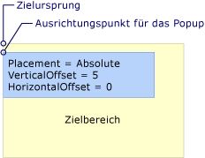
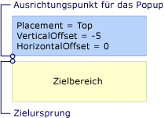
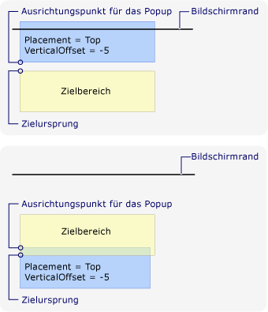
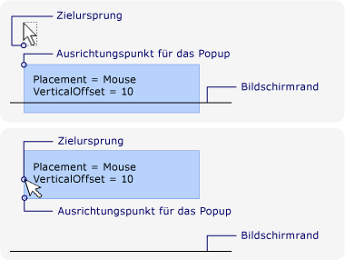

# Verhalten beim Platzieren von Popups
Ein <xref:System.Windows.Controls.Primitives.Popup> -Steuerelement zeigt den Inhalt in einem separaten Fenster, die über eine Anwendung befindet. Sie können angeben, dass die Position des ein <xref:System.Windows.Controls.Primitives.Popup> relativ zu einem Steuerelement, der Maus oder dem Bildschirm mit der <xref:System.Windows.Controls.Primitives.Popup.PlacementTarget%2A>, <xref:System.Windows.Controls.Primitives.Popup.Placement%2A>, <xref:System.Windows.Controls.Primitives.Popup.PlacementRectangle%2A>, <xref:System.Windows.Controls.Primitives.Popup.HorizontalOffset%2A>, und <xref:System.Windows.Controls.Primitives.Popup.VerticalOffset%2A> Eigenschaften.  Diese Eigenschaften arbeiten zusammen, um die Flexibilität bei der Angabe der Position von der <xref:System.Windows.Controls.Primitives.Popup>.  
  
> [!NOTE]
>  Die <xref:System.Windows.Controls.ToolTip> und <xref:System.Windows.Controls.ContextMenu> Klassen auch definieren diese fünf Eigenschaften und Verhalten sich ähnlich.  
  
   
  
   
## Positionieren von Popups  
 Die Platzierung von einer <xref:System.Windows.Controls.Primitives.Popup> kann relativ zu einer <xref:System.Windows.UIElement> oder den gesamten Bildschirm.  Das folgende Beispiel erstellt vier <xref:System.Windows.Controls.Primitives.Popup> Steuerelemente, die relativ zu einer <xref:System.Windows.UIElement>– in diesem Fall einem Bild. Alle der <xref:System.Windows.Controls.Primitives.Popup> Steuerelemente verfügen über die <xref:System.Windows.Controls.Primitives.Popup.PlacementTarget%2A> Eigenschaft festgelegt, um `image1`, aber jedes <xref:System.Windows.Controls.Primitives.Popup> hat einen anderen Wert für die Placement-Eigenschaft.  
  
 [!code-xml[PopupPositionSnippet#3](../../../../samples/snippets/csharp/VS_Snippets_Wpf/PopupPositionSnippet/CS/Window1.xaml#3)]  
  
 Die folgende Abbildung zeigt das Bild und die <xref:System.Windows.Controls.Primitives.Popup> Steuerelemente  
  
   
Bild mit vier Popups  
  
 Dieses einfache Beispiel zeigt, wie Sie festlegen der <xref:System.Windows.Controls.Primitives.Popup.PlacementTarget%2A> und <xref:System.Windows.Controls.Primitives.Popup.Placement%2A> Eigenschaften jedoch mithilfe der <xref:System.Windows.Controls.Primitives.Popup.PlacementRectangle%2A>, <xref:System.Windows.Controls.Primitives.Popup.HorizontalOffset%2A>, und <xref:System.Windows.Controls.Primitives.Popup.VerticalOffset%2A> Eigenschaften, Sie haben sogar noch mehr Kontrolle über die Where der <xref:System.Windows.Controls.Primitives.Popup> positioniert ist.  
  
   
## Definitionen von Begriffen: der Aufbau eines Popups  
 Die folgenden Begriffe sind hilfreich, zu verstehen, wie die <xref:System.Windows.Controls.Primitives.Popup.PlacementTarget%2A>, <xref:System.Windows.Controls.Primitives.Popup.Placement%2A>, <xref:System.Windows.Controls.Primitives.Popup.PlacementRectangle%2A>, <xref:System.Windows.Controls.Primitives.Popup.HorizontalOffset%2A>, und <xref:System.Windows.Controls.Primitives.Popup.VerticalOffset%2A> Eigenschaften beziehen sich auf einander und der <xref:System.Windows.Controls.Primitives.Popup>:  
  
-   Zielobjekt  
  
-   Zielbereich  
  
-   Zielursprung  
  
-   Popup-Ausrichtungspunkt an  
  
 Dieser Begriffe kann eine bequeme Möglichkeit zum Verweisen auf verschiedene Aspekte der <xref:System.Windows.Controls.Primitives.Popup> und das Steuerelement, das diesem zugeordnet ist.  
  
### Zielobjekt  
 Die *Zielobjekt* ist das Element, das die <xref:System.Windows.Controls.Primitives.Popup> zugeordnet ist. Wenn die <xref:System.Windows.Controls.Primitives.Popup.PlacementTarget%2A> festgelegt wird, gibt Sie das Zielobjekt.  Wenn <xref:System.Windows.Controls.Primitives.Popup.PlacementTarget%2A> nicht festgelegt ist, und die <xref:System.Windows.Controls.Primitives.Popup> besitzt ein übergeordnetes Element das übergeordnete Element ist das Zielobjekt.  Liegt keine <xref:System.Windows.Controls.Primitives.Popup.PlacementTarget%2A> Wert und kein übergeordnetes Element kein Zielobjekt vorhanden ist und die <xref:System.Windows.Controls.Primitives.Popup> relativ zum Bildschirm positioniert ist.  
  
 Das folgende Beispiel erstellt eine <xref:System.Windows.Controls.Primitives.Popup> , das untergeordnete Element des ein <xref:System.Windows.Controls.Canvas>.  Im Beispiel wird nicht festgelegt. der <xref:System.Windows.Controls.Primitives.Popup.PlacementTarget%2A> Eigenschaft auf den <xref:System.Windows.Controls.Primitives.Popup>. Der Standardwert für <xref:System.Windows.Controls.Primitives.Popup.Placement%2A> ist <xref:System.Windows.Controls.Primitives.PlacementMode?displayProperty=fullName>, sodass die <xref:System.Windows.Controls.Primitives.Popup> unterhalb der <xref:System.Windows.Controls.Canvas>.  
  
 [!code-xml[PopupPositionSnippet#1](../../../../samples/snippets/csharp/VS_Snippets_Wpf/PopupPositionSnippet/CS/Window1.xaml#1)]  
  
 Die folgende Abbildung zeigt, dass die <xref:System.Windows.Controls.Primitives.Popup> positioniert ist, relativ zu der <xref:System.Windows.Controls.Canvas>.  
  
   
Popup mit PlacementTarget  
  
 Das folgende Beispiel erstellt eine <xref:System.Windows.Controls.Primitives.Popup> , das untergeordnete Element des ein <xref:System.Windows.Controls.Canvas>, aber dieses Mal die <xref:System.Windows.Controls.Primitives.Popup.PlacementTarget%2A> auf festgelegt ist `ellipse1`, daher wird der <xref:System.Windows.Shapes.Ellipse>.  
  
 [!code-xml[PopupPositionSnippet#2](../../../../samples/snippets/csharp/VS_Snippets_Wpf/PopupPositionSnippet/CS/Window1.xaml#2)]  
  
 Die folgende Abbildung zeigt, dass die <xref:System.Windows.Controls.Primitives.Popup> positioniert ist, relativ zu der <xref:System.Windows.Shapes.Ellipse>.  
  
   
Popup mit PlacementTarget  
  
> [!NOTE]
>  Für <xref:System.Windows.Controls.ToolTip>, der Standardwert von <xref:System.Windows.Controls.Primitives.Popup.Placement%2A> ist <xref:System.Windows.Controls.Primitives.PlacementMode>.  Für <xref:System.Windows.Controls.ContextMenu>, der Standardwert von <xref:System.Windows.Controls.Primitives.Popup.Placement%2A> ist <xref:System.Windows.Controls.Primitives.PlacementMode>. Diese Werte werden später erklärt in "Wie die Eigenschaften zusammenarbeiten."  
  
### Zielbereich  
 Die *Zielbereich* ist der Bereich auf dem Bildschirm, der <xref:System.Windows.Controls.Primitives.Popup> relativ ist. In den vorherigen Beispielen die <xref:System.Windows.Controls.Primitives.Popup> orientiert sich mit den Grenzen des Zielobjekts, aber in einigen Fällen die <xref:System.Windows.Controls.Primitives.Popup> andere Grenzen ausgerichtet ist selbst wenn die <xref:System.Windows.Controls.Primitives.Popup> hat ein Zielobjekt.  Wenn die <xref:System.Windows.Controls.Primitives.Popup.PlacementRectangle%2A> festgelegt wird, der Zielbereich unterscheidet sich von den Grenzen des Zielobjekts.  
  
 Das folgende Beispiel erstellt zwei <xref:System.Windows.Controls.Canvas> Objekte, die jeweils mit einem <xref:System.Windows.Shapes.Rectangle> und ein <xref:System.Windows.Controls.Primitives.Popup>.  In beiden Fällen das Zielobjekt für den <xref:System.Windows.Controls.Primitives.Popup> ist die <xref:System.Windows.Controls.Canvas>. Die <xref:System.Windows.Controls.Primitives.Popup> in der ersten <xref:System.Windows.Controls.Canvas> hat die <xref:System.Windows.Controls.Primitives.Popup.PlacementRectangle%2A> festgelegt, wobei die <xref:System.Windows.Rect.X%2A>, <xref:System.Windows.Rect.Y%2A>, <xref:System.Windows.Rect.Width%2A>, und <xref:System.Windows.Rect.Height%2A> Eigenschaften bzw. auf 50, 50, 50 und 100 festgelegt. Die <xref:System.Windows.Controls.Primitives.Popup> in der zweiten <xref:System.Windows.Controls.Canvas> verfügt nicht über die <xref:System.Windows.Controls.Primitives.Popup.PlacementRectangle%2A> festgelegt.  Daher die erste <xref:System.Windows.Controls.Primitives.Popup> befindet sich unter der <xref:System.Windows.Controls.Primitives.Popup.PlacementRectangle%2A> und das zweite <xref:System.Windows.Controls.Primitives.Popup> befindet sich unter der <xref:System.Windows.Controls.Canvas>. Jede <xref:System.Windows.Controls.Canvas> enthält auch eine <xref:System.Windows.Shapes.Rectangle> , hat die gleichen Grenzen wie die <xref:System.Windows.Controls.Primitives.Popup.PlacementRectangle%2A> für die erste <xref:System.Windows.Controls.Primitives.Popup>.  Beachten Sie, dass die <xref:System.Windows.Controls.Primitives.Popup.PlacementRectangle%2A> erstellt nicht sichtbares Element in der Anwendung, das Beispiel erstellt eine <xref:System.Windows.Shapes.Rectangle> zur Darstellung der <xref:System.Windows.Controls.Primitives.Popup.PlacementRectangle%2A>.  
  
 [!code-xml[PopupPositionSnippet#4](../../../../samples/snippets/csharp/VS_Snippets_Wpf/PopupPositionSnippet/CS/Window1.xaml#4)]  
  
 Die folgende Abbildung zeigt das Ergebnis des vorherigen Beispiels.  
  
   
Popup mit und ohne PlacementRectangle  
  
### Zielursprung und Popup-Ausrichtungspunkt an  
 Die *Ziel Ursprung* und *Popup-Ausrichtungspunkt an* sind Bezugspunkte auf dem Zielbereich und dem Popup, jeweils für die Positionierung verwendet. Sie können die <xref:System.Windows.Controls.Primitives.Popup.HorizontalOffset%2A> und <xref:System.Windows.Controls.Primitives.Popup.VerticalOffset%2A> Eigenschaften, um das Popup aus dem Zielbereich zu verschieben.  Die <xref:System.Windows.Controls.Primitives.Popup.HorizontalOffset%2A> und <xref:System.Windows.Controls.Primitives.Popup.VerticalOffset%2A> sind relativ zum Zielursprung und die Popup-Ausrichtungspunkt an. Der Wert der <xref:System.Windows.Controls.Primitives.Popup.Placement%2A> -Eigenschaft bestimmt, wo sich der Ursprung und Popup befinden.  
  
 Das folgende Beispiel erstellt eine <xref:System.Windows.Controls.Primitives.Popup> und legt die <xref:System.Windows.Controls.Primitives.Popup.HorizontalOffset%2A> und <xref:System.Windows.Controls.Primitives.Popup.VerticalOffset%2A> Eigenschaften auf 20.  Die <xref:System.Windows.Controls.Primitives.Popup.Placement%2A> -Eigenschaft wird festgelegt, um <xref:System.Windows.Controls.Primitives.PlacementMode> (Standardeinstellung), also ist des Ziel-Ursprungs die linke obere Ecke des Zielbereichs und der Ausrichtungspunkt ist der oberen linken Ecke des der <xref:System.Windows.Controls.Primitives.Popup>.  
  
 [!code-xml[PopupPositionSnippet#5](../../../../samples/snippets/csharp/VS_Snippets_Wpf/PopupPositionSnippet/CS/Window1.xaml#5)]  
  
 Die folgende Abbildung zeigt das Ergebnis des vorherigen Beispiels.  
  
   
Popup mit HorizontalOffset und VerticalOffset  
  
   
## Wie die Eigenschaften zusammenarbeiten  
 Die Werte der <xref:System.Windows.Controls.Primitives.Popup.PlacementTarget%2A>, <xref:System.Windows.Controls.Primitives.Popup.PlacementRectangle%2A>, und <xref:System.Windows.Controls.Primitives.Popup.Placement%2A> müssen zusammen betrachtet werden, zum Ermitteln des richtigen Bereich Zielursprung und Popup-Ausrichtungspunkt an.  Z. B. wenn der Wert der <xref:System.Windows.Controls.Primitives.Popup.Placement%2A> ist <xref:System.Windows.Controls.Primitives.PlacementMode>, es ist kein Zielobjekt der <xref:System.Windows.Controls.Primitives.Popup.PlacementRectangle%2A> wird ignoriert, und der Zielbereich entspricht den Grenzen des Mauszeigers. Andererseits, wenn <xref:System.Windows.Controls.Primitives.Popup.Placement%2A> ist <xref:System.Windows.Controls.Primitives.PlacementMode>, <xref:System.Windows.Controls.Primitives.Popup.PlacementTarget%2A> oder übergeordneten bestimmt das Zielobjekt und <xref:System.Windows.Controls.Primitives.Popup.PlacementRectangle%2A> legt den Zielbereich.  
  
 Die folgende Tabelle beschreibt das Zielobjekt, Zielbereich, Zielursprung und Popup-Ausrichtungspunkt an und gibt an, ob <xref:System.Windows.Controls.Primitives.Popup.PlacementTarget%2A> und <xref:System.Windows.Controls.Primitives.Popup.PlacementRectangle%2A> wird für jede <xref:System.Windows.Controls.Primitives.PlacementMode> -Enumerationswert.  
  
|PlacementMode|Zielobjekt|Zielbereich|Zielursprung|Popup-Ausrichtungspunkt an|  
|-------------------|-------------------|-----------------|-------------------|---------------------------|  
|<xref:System.Windows.Controls.Primitives.PlacementMode>|Nicht zutreffend. <xref:System.Windows.Controls.Primitives.Popup.PlacementTarget%2A> wird ignoriert.|Der Bildschirm oder <xref:System.Windows.Controls.Primitives.Popup.PlacementRectangle%2A> Wenn sie festgelegt ist.  Die <xref:System.Windows.Controls.Primitives.Popup.PlacementRectangle%2A> bezieht sich auf dem Bildschirm.|Die linke obere Ecke des Zielbereichs.|Der linke obere Ecke des der <xref:System.Windows.Controls.Primitives.Popup>.|  
|<xref:System.Windows.Controls.Primitives.PlacementMode>|Nicht zutreffend. <xref:System.Windows.Controls.Primitives.Popup.PlacementTarget%2A> wird ignoriert.|Der Bildschirm oder <xref:System.Windows.Controls.Primitives.Popup.PlacementRectangle%2A> Wenn sie festgelegt ist.  Die <xref:System.Windows.Controls.Primitives.Popup.PlacementRectangle%2A> bezieht sich auf dem Bildschirm.|Die linke obere Ecke des Zielbereichs.|Der linke obere Ecke des der <xref:System.Windows.Controls.Primitives.Popup>.|  
|<xref:System.Windows.Controls.Primitives.PlacementMode>|<xref:System.Windows.Controls.Primitives.Popup.PlacementTarget%2A> oder übergeordnetes Element.|Das Zielobjekt oder <xref:System.Windows.Controls.Primitives.Popup.PlacementRectangle%2A> Wenn sie festgelegt ist.  Die <xref:System.Windows.Controls.Primitives.Popup.PlacementRectangle%2A> ist relativ zum Zielobjekt.|Die linke obere Ecke des Zielbereichs.|Der linke obere Ecke des der <xref:System.Windows.Controls.Primitives.Popup>.|  
|<xref:System.Windows.Controls.Primitives.PlacementMode>|<xref:System.Windows.Controls.Primitives.Popup.PlacementTarget%2A> oder übergeordnetes Element.|Das Zielobjekt oder <xref:System.Windows.Controls.Primitives.Popup.PlacementRectangle%2A> Wenn sie festgelegt ist.  Die <xref:System.Windows.Controls.Primitives.Popup.PlacementRectangle%2A> ist relativ zum Zielobjekt.|Die Mitte des Zielbereichs.|Die Mitte des der <xref:System.Windows.Controls.Primitives.Popup>.|  
|<xref:System.Windows.Controls.Primitives.PlacementMode>|<xref:System.Windows.Controls.Primitives.Popup.PlacementTarget%2A> oder übergeordnetes Element.|Das Zielobjekt oder <xref:System.Windows.Controls.Primitives.Popup.PlacementRectangle%2A> Wenn sie festgelegt ist.  Die <xref:System.Windows.Controls.Primitives.Popup.PlacementRectangle%2A> ist relativ zum Zielobjekt.|Definiert die <xref:System.Windows.Controls.Primitives.CustomPopupPlacementCallback>.|Definiert die <xref:System.Windows.Controls.Primitives.CustomPopupPlacementCallback>.|  
|<xref:System.Windows.Controls.Primitives.PlacementMode>|<xref:System.Windows.Controls.Primitives.Popup.PlacementTarget%2A> oder übergeordnetes Element.|Das Zielobjekt oder <xref:System.Windows.Controls.Primitives.Popup.PlacementRectangle%2A> Wenn sie festgelegt ist.  Die <xref:System.Windows.Controls.Primitives.Popup.PlacementRectangle%2A> ist relativ zum Zielobjekt.|Die linke obere Ecke des Zielbereichs.|Oben rechts von der <xref:System.Windows.Controls.Primitives.Popup>.|  
|<xref:System.Windows.Controls.Primitives.PlacementMode>|Nicht zutreffend. <xref:System.Windows.Controls.Primitives.Popup.PlacementTarget%2A> wird ignoriert.|Die Grenzen des Mauszeigers. <xref:System.Windows.Controls.Primitives.Popup.PlacementRectangle%2A> wird ignoriert.|Die linke obere Ecke des Zielbereichs.|Der linke obere Ecke des der <xref:System.Windows.Controls.Primitives.Popup>.|  
|<xref:System.Windows.Controls.Primitives.PlacementMode>|Nicht zutreffend. <xref:System.Windows.Controls.Primitives.Popup.PlacementTarget%2A> wird ignoriert.|Die Grenzen des Mauszeigers. <xref:System.Windows.Controls.Primitives.Popup.PlacementRectangle%2A> wird ignoriert.|Die linke obere Ecke des Zielbereichs.|Der linke obere Ecke des der <xref:System.Windows.Controls.Primitives.Popup>.|  
|<xref:System.Windows.Controls.Primitives.PlacementMode>|<xref:System.Windows.Controls.Primitives.Popup.PlacementTarget%2A> oder übergeordnetes Element.|Das Zielobjekt oder <xref:System.Windows.Controls.Primitives.Popup.PlacementRectangle%2A> Wenn sie festgelegt ist.  Die <xref:System.Windows.Controls.Primitives.Popup.PlacementRectangle%2A> ist relativ zum Zielobjekt.|Die linke obere Ecke des Zielbereichs.|Der linke obere Ecke des der <xref:System.Windows.Controls.Primitives.Popup>.|  
|<xref:System.Windows.Controls.Primitives.PlacementMode>|<xref:System.Windows.Controls.Primitives.Popup.PlacementTarget%2A> oder übergeordnetes Element.|Das Zielobjekt oder <xref:System.Windows.Controls.Primitives.Popup.PlacementRectangle%2A> Wenn sie festgelegt ist.  Die <xref:System.Windows.Controls.Primitives.Popup.PlacementRectangle%2A> ist relativ zum Zielobjekt.|Die linke obere Ecke des Zielbereichs.|Der linke obere Ecke des der <xref:System.Windows.Controls.Primitives.Popup>.|  
|<xref:System.Windows.Controls.Primitives.PlacementMode>|<xref:System.Windows.Controls.Primitives.Popup.PlacementTarget%2A> oder übergeordnetes Element.|Das Zielobjekt oder <xref:System.Windows.Controls.Primitives.Popup.PlacementRectangle%2A> Wenn sie festgelegt ist.  Die <xref:System.Windows.Controls.Primitives.Popup.PlacementRectangle%2A> ist relativ zum Zielobjekt.|Die rechte obere Ecke des Zielbereichs.|Der linke obere Ecke des der <xref:System.Windows.Controls.Primitives.Popup>.|  
|<xref:System.Windows.Controls.Primitives.PlacementMode>|<xref:System.Windows.Controls.Primitives.Popup.PlacementTarget%2A> oder übergeordnetes Element.|Das Zielobjekt oder <xref:System.Windows.Controls.Primitives.Popup.PlacementRectangle%2A> Wenn sie festgelegt ist.  Die <xref:System.Windows.Controls.Primitives.Popup.PlacementRectangle%2A> ist relativ zum Zielobjekt.|Die linke obere Ecke des Zielbereichs.|Der linke untere Ecke des der <xref:System.Windows.Controls.Primitives.Popup>.|  
  
 Die folgenden Abbildungen zeigen die <xref:System.Windows.Controls.Primitives.Popup>, Zielbereich, Zielursprung und Ausrichtungspunkt zeigen für jeden <xref:System.Windows.Controls.Primitives.PlacementMode> Wert. In jeder Abbildung ist der Zielbereich Gelb, und die <xref:System.Windows.Controls.Primitives.Popup> ist Blau.  
  
   
Platzierung ist Absolute oder AbsolutePoint  
  
   
Platzierung ist Bottom  
  
   
Platzierung ist Center  
  
   
Platzierung ist Left  
  
   
Platzierung ist Mouse  
  
   
Platzierung ist MousePoint  
  
   
Platzierung ist relative- oder RelativePoint  
  
   
Platzierung ist Right  
  
   
Platzierung ist Top  
  
   
## Wenn das Popup stößt auf den Rand des Bildschirms  
 Aus Gründen der Sicherheit eine <xref:System.Windows.Controls.Primitives.Popup> nicht vom Rand eines Bildschirms ausgeblendet werden. Eine der folgenden drei Schritte geschieht bei der <xref:System.Windows.Controls.Primitives.Popup> einen Bildschirmrand stößt:  
  
-   Das Popup richtet sich am Bildschirmrand, der verdecken würde die <xref:System.Windows.Controls.Primitives.Popup>.  
  
-   Das Popup verwendet einen anderen Ausrichtungspunkt.  
  
-   Das Popup verwendet ein anderes Ziel Ursprungs- und Popup-Ausrichtungspunkt an.  
  
 Diese Optionen werden weiter unten in diesem Abschnitt beschrieben.  
  
 Das Verhalten von der <xref:System.Windows.Controls.Primitives.Popup> trifft es ein Bildschirmrand hängt vom Wert von der <xref:System.Windows.Controls.Primitives.Popup.Placement%2A> -Eigenschaft und die Bildschirmrand das Popup stößt. In der folgenden Tabelle wird das Verhalten zusammengefasst bei der <xref:System.Windows.Controls.Primitives.Popup> einen Bildschirmrand stößt, für jede <xref:System.Windows.Controls.Primitives.PlacementMode> Wert.  
  
|PlacementMode|Oberen Rand|Unteren Rand|Linksbündig|Rechtsbündig|  
|-------------------|--------------|-----------------|---------------|----------------|  
|<xref:System.Windows.Controls.Primitives.PlacementMode>|Am oberen Rand ausgerichtet.|Am unteren Rand ausgerichtet.|Am linken Rand ausgerichtet.|Am rechten Rand ausgerichtet.|  
|<xref:System.Windows.Controls.Primitives.PlacementMode>|Am oberen Rand ausgerichtet.|Der Ausrichtungspunkt ändert sich in der unteren linken Ecke des der <xref:System.Windows.Controls.Primitives.Popup>.|Am linken Rand ausgerichtet.|Der Ausrichtungspunkt ändert sich in der oberen rechten Ecke von der <xref:System.Windows.Controls.Primitives.Popup>.|  
|<xref:System.Windows.Controls.Primitives.PlacementMode>|Am oberen Rand ausgerichtet.|Der Zielursprung ändert sich in der oberen linken Ecke des Zielbereichs und der Ausrichtungspunkt ändert sich in der unteren linken Ecke des der <xref:System.Windows.Controls.Primitives.Popup>.|Am linken Rand ausgerichtet.|Am rechten Rand ausgerichtet.|  
|<xref:System.Windows.Controls.Primitives.PlacementMode>|Am oberen Rand ausgerichtet.|Am unteren Rand ausgerichtet.|Am linken Rand ausgerichtet.|Am rechten Rand ausgerichtet.|  
|<xref:System.Windows.Controls.Primitives.PlacementMode>|Am oberen Rand ausgerichtet.|Am unteren Rand ausgerichtet.|Der Zielursprung ändert sich in der oberen rechten Ecke des Zielbereichs und der Ausrichtungspunkt ändert sich in der oberen linken Ecke des der <xref:System.Windows.Controls.Primitives.Popup>.|Am rechten Rand ausgerichtet.|  
|<xref:System.Windows.Controls.Primitives.PlacementMode>|Am oberen Rand ausgerichtet.|Der Zielursprung ändert sich in der oberen linken Ecke des Zielbereichs (die Grenzen des Mauszeigers) und der Ausrichtungspunkt ändert sich in der unteren linken Ecke des der <xref:System.Windows.Controls.Primitives.Popup>.|Am linken Rand ausgerichtet.|Am rechten Rand ausgerichtet.|  
|<xref:System.Windows.Controls.Primitives.PlacementMode>|Am oberen Rand ausgerichtet.|Der Ausrichtungspunkt ändert sich in der unteren linken Ecke des der <xref:System.Windows.Controls.Primitives.Popup>.|Am linken Rand ausgerichtet.|Der Ausrichtungspunkt Änderungen an der oberen rechten Ecke des Popups.|  
|<xref:System.Windows.Controls.Primitives.PlacementMode>|Am oberen Rand ausgerichtet.|Am unteren Rand ausgerichtet.|Am linken Rand ausgerichtet.|Am rechten Rand ausgerichtet.|  
|<xref:System.Windows.Controls.Primitives.PlacementMode>|Am oberen Rand ausgerichtet.|Der Ausrichtungspunkt ändert sich in der unteren linken Ecke des der <xref:System.Windows.Controls.Primitives.Popup>.|Am linken Rand ausgerichtet.|Der Ausrichtungspunkt Änderungen an der oberen rechten Ecke des Popups.|  
|<xref:System.Windows.Controls.Primitives.PlacementMode>|Am oberen Rand ausgerichtet.|Am unteren Rand ausgerichtet.|Am linken Rand ausgerichtet.|Der Zielursprung ändert sich in der oberen linken Ecke des Zielbereichs und der Ausrichtungspunkt ändert sich in der oberen rechten Ecke von der <xref:System.Windows.Controls.Primitives.Popup>.|  
|<xref:System.Windows.Controls.Primitives.PlacementMode>|Der Zielursprung ändert sich in der unteren linken Ecke des Zielbereichs und der Ausrichtungspunkt ändert sich in der oberen linken Ecke des der <xref:System.Windows.Controls.Primitives.Popup>. Dies ist genauso wie beim <xref:System.Windows.Controls.Primitives.Popup.Placement%2A> ist <xref:System.Windows.Controls.Primitives.PlacementMode>.|Am unteren Rand ausgerichtet.|Am linken Rand ausgerichtet.|Am rechten Rand ausgerichtet.|  
  
### Ausrichten am Bildschirmrand  
 Ein <xref:System.Windows.Controls.Primitives.Popup> können ausrichten, an den Rand des Bildschirms durch Neupositionieren sich also die gesamte <xref:System.Windows.Controls.Primitives.Popup> auf dem Bildschirm sichtbar ist.  In diesem Fall der Abstand zwischen dem Ursprung und Popup unterscheidet sich möglicherweise von den Werten der <xref:System.Windows.Controls.Primitives.Popup.HorizontalOffset%2A> und <xref:System.Windows.Controls.Primitives.Popup.VerticalOffset%2A>. Wenn <xref:System.Windows.Controls.Primitives.Popup.Placement%2A> ist <xref:System.Windows.Controls.Primitives.PlacementMode>, <xref:System.Windows.Controls.Primitives.PlacementMode>, oder <xref:System.Windows.Controls.Primitives.PlacementMode>, <xref:System.Windows.Controls.Primitives.Popup> richtet sich selbst zu jedem Bildschirmkante aus.  Nehmen wir beispielsweise an, die eine <xref:System.Windows.Controls.Primitives.Popup> hat <xref:System.Windows.Controls.Primitives.Popup.Placement%2A> festgelegt <xref:System.Windows.Controls.Primitives.PlacementMode> und <xref:System.Windows.Controls.Primitives.Popup.VerticalOffset%2A> auf 100 festgelegt.  Wenn der unteren Rand des Bildschirms ganz oder teilweise verdeckt die <xref:System.Windows.Controls.Primitives.Popup>, <xref:System.Windows.Controls.Primitives.Popup> automatisch neu positioniert und am unteren Rand des Bildschirms und den vertikalen Abstand zwischen dem Zielursprung und Popup-Ausrichtungspunkt ist kleiner als 100. Die folgende Abbildung zeigt dies.  
  
   
Popup richtet sich an den Rand des Bildschirms  
  
### Ändern die Popup-Ausrichtungspunkt an  
 Wenn <xref:System.Windows.Controls.Primitives.Popup.Placement%2A> ist <xref:System.Windows.Controls.Primitives.PlacementMode>, <xref:System.Windows.Controls.Primitives.PlacementMode>, oder <xref:System.Windows.Controls.Primitives.PlacementMode>, Popup-Ausrichtungspunkt ändert, wenn das Popup auf den unteren oder rechten Bildschirmrand stößt.  
  
 Die folgende Abbildung zeigt, dass wenn der untere Bildschirmrand ganz oder teilweise verdeckt die <xref:System.Windows.Controls.Primitives.Popup>, Popup-Ausrichtungspunkt an der linken unteren Ecke des ist die <xref:System.Windows.Controls.Primitives.Popup>.  
  
   
Popup stößt auf unteren Rand des Bildschirms, und ändert den Ausrichtungspunkt  
  
 Die folgende Abbildung zeigt, dass wenn der <xref:System.Windows.Controls.Primitives.Popup> ausgeblendet vom rechten Bildschirmrand wird die Popup-Ausrichtungspunkt an der oberen rechten Ecke des der <xref:System.Windows.Controls.Primitives.Popup>.  
  
   
Popup stößt auf rechten Rand des Bildschirms, und ändert den Ausrichtungspunkt  
  
 Wenn die <xref:System.Windows.Controls.Primitives.Popup> findet den unteren oder rechten Bildschirmrand, Popup-Ausrichtungspunkt an ist der unteren rechten Ecke von der <xref:System.Windows.Controls.Primitives.Popup>.  
  
### Ändern des Zielursprung und Popup-Ausrichtungspunkt an  
 Wenn <xref:System.Windows.Controls.Primitives.Popup.Placement%2A> ist <xref:System.Windows.Controls.Primitives.PlacementMode>, <xref:System.Windows.Controls.Primitives.PlacementMode>, <xref:System.Windows.Controls.Primitives.PlacementMode>, <xref:System.Windows.Controls.Primitives.PlacementMode>, oder <xref:System.Windows.Controls.Primitives.PlacementMode>, der Ursprung und Popup Popup auf ändern, wenn ein bestimmte Bildschirmrand stößt.  Am Bildschirmrand aus, bei dem die Position ändern, hängt die <xref:System.Windows.Controls.Primitives.PlacementMode> Wert.  
  
 Die folgende Abbildung zeigt, dass wenn <xref:System.Windows.Controls.Primitives.Popup.Placement%2A> ist <xref:System.Windows.Controls.Primitives.PlacementMode> und <xref:System.Windows.Controls.Primitives.Popup> auf den unteren Bildschirmrand stößt Ziel stammt aus der oberen linken Ecke des Zielbereichs und der Ausrichtungspunkt ist die linke obere Ecke des der <xref:System.Windows.Controls.Primitives.Popup>.  
  
   
Platzierung ist Bottom, und das Popup stößt auf den unteren Rand des Bildschirms  
  
 Die folgende Abbildung zeigt, dass wenn <xref:System.Windows.Controls.Primitives.Popup.Placement%2A> ist <xref:System.Windows.Controls.Primitives.PlacementMode> und <xref:System.Windows.Controls.Primitives.Popup> auf den linken Bildschirmrand stößt Ziel stammt aus der oberen rechten Ecke des Zielbereichs und der Ausrichtungspunkt ist die linke obere Ecke des der <xref:System.Windows.Controls.Primitives.Popup>.  
  
   
Platzierung ist Left, und das Popup stößt auf den linken Rand des Bildschirms  
  
 Die folgende Abbildung zeigt, dass wenn <xref:System.Windows.Controls.Primitives.Popup.Placement%2A> ist <xref:System.Windows.Controls.Primitives.PlacementMode> und <xref:System.Windows.Controls.Primitives.Popup> auf den rechten Bildschirmrand stößt Ziel stammt aus der oberen linken Ecke des Zielbereichs und der Ausrichtungspunkt ist der oberen rechten Ecke von der <xref:System.Windows.Controls.Primitives.Popup>.  
  
   
Platzierung ist Right, und das Popup stößt auf den rechten Rand des Bildschirms  
  
 Die folgende Abbildung zeigt, dass wenn <xref:System.Windows.Controls.Primitives.Popup.Placement%2A> ist <xref:System.Windows.Controls.Primitives.PlacementMode> und <xref:System.Windows.Controls.Primitives.Popup> auf den oberen Bildschirmrand stößt der Zielursprung die linke obere Ecke des Zielbereichs und Popup-Ausrichtungspunkt an der oberen linken Ecke des der <xref:System.Windows.Controls.Primitives.Popup>.  
  
   
Platzierung ist Top, und das Popup stößt auf den oberen Rand des Bildschirms  
  
 Die folgende Abbildung zeigt, dass wenn <xref:System.Windows.Controls.Primitives.Popup.Placement%2A> ist <xref:System.Windows.Controls.Primitives.PlacementMode> und <xref:System.Windows.Controls.Primitives.Popup> auf den unteren Bildschirmrand stößt Ziel stammt aus der oberen linken Ecke des Zielbereichs (die Grenzen des Mauszeigers) und der Ausrichtungspunkt ist die linke obere Ecke des der <xref:System.Windows.Controls.Primitives.Popup>.  
  
   
Platzierung ist Mouse, und das Popup stößt auf den unteren Rand des Bildschirms  
  
### Anpassen von Popup-Platzierung  
 Sie können das Ziel Ursprungs- und Popup-Ausrichtungspunkt an anpassen, indem die <xref:System.Windows.Controls.Primitives.Popup.Placement%2A> -Eigenschaft <xref:System.Windows.Controls.Primitives.PlacementMode>. Definieren Sie dann einen <xref:System.Windows.Controls.Primitives.CustomPopupPlacementCallback> -Delegat, der für eine Reihe von möglichen Platzierungspunkten und Primärachsen (in Reihenfolge) gibt die <xref:System.Windows.Controls.Primitives.Popup>. Der Punkt, der den größten Teil zeigt die <xref:System.Windows.Controls.Primitives.Popup> ausgewählt ist.  Die Position des der <xref:System.Windows.Controls.Primitives.Popup> wird automatisch angepasst, wenn die <xref:System.Windows.Controls.Primitives.Popup> am Rand des Bildschirms ausgeblendet ist. Ein Beispiel finden Sie unter [angeben einer benutzerdefinierten Popup-Position](../../../../docs/framework/wpf/controls/how-to-specify-a-custom-popup-position.md).  
  
## Siehe auch  
 [Beispiel](http://go.microsoft.com/fwlink/?LinkID=160032)