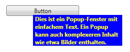

# Kontextmen&#252;
Das <xref:System.Windows.Controls.Primitives.Popup>\-Steuerelement zeigt Inhalt in einem separaten Fenster an, das unverankert über dem aktuellen Anwendungsfenster angezeigt wird.  
  
 Die folgende Abbildung zeigt ein <xref:System.Windows.Controls.Primitives.Popup>\-Steuerelement, das relativ zu einer <xref:System.Windows.Controls.Button> positioniert wird, bei der es sich um das ihm übergeordnete Element handelt.  
  
   
  
## In diesem Abschnitt  
 [Übersicht über Popups](../../../../docs/framework/wpf/controls/popup-overview.md)  
 [Verhalten beim Platzieren von Popups](../../../../docs/framework/wpf/controls/popup-placement-behavior.md)  
 [Gewusst wie\-Themen](../../../../docs/framework/wpf/controls/popup-how-to-topics.md)  
  
## Referenz  
 <xref:System.Windows.Controls.Primitives.Popup>  
  
## Verwandte Abschnitte