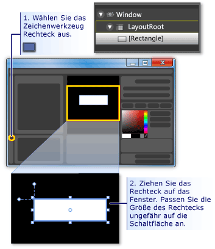
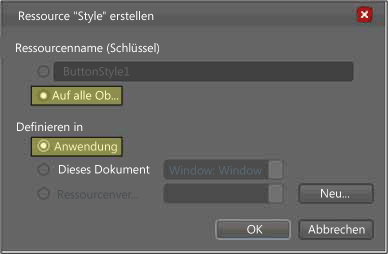
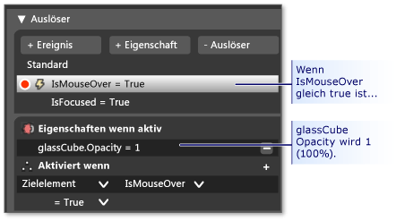
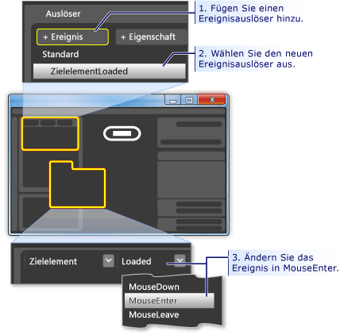
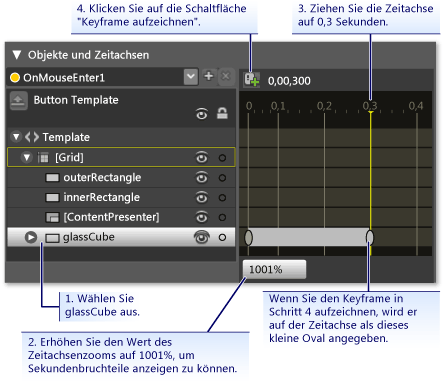
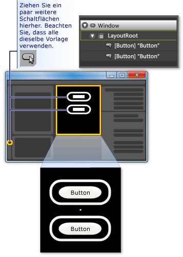

# Exemplarische Vorgehensweise: Erstellen einer Schaltfl&#228;che mit Microsoft Expression Blend
Diese exemplarische Vorgehensweise führt Sie durch das Erstellen einer benutzerdefinierten [!INCLUDE[TLA2#tla_wpf](../../../../includes/tla2sharptla-wpf-md.md)]\-Schaltfläche mit Microsoft Expression Blend.  
  
> [!IMPORTANT]
>  Microsoft Expression Blend generiert [!INCLUDE[TLA#tla_xaml](../../../../includes/tlasharptla-xaml-md.md)]\-Code, der dann kompiliert wird, um das ausführbare Programm zu erstellen.  Wenn Sie lieber direkt mit [!INCLUDE[TLA#tla_xaml](../../../../includes/tlasharptla-xaml-md.md)] arbeiten, gibt es eine weitere exemplarische Vorgehensweise, in der mit [!INCLUDE[TLA#tla_xaml](../../../../includes/tlasharptla-xaml-md.md)] die gleiche Anwendung erstellt wird wie in diesem Dokument. Dabei wird jedoch [!INCLUDE[vs_current_short](../../../../includes/vs-current-short-md.md)] statt Blend verwendet.  Weitere Informationen finden Sie unter [Erstellen einer Schaltfläche mit XAML](../../../../docs/framework/wpf/controls/walkthrough-create-a-button-by-using-xaml.md).  
  
 Die folgende Abbildung zeigt die benutzerdefinierte Schaltfläche, die Sie erstellen.  
  
   
  
## Konvertieren einer Form in eine Schaltfläche  
 Im ersten Teil dieser exemplarischen Vorgehensweise erstellen Sie das benutzerdefinierte Aussehen der benutzerdefinierten Schaltfläche.  Dazu konvertieren Sie zunächst ein Rechteck in eine Schaltfläche.  Sie fügen der Vorlage der Schaltfläche dann zusätzliche Formen hinzu und erstellen eine komplexere Schaltfläche.  Sie fragen sich vielleicht, warum Sie nicht mit einer normalen Schaltfläche beginnen und diese dann anpassen.  Eine Schaltfläche verfügt über integrierte Funktionen, die Sie nicht benötigen. Aus diesem Grund ist es bei benutzerdefinierten Schaltflächen einfacher, mit einem Rechteck zu beginnen.  
  
#### So erstellen Sie ein neues Projekt in Expression Blend  
  
1.  Starten Sie Expression Blend.  \(Klicken Sie auf **Start**, zeigen Sie auf **Alle Programme**, zeigen Sie dann auf **Microsoft Expression**, und klicken Sie anschließend auf **Microsoft Expression Blend**.\)  
  
2.  Maximieren Sie ggf. die Anwendung.  
  
3.  Klicken Sie im Menü **Datei** auf **Neues Projekt**.  
  
4.  Wählen Sie **Standardanwendung \(.exe\)** aus.  
  
5.  Nennen Sie das Projekt `CustomButton`, und klicken Sie auf **OK**.  
  
 Sie haben jetzt ein leeres [!INCLUDE[TLA2#tla_wpf](../../../../includes/tla2sharptla-wpf-md.md)]\-Projekt.  Sie können F5 drücken, um die Anwendung auszuführen.  Wie erwartet besteht die Anwendung nur aus einem leeren Fenster.  Danach erstellen Sie ein abgerundetes Rechteck und konvertieren es in eine Schaltfläche.  
  
#### So konvertieren Sie ein Rechteck in eine Schaltfläche  
  
1.  **Legen Sie die Window Background\-Eigenschaft auf Schwarz fest:** Wählen Sie das Fenster aus, klicken Sie auf die Registerkarte **Eigenschaften**, und legen Sie die <xref:System.Windows.Controls.Control.Background%2A>\-Eigenschaft auf `Black` fest.  
  
       
  
2.  **Zeichnen Sie im Fenster ein Rechteck, das ungefähr die Größe einer Schaltfläche hat:** Wählen Sie im linken Toolpanel das Rechtecktool aus, und ziehen Sie das Rechteck in das Fenster.  
  
       
  
3.  **Runden Sie die Ecken des Rechtecks ab:** Ziehen Sie entweder die Kontrollpunkte des Rechtecks, oder legen Sie die <xref:System.Windows.Shapes.Rectangle.RadiusX%2A>\-Eigenschaft und die <xref:System.Windows.Shapes.Rectangle.RadiusY%2A>\-Eigenschaft direkt fest.  Legen Sie die Werte <xref:System.Windows.Shapes.Rectangle.RadiusX%2A> und <xref:System.Windows.Shapes.Rectangle.RadiusY%2A> auf 20 fest.  
  
       
  
4.  **Konvertieren Sie das Rechteck in eine Schaltfläche:** Wählen Sie das Rechteck aus.  Klicken Sie im Menü **Werkzeuge** auf **Schaltfläche erstellen**.  
  
       
  
5.  **Geben Sie das Format\/die Vorlage an:** Ein Dialogfeld wird angezeigt, das ungefähr folgendermaßen aussieht.  
  
       
  
     Wählen Sie für **Ressourcenname \(Schlüssel\)** die Option **Auf alle Objekte anwenden** aus.  Dadurch werden die resultierende Formatvorlage sowie die Schaltflächenvorlage auf alle Objekte angewendet, die Schaltflächen sind.  Wählen Sie für **Definieren in** die Option **Anwendung** aus.  Dadurch werden die resultierende Formatvorlage sowie die Schaltflächenvorlage für die gesamte Anwendung gültig.  Wenn Sie Werte in diesen zwei Feldern festlegen, werden der Schaltflächenformatvorlage und die Schaltflächenvorlage auf alle Schaltflächen in der Anwendung angewendet, und jede in der Anwendung erstellte Schaltfläche verwendet diese Vorlage standardmäßig.  
  
## Bearbeiten der Schaltflächenvorlage  
 Sie haben jetzt ein Rechteck, das in eine Schaltfläche umgewandelt wurde.  In diesem Abschnitt ändern Sie die Vorlage der Schaltfläche und nehmen weitere Anpassungen am Aussehen vor.  
  
#### So bearbeiten Sie die Schaltflächenvorlage, um die Schaltflächendarstellung zu ändern  
  
1.  **Wechseln Sie in die Ansicht zum Bearbeiten der Vorlage:** Wenn Sie das Aussehen der Schaltfläche weiter anpassen möchten, müssen Sie die Schaltflächenvorlage bearbeiten.  Diese Vorlage wurde erstellt, als Sie das Rechteck in eine Schaltfläche konvertiert haben.  Um die Schaltflächenvorlage zu bearbeiten, klicken Sie mit der rechten Maustaste auf die Schaltfläche, wählen Sie **Steuerelementteile bearbeiten \(Vorlage\)** und anschließend **Vorlage bearbeiten** aus.  
  
       
  
     Beachten Sie im Vorlagen\-Editor, dass die Schaltfläche jetzt in ein <xref:System.Windows.Shapes.Rectangle> und den <xref:System.Windows.Controls.ContentPresenter> aufgeteilt wird.  Der <xref:System.Windows.Controls.ContentPresenter> wird verwendet, um Inhalt innerhalb der Schaltfläche anzuzeigen \(z. B. die Zeichenfolge "Button"\).  Sowohl das Rechteck als auch der <xref:System.Windows.Controls.ContentPresenter> werden in einem <xref:System.Windows.Controls.Grid> angeordnet.  
  
       
  
2.  **Ändern Sie die Namen der Vorlagenkomponenten:** Klicken Sie  im Vorlagenbestand mit der rechten Maustaste auf das Rechteck, ändern Sie den <xref:System.Windows.Shapes.Rectangle>\-Namen von "\[Rectangle\]" in "outerRectangle", und ändern Sie "\[ContentPresenter\]" in "myContentPresenter".  
  
       
  
3.  **Ändern Sie das Rechteck, sodass es innen leer ist \(wie ein Doughnut\):** Wählen Sie **outerRectangle** aus, und legen Sie <xref:System.Windows.Shapes.Shape.Fill%2A> auf "Transparent" und <xref:System.Windows.Shapes.Shape.StrokeThickness%2A> auf 5 fest.  
  
       
  
     Legen Sie dann den <xref:System.Windows.Shapes.Shape.Stroke%2A> auf die Farbe fest, die in der Vorlage verwendet werden soll.  Klicken Sie dazu auf das kleine weiße Feld neben **Strich**, wählen Sie **CustomExpression** aus, und geben Sie im Dialogfeld "{TemplateBinding Background}" ein.  
  
       
  
4.  **Erstellen Sie ein inneres Rechteck:** Erstellen Sie nun ein weiteres Rechteck \(nennen Sie es "innerRectangle"\), und platzieren Sie es symmetrisch innerhalb des **outerRectangle**.  Für diesen Schritt ist es empfehlenswert, die Ansicht zu vergrößern, damit die Schaltfläche im Bearbeitungsbereich größer dargestellt wird.  
  
    > [!NOTE]
    >  Ihr Rechteck sieht möglicherweise anders aus als das in der Abbildung \(es könnte beispielsweise abgerundete Ecken haben\).  
  
       
  
5.  **Verschieben Sie ContentPresenter nach oben:** Es ist möglich, dass der Text "Button" jetzt nicht mehr sichtbar ist.  Wenn dies der Fall ist, liegt das daran, dass sich **innerRectangle** über **myContentPresenter** befindet.  Sie können dieses Problem beheben, indem Sie **myContentPresenter** unter **innerRectangle** ziehen.  Platzieren Sie die Rechtecke und **myContentPresenter** neu, bis die Schaltfläche ähnlich wie unten dargestellt aussieht.  
  
    > [!NOTE]
    >  Alternativ können Sie auch **myContentPresenter** im Vordergrund platzieren, indem Sie mit der rechten Maustaste darauf klicken und anschließend auf **Eine Ebene nach vorne** klicken.  
  
       
  
6.  **Ändern Sie die Darstellung von innerRectangle:** Legen Sie die Werte für <xref:System.Windows.Shapes.Rectangle.RadiusX%2A>, <xref:System.Windows.Shapes.Rectangle.RadiusY%2A> und <xref:System.Windows.Shapes.Shape.StrokeThickness%2A> auf 20 fest.  Legen Sie zusätzlich <xref:System.Windows.Shapes.Shape.Fill%2A> für den Hintergrund der Vorlage fest, indem Sie den benutzerdefinierten Ausdruck "{TemplateBinding Background}" \) verwenden, und legen Sie <xref:System.Windows.Shapes.Shape.Stroke%2A> auf "transparent" fest.  Beachten Sie, dass die Einstellungen für <xref:System.Windows.Shapes.Shape.Fill%2A> und <xref:System.Windows.Shapes.Shape.Stroke%2A> für **innerRectangle** genau entgegengesetzt zu den Einstellungen für **outerRectangle** sind.  
  
       
  
7.  **Fügen Sie oben auf der Schaltfläche eine Glasebene hinzu:** Der letzte Schritt beim Anpassen des Aussehens der Schaltfläche ist das Hinzufügen einer Glasebene oben auf der Schaltfläche.  Diese Glasebene besteht aus einem dritten Rechteck.  Da das Glas die gesamte Schaltfläche bedecken wird, entspricht die Größe des Glasrechtecks den Abmessungen des **outerRectangle**.  Erstellen Sie das Rechteck also einfach, indem Sie das **outerRectangle** kopieren.  Markieren Sie **outerRectangle**, und verwenden Sie STRG\+C und STRG\+V, um eine Kopie zu erstellen.  Nennen Sie dieses neue Rechteck "glassCube".  
  
8.  **Positionieren Sie glassCube ggf. neu:** Wenn **glassCube** noch nicht so positioniert wurde, dass die gesamte Schaltfläche bedeckt ist, ziehen Sie glassCube an die richtige Position.  
  
9. **Geben Sie glassCube eine etwas andere Form als outerRectangle:** Ändern Sie die Eigenschaften von **glassCube**.  Beginnen Sie damit, die <xref:System.Windows.Shapes.Rectangle.RadiusX%2A>\-Eigenschaft und die <xref:System.Windows.Shapes.Rectangle.RadiusY%2A>\-Eigenschaft in 10 sowie die <xref:System.Windows.Shapes.Shape.StrokeThickness%2A> in 2 zu ändern.  
  
       
  
10. **Lassen Sie glassCube wie Glas aussehen:** Legen Sie <xref:System.Windows.Shapes.Shape.Fill%2A> so fest, dass ein Glaseffekt erzielt wird, indem Sie einen linearen Farbverlauf verwenden, der zu 75 % deckend ist und in sechs ungefähr gleichmäßigen Intervallen zwischen der Farbe Weiß und Transparent wechselt.  Sie müssen die Farbverlaufsunterbrechungspunkte wie folgt festlegen:  
  
    -   Farbverlaufsunterbrechungspunkt 1: Weiß mit einem Alphawert von 75 %  
  
    -   Farbverlaufsunterbrechungspunkt 2: Transparent  
  
    -   Farbverlaufsunterbrechungspunkt 3: Weiß mit einem Alphawert von 75 %  
  
    -   Farbverlaufsunterbrechungspunkt 4: Transparent  
  
    -   Farbverlaufsunterbrechungspunkt 5: Weiß mit einem Alphawert von 75 %  
  
    -   Farbverlaufsunterbrechungspunkt 6: Transparent  
  
     Auf diese Weise wird ein Eindruck von "gewelltem" Glas erzielt.  
  
       
  
11. **Blenden Sie die Glasebene aus:** Nachdem Sie gesehen haben, wie die Glasebene aussieht, wechseln Sie zum **Darstellungsbereich** von **Eigenschaftenpanel**, und legen Sie die Deckkraft auf 0 % fest, um die Ebene auszublenden.  In den folgenden Abschnitten werden Eigenschaftentrigger und \-ereignisse verwendet, um die Glasebene anzuzeigen und zu ändern.  
  
       
  
## Anpassen des Schaltflächenverhaltens  
 Sie haben jetzt die Darstellung der Schaltfläche angepasst, indem Sie die Vorlage geändert haben. Die Schaltfläche reagiert jedoch bei Benutzeraktionen nicht wie eine normale Schaltfläche \(beispielsweise Ändern der Darstellung bei einem Mouseover\-Ereignis, Erhalten des Fokus und Klicken\). Die nächsten zwei Vorgänge zeigen, wie ein solches Verhalten in der benutzerdefinierten Schaltfläche integriert wird.  Beginnen Sie mit einfachen Eigenschaftentriggern, und fügen Sie dann Ereignistrigger und Animationen hinzu.  
  
#### So legen Sie Eigenschaftentrigger fest  
  
1.  **Erstellen Sie einen neuen Eigenschaftentrigger:** Wählen Sie **glassCube** aus, und klicken Sie im Bereich **Auslöser** auf **Eigenschaft** \(siehe die Abbildung nach dem nächsten Schritt\).  Dies erstellt einen Eigenschaftentrigger mit einem Standardeigenschaftentrigger.  
  
2.  **Machen Sie IsMouseOver zur vom Trigger verwendeten Eigenschaft:** Ändern Sie die Eigenschaft in <xref:System.Windows.UIElement.IsMouseOver%2A>.  Dadurch wird der Eigenschaftentrigger aktiviert, wenn die <xref:System.Windows.UIElement.IsMouseOver%2A>\-Eigenschaft auf `true` festgelegt ist \(wenn der Benutzer mit der Maus auf die Schaltfläche zeigt\).  
  
       
  
3.  **IsMouseOver löst die Deckkraft von 100 % für glassCube aus:** Beachten Sie, dass die Option **Auslöseraufzeichnung ist an** ausgewählt ist \(siehe vorherige Abbildung\).  Dies bedeutet, dass alle Änderungen, die Sie während der Aufzeichnung an den Eigenschaftswerten von **glassCube** vornehmen, zu Aktionen werden, die ausgeführt werden, wenn <xref:System.Windows.UIElement.IsMouseOver%2A> `true` ist.  Ändern Sie während der Aufzeichnung die <xref:System.Windows.UIElement.Opacity%2A> von **glassCube** in 100 %.  
  
       
  
     Sie haben jetzt den ersten Eigenschaftentrigger erstellt.  Beachten Sie, dass die Änderung der <xref:System.Windows.UIElement.Opacity%2A> in 100 % vom **Auslöserpanel** des Editors aufgezeichnet wurde.  
  
       
  
     Drücken Sie F5, um die Anwendung auszuführen, und bewegen Sie den Mauszeiger über die Schaltfläche und von der Schaltfläche weg.  Die Glasebene sollte angezeigt werden, wenn Sie die Maus über die Schaltfläche bewegen, und wieder ausgeblendet werden, sobald der Mauszeiger die Schaltfläche verlässt.  
  
4.  **IsMouseOver löst eine Änderung des Werts für den Strich aus:** Ordnen Sie dem <xref:System.Windows.UIElement.IsMouseOver%2A>\-Trigger einige andere Aktionen zu.  Während die Aufzeichnung fortgesetzt wird, wählen Sie statt **glassCube** jetzt **outerRectangle** aus.  Legen Sie dann den <xref:System.Windows.Shapes.Shape.Stroke%2A> von **outerRectangle** auf den benutzerdefinierten Ausdruck von "{DynamicResource {x:Static SystemColors.HighlightBrushKey}}" fest.  Dadurch wird der <xref:System.Windows.Shapes.Shape.Stroke%2A> auf die typische von Schaltflächen verwendete Hervorhebungsfarbe festgelegt.  Drücken Sie F5, um den Effekt zu sehen, wenn Sie die Maus über die Schaltfläche bewegen.  
  
       
  
5.  **IsMouseOver löst verschwommenen Text aus:** Ordnen Sie dem <xref:System.Windows.UIElement.IsMouseOver%2A>\-Eigenschaftentrigger eine weitere Aktion zu.  Lassen Sie den Inhalt der Schaltfläche ein wenig verschwommen aussehen, wenn das Glas darüber angezeigt wird.  Dazu können Sie einen Weichzeichner\-<xref:System.Windows.Media.Effects.BitmapEffect> auf <xref:System.Windows.Controls.ContentPresenter> \(**myContentPresenter**\) anwenden.  
  
       
  
    > [!NOTE]
    >  Um das **Eigenschaftenpanel** wieder in den Zustand vor der Suche nach <xref:System.Windows.Media.Effects.BitmapEffect> zurückzuversetzen, löschen Sie den Text aus dem Feld **Suchen**.  
  
     Sie haben jetzt einen Eigenschaftentrigger mit mehreren damit verknüpften Aktionen verwendet, um ein Hervorhebungsverhalten zu erstellen, das anzeigt, dass der Mauszeiger in den Schaltflächenbereich eintritt oder ihn verlässt.  Ein weiteres typisches Verhalten für eine Schaltfläche ist, dass sie hervorgehoben wird, wenn sie den Fokus erhält \(beispielsweise, nachdem auf die Schaltfläche geklickt wurde\).  Sie können ein solches Verhalten hinzufügen, indem Sie einen weiteren Eigenschaftentrigger für die <xref:System.Windows.UIElement.IsFocused%2A>\-Eigenschaft hinzufügen.  
  
6.  **Erstellen Sie einen Eigenschaftentrigger für IsFocused:** Erstellen Sie mit dem gleichen Verfahren wie für <xref:System.Windows.UIElement.IsMouseOver%2A> \(siehe den ersten Schritt in diesem Abschnitt\) einen weiteren Eigenschaftentrigger für die <xref:System.Windows.UIElement.IsFocused%2A>\-Eigenschaft.  Fügen Sie dem Trigger bei ausgewählter Option **Auslöseraufzeichnung ist an** die folgenden Aktionen hinzu:  
  
    -   **glassCube** erhält eine <xref:System.Windows.UIElement.Opacity%2A> von 100 %.  
  
    -   **outerRectangle** erhält für <xref:System.Windows.Shapes.Shape.Stroke%2A> einen benutzerdefinierten Ausdruckswert von "{DynamicResource {x:Static SystemColors.Hig hlightBrushKey}}".  
  
 Im letzten Schritt dieser exemplarischen Vorgehensweise fügen Sie der Schaltfläche Animationen hinzu.  Diese Animationen werden von Ereignissen ausgelöst, insbesondere von den Ereignissen <xref:System.Windows.UIElement.MouseEnter> und <xref:System.Windows.Controls.Primitives.ButtonBase.Click>.  
  
#### So verwenden Sie Ereignistrigger und Animationen, um Interaktivität hinzuzufügen.  
  
1.  **Erstellen Sie einen MouseEnter\-Ereignistrigger:** Fügen Sie einen neuen Ereignistrigger hinzu, und wählen Sie <xref:System.Windows.UIElement.MouseEnter> als Ereignis aus, das in dem Trigger verwendet werden soll.  
  
       
  
2.  **Erstellen Sie eine Animationszeitachse:** Ordnen Sie als nächsten Schritt dem <xref:System.Windows.UIElement.MouseEnter>\-Ereignis eine Animationszeitachse zu.  
  
       
  
     Nachdem Sie auf **OK** geklickt haben, um eine neue Zeitachse zu erstellen, wird ein **Zeitachsenpanel** angezeigt, und die Meldung "Zeitachsenaufzeichnung ist an" wird im Entwurfspanel angezeigt.  Dies bedeutet, dass Sie anfangen können, Änderungen an den Eigenschaften der Zeitachse \(Animieren von Eigenschaftenänderungen\) aufzuzeichnen.  
  
    > [!NOTE]
    >  Sie müssen möglicherweise die Größe des Fensters und\/oder der Panels ändern, damit Sie die Anzeige sehen können.  
  
       
  
3.  **Erstellen Sie einen Keyframe:** Um eine Animation zu erstellen, wählen Sie das Objekt aus, das Sie animieren möchten, erstellen Sie ein oder zwei Keyframes auf der Zeitachse, und legen Sie für diese Keyframes die Eigenschaftswerte fest, zwischen denen die Animation interpolieren soll.  Die folgende Abbildung führt Sie durch die Erstellung eines Keyframes.  
  
       
  
4.  **Verkleinern von glassCube bei diesem Keyframe:** Wenn Sie den zweiten Keyframe ausgewählt haben, verringern Sie die Größe von **glassCube** auf 90 % seiner vollen Größe, indem Sie **Größentransformation** verwenden.  
  
       
  
     Drücken Sie F5, um die Anwendung auszuführen.  Bewegen Sie den Mauszeiger über die Schaltfläche.  Beachten Sie, dass die Glasebene oben auf der Schaltfläche verkleinert wird.  
  
5.  **Erstellen Sie einen weiteren Ereignistrigger, und ordnen Sie ihm eine andere Animation zu:** Fügen Sie eine weitere Animation hinzu.  Verwenden Sie ein ähnliches Verfahren wie das, mit dem Sie die vorherige Ereignistriggeranimation erstellt haben:  
  
    1.  Erstellen Sie mit dem <xref:System.Windows.Controls.Primitives.ButtonBase.Click>\-Ereignis einen neuen Ereignistrigger.  
  
    2.  Ordnen Sie dem <xref:System.Windows.Controls.Primitives.ButtonBase.Click>\-Ereignis eine neue Zeitachse zu.  
  
       
  
    1.  Erstellen Sie für diese Zeitachse zwei Keyframes, einen bei 0,0 Sekunden und den zweiten bei 0,3 Sekunden.  
  
    2.  Heben Sie den Keyframe bei 0,3 Sekunden hervor, und legen Sie **Transformationswinkel drehen** auf 360 Grad fest.  
  
       
  
    1.  Drücken Sie F5, um die Anwendung auszuführen.  Klicken Sie auf die Schaltfläche.  Beachten Sie, dass sich die Glasebene dreht.  
  
## Schlussfolgerung  
 Sie haben eine benutzerdefinierte Schaltfläche erstellt.  Sie haben dazu eine Schaltflächenvorlage verwendet, die auf alle Schaltflächen in der Anwendung angewendet wurde.  Wenn Sie den Bearbeitungsmodus für die Vorlage verlassen \(siehe folgende Abbildung\) und weitere Schaltflächen erstellen, werden Sie feststellen, dass diese nicht wie die Standardschaltfläche, sondern wie Ihre benutzerdefinierte Schaltfläche aussehen und reagieren.  
  
   
  
   
  
 Drücken Sie F5, um die Anwendung auszuführen.  Klicken Sie auf die Schaltflächen und beachten Sie, dass das Verhalten aller Schaltflächen gleich ist.  
  
 Beim Anpassen der Vorlage haben Sie die <xref:System.Windows.Shapes.Shape.Fill%2A>\-Eigenschaft von **innerRectangle** und die <xref:System.Windows.Shapes.Shape.Stroke%2A>\-Eigenschaft von **outerRectangle** auf den Vorlagenhintergrund \({TemplateBinding Background}\) festgelegt.  Wenn Sie die Hintergrundfarbe für die einzelnen Schaltflächen festlegen, wird daher der festgelegte Hintergrund für diese entsprechenden Eigenschaften verwendet.  Versuchen Sie, jetzt den Hintergrund zu ändern.  In der folgenden Abbildung werden verschiedene Farbverläufe verwendet.  Obwohl eine Vorlage für das generelle Anpassen von Steuerelementen \(z. B. Schaltflächen\) nützlich ist, können Steuerelemente mit Vorlagen immer noch bearbeitet werden, sodass sie unterschiedlich aussehen.  
  
   
  
 Beim Erstellen einer benutzerdefinierten Schaltflächenvorlage haben Sie gelernt, wie Sie folgende Schritte in Microsoft Expression Blend ausführen:  
  
-   Anpassen des Aussehens eines Steuerelements.  
  
-   Festlegen von Eigenschaftentriggern.  Eigenschaftentrigger sind sehr nützlich, da sie nicht nur für Steuerelemente, sondern für die meisten Objekte verwendet werden können.  
  
-   Festlegen von Ereignistriggern.  Ereignistrigger sind sehr nützlich, da sie nicht nur für Steuerelemente, sondern für die meisten Objekte verwendet werden können.  
  
-   Erstellen von Animationen.  
  
-   Verschiedene Vorgänge: Erstellen von Farbverläufen, Hinzufügen von BitmapEffects, Verwenden von Transformationen und Festlegen von grundlegenden Objekt\-Eigenschaften.  
  
## Siehe auch  
 [Erstellen einer Schaltfläche mit XAML](../../../../docs/framework/wpf/controls/walkthrough-create-a-button-by-using-xaml.md)   
 [Erstellen von Formaten und Vorlagen](../../../../docs/framework/wpf/controls/styling-and-templating.md)   
 [Übersicht über Animationen](../../../../docs/framework/wpf/graphics-multimedia/animation-overview.md)   
 [Übersicht über das Zeichnen mit Volltonfarben und Farbverläufen](../../../../docs/framework/wpf/graphics-multimedia/painting-with-solid-colors-and-gradients-overview.md)   
 [Übersicht über Bitmapeffekte](../../../../docs/framework/wpf/graphics-multimedia/bitmap-effects-overview.md)