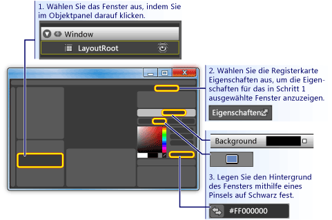
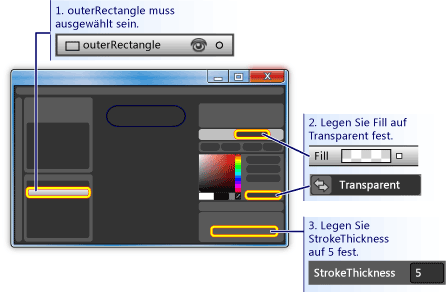
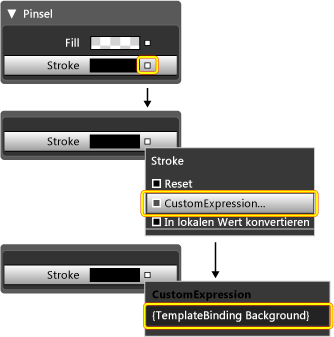
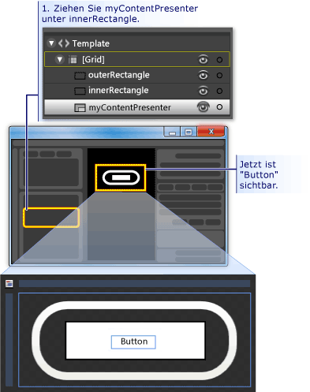
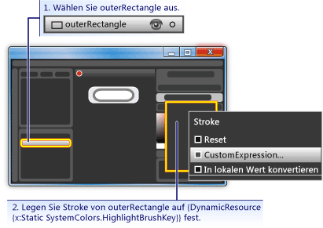

# Exemplarische Vorgehensweise: Erstellen einer Schaltfläche mit Microsoft Expression Blend
Diese exemplarische Vorgehensweise führt Sie schrittweise durch den Prozess zum Erstellen einer [!INCLUDE[TLA2#tla_wpf](../../../../includes/tla2sharptla-wpf-md.md)] benutzerdefinierte Schaltfläche mit Microsoft Expression Blend.  
  
> [!IMPORTANT]
>  Microsoft Expression Blend funktioniert durch die Erstellung [!INCLUDE[TLA#tla_xaml](../../../../includes/tlasharptla-xaml-md.md)] , wird dann kompiliert, das ausführbare Programm vornehmen. Wenn Sie lieber mit arbeiten [!INCLUDE[TLA#tla_xaml](../../../../includes/tlasharptla-xaml-md.md)] direkt, besteht ein anderes Exemplarische Vorgehensweise, die die gleiche Anwendung wie diese erstellt [!INCLUDE[TLA#tla_xaml](../../../../includes/tlasharptla-xaml-md.md)] mit Visual Studio anstelle von Blend. Finden Sie unter [erstellen Sie eine Schaltfläche durch Verwendung von XAML-](../../../../docs/framework/wpf/controls/walkthrough-create-a-button-by-using-xaml.md) für Weitere Informationen.  
  
 Die folgende Abbildung zeigt der benutzerdefinierten Schaltfläche, die Sie erstellen.  
  
   
  
## Konvertieren von Formen mit einer Schaltfläche  
 Im ersten Teil dieser exemplarischen Vorgehensweise erstellen Sie die benutzerdefinierte Darstellung der die benutzerdefinierte Schaltfläche. Zu diesem Zweck, konvertieren Sie zuerst ein Rechteck mit einer Schaltfläche. Anschließend fügen Sie weitere Formen der Vorlage der Schaltfläche, erstellen eine komplexere Schaltfläche. Warum nicht mit eine normale Schaltfläche beginnen, und passen Sie sie? Da eine Schaltfläche verfügt über integrierte Funktionen, die Sie nicht benötigen; für benutzerdefinierte Schaltflächen ist es einfacher, mit einem Rechteck beginnen.  
  
#### So erstellen ein neues Projekt in Expression Blend  
  
1.  Starten Sie Expression Blend. (Klicken Sie auf **starten**, zeigen Sie auf **Programme**, zeigen Sie auf **Microsoft Expression**, und klicken Sie dann auf **Microsoft Expression Blend**.)  
  
2.  Maximieren Sie die Anwendung bei Bedarf.  
  
3.  Klicken Sie im Menü **Datei** auf **Neues Projekt**.  
  
4.  Wählen Sie **Standard-Anwendung (.exe)**.  
  
5.  Nennen Sie das Projekt `CustomButton` , und drücken Sie **OK**.  
  
 An diesem Punkt haben Sie ein leeres [!INCLUDE[TLA2#tla_wpf](../../../../includes/tla2sharptla-wpf-md.md)] Projekt. Drücken Sie F5, um die Anwendung auszuführen. Wie zu erwarten, besteht die Anwendung nur ein leeres Fenster aus. Als Nächstes erstellen ein abgerundetes Rechteck und ihn in eine Schaltfläche zu konvertieren.  
  
#### Um ein Rechteck mit einer Schaltfläche zu konvertieren.  
  
1.  **Das Fenster Hintergrundeigenschaft auf Schwarz festgelegt:** wählen Sie das Fenster aus, klicken Sie auf die **Registerkarte "Eigenschaften"**, und legen Sie die <xref:System.Windows.Controls.Control.Background%2A> Eigenschaft, um `Black`.  
  
       
  
2.  **Zeichnen Sie ein Rechteck ungefähr der Größe einer Schaltfläche auf das Fenster:** wählen Sie das Rechteck-Tool im linken Tool-Bereich, und ziehen Sie das Rechteck in das Fenster.  
  
       
  
3.  **Runden Sie die Ecken des Rechtecks:** entweder die Steuerpunkte des Rechtecks ziehen, oder legen Sie direkt die <xref:System.Windows.Shapes.Rectangle.RadiusX%2A> und <xref:System.Windows.Shapes.Rectangle.RadiusY%2A> Eigenschaften. Legen Sie die Werte der <xref:System.Windows.Shapes.Rectangle.RadiusX%2A> und <xref:System.Windows.Shapes.Rectangle.RadiusY%2A> bis 20.  
  
       
  
4.  **Ändern Sie das Rechteck in eine Schaltfläche:** wählen Sie das Rechteck. Auf der **Tools** Menü klicken Sie auf **Schaltfläche**.  
  
       
  
5.  **Geben Sie den Bereich der Formatvorlage:** ein Dialogfeld an, wie im folgenden wird angezeigt.  
  
       
  
     Für **Resource Name (Schlüssel)** Option **anwenden auf alle**.  Dies veranlasst das resultierende Stil und einem Schaltflächenvorlage auf alle Objekte angewendet, die Schaltflächen sind. Für **definieren in**Option **Anwendung**. Dies veranlasst das resultierende Stil und einem Schaltflächenvorlage Bereich über die gesamte Anwendung aufweisen. Wenn Sie die Werte in diesen beiden Felder festlegen, die Schaltflächenformat und Vorlage gelten für alle Schaltflächen in der gesamten Anwendung und keine der Schaltflächen, die Sie in der Anwendung zu erstellen, wird standardmäßig verwenden Sie diese Vorlage.  
  
## Bearbeiten Sie die Schaltflächenvorlage  
 Sie haben jetzt ein Rechteck, das mit einer Schaltfläche geändert wurde. In diesem Abschnitt Sie die Vorlage der Schaltfläche ändern und weiter anpassen, wie er aussieht.  
  
#### So bearbeiten Sie die Schaltflächenvorlage, um das Erscheinungsbild der Schaltfläche zu ändern.  
  
1.  **Wechseln Sie in der Bearbeitungsansicht für Vorlage:** um das Aussehen der Schaltfläche noch weiter anzupassen, müssen wir die Schaltflächenvorlage bearbeiten. Diese Vorlage wurde erstellt, wenn wir das Rechteck in eine Schaltfläche konvertiert. Um die Schaltflächenvorlage zu bearbeiten, der rechten Maustaste, und wählen Sie **bearbeiten-Steuerelementteile (Vorlage)** und dann **Vorlage bearbeiten**.  
  
       
  
     Beachten Sie in der Vorlagen-Editor, dass die Schaltfläche in aufgeteilt ist ein <xref:System.Windows.Shapes.Rectangle> und die <xref:System.Windows.Controls.ContentPresenter>. Die <xref:System.Windows.Controls.ContentPresenter> wird verwendet, um Inhalt innerhalb der Schaltfläche (z. B. die Zeichenfolge "Button"). Sowohl das Rechteck und <xref:System.Windows.Controls.ContentPresenter> innerhalb eines angelegt sind eine <xref:System.Windows.Controls.Grid>.  
  
       
  
2.  **Ändern Sie die Namen der Vorlagenkomponenten:** mit der rechten Maustaste in des Rechtecks in der Vorlage Inventur, Änderung der <xref:System.Windows.Shapes.Rectangle> Benennen von "[Rectangle]" in "OuterRectangle", und ändern Sie "[ContentPresenter]" in "MyContentPresenter".  
  
       
  
3.  **Ändern Sie das Rechteck aus, sodass sie innerhalb von (z. B. ein Rad) leer ist:** wählen **OuterRectangle** und <xref:System.Windows.Shapes.Shape.Fill%2A> auf "Transparent" und <xref:System.Windows.Shapes.Shape.StrokeThickness%2A> auf 5.  
  
       
  
     Legen Sie dann die <xref:System.Windows.Shapes.Shape.Stroke%2A> die Farbe von der Vorlage verwendet werden wird. Zu diesem Zweck klicken Sie auf das kleine weiße Feld neben **Strich**Option **CustomExpression**, und geben Sie im Dialogfeld "{TemplateBinding Background}".  
  
       
  
4.  **Erstellen Sie ein inneres Rechteck:** erstellen Sie nun ein weiteres Rechteck (nennen Sie es "InnerRectangle"), und positionieren Sie es symmetrisch innerhalb der **OuterRectangle** . Für diese Art der arbeiten sollten Sie wahrscheinlich um die Schaltfläche im Bearbeitungsbereich vergrößern/verkleinern.  
  
    > [!NOTE]
    >  Das Rechteck kann andere als die in der Abbildung aussehen (z. B. es möglicherweise abgerundete Ecken haben).  
  
       
  
5.  **Bewegen Sie ContentPresenter nach oben:** an dieser Stelle ist es möglich, dass der Text "Button" nicht mehr sichtbar sind. Wenn dies der Fall ist, ist dies da **InnerRectangle** wird auf der Basis von der **MyContentPresenter**. Um dieses Problem zu beheben, ziehen Sie **MyContentPresenter** unten **InnerRectangle**. Positionieren Sie Rechtecke und **MyContentPresenter** in der folgenden Abbildung aussehen.  
  
    > [!NOTE]
    >  Alternativ können Sie auch positionieren **MyContentPresenter** an erster Stelle, indem sie mit der rechten Maustaste, und **vorne**.  
  
       
  
6.  **Ändern der Darstellung von InnerRectangle:** legen Sie die <xref:System.Windows.Shapes.Rectangle.RadiusX%2A>, <xref:System.Windows.Shapes.Rectangle.RadiusY%2A>, und <xref:System.Windows.Shapes.Shape.StrokeThickness%2A> Werte bis 20. Darüber hinaus legen Sie die <xref:System.Windows.Shapes.Shape.Fill%2A> dem Hintergrund der Vorlage mit den benutzerdefinierten Ausdruck "{TemplateBinding Background}"), und legen <xref:System.Windows.Shapes.Shape.Stroke%2A> "transparent". Beachten Sie, dass die Einstellungen für die <xref:System.Windows.Shapes.Shape.Fill%2A> und <xref:System.Windows.Shapes.Shape.Stroke%2A> von **InnerRectangle** sind das Gegenteil von denen für **OuterRectangle**.  
  
       
  
7.  **Hinzufügen eine Glasebene an erster Stelle:** letzte Teil Anpassen des Aussehens der Schaltfläche zum Hinzufügen einer Glass-Ebene im Vordergrund ist. Diese Glasebene besteht aus einem dritten Rechteck. Da das Glas auf die Schaltfläche mit den gesamten behandelt wird, gleicht das Glasrechteck in Dimensionen aus, die die **OuterRectangle**. Aus diesem Grund erstellen Sie das Rechteck einfach, indem Sie das eine Kopie der **OuterRectangle**. Markieren Sie **OuterRectangle** und verwenden Sie STRG + C und STRG + V, um eine Kopie zu erstellen. Nennen Sie dieses neue Rechteck "GlassCube".  
  
8.  **Positionieren Sie GlassCube ggf.:** Wenn **GlassCube** ist noch nicht positioniert, damit die gesamte Schaltfläche bedeckt, ziehen Sie es in Position.  
  
9. **Geben Sie eine etwas andere Form als OuterRectangle GlassCube:** Ändern der Eigenschaften eines **GlassCube**. Zunächst durch Ändern der <xref:System.Windows.Shapes.Rectangle.RadiusX%2A> und <xref:System.Windows.Shapes.Rectangle.RadiusY%2A> Eigenschaften auf 10 und der <xref:System.Windows.Shapes.Shape.StrokeThickness%2A> auf 2.  
  
       
  
10. **Stellen GlassCube Glas aussehen:** legen Sie die <xref:System.Windows.Shapes.Shape.Fill%2A> um einen Glaseffekt mit ein linearer Farbverlauf, der 75 % undurchsichtig und wechselt zwischen der Farbe Weiß und Transparent über 6 ungefähr gleichmäßig verteilt Intervallen. Was die Farbverlaufsstopps auf festgelegt ist:  
  
    -   Farbverlaufsstopps 1: Whitepaper mit Alphawert von 75 %  
  
    -   Farbverlaufsstopp 2: Transparente  
  
    -   Farbverlaufsstopps 3: Whitepaper mit Alphawert von 75 %  
  
    -   Farbverlaufsstopp 4: Transparente  
  
    -   Farbverlaufsstopps 5: Whitepaper mit Alphawert von 75 %  
  
    -   Farbverlaufsstopp 6: Transparente  
  
     Dadurch wird ein "Wellenlinien" Glas Erscheinungsbild erstellt.  
  
       
  
11. **Ausblenden Glas:** nun, dass Sie sehen, wie die Glasebene Ebene aussieht, wechseln Sie in der **Darstellungsbereich** von der **Eigenschaftenbereich** und legen Sie die Deckkraft 0 %, um ihn auszublenden. In den folgenden Abschnitten verwenden wir Eigenschaftsauslöser und Ereignisse anzeigen und bearbeiten die Glass-Ebene.  
  
       
  
## Das Verhalten der Schaltfläche anzupassen  
 Zu diesem Zeitpunkt Sie die Darstellung der Schaltfläche durch Bearbeitung der Vorlage angepasst haben, aber die Schaltfläche "" nicht als Reaktion auf Benutzeraktionen wie normale Schaltflächen (z. B. Ändern der Darstellung von Maus über den Fokus erhält und auf.) Die folgenden beiden Verfahren zeigen, wie zum Erstellen von Verhalten, wie diese in die benutzerdefinierte Schaltfläche. Wir beginnen mit einfache Eigenschaftentrigger und anschließend Ereignistriggern und Animationen hinzufügen.  
  
#### So legen Sie die Eigenschaft Trigger  
  
1.  **Erstellen Sie einen neuen Eigenschaftsauslöser:** mit **GlassCube** ausgewählt haben, klicken Sie auf **+ Eigenschaft** in der **Trigger** Bereich (siehe Abbildung, die als Nächstes folgt). Dadurch werden einen Eigenschaftsauslöser einen Eigenschaftsauslöser Standardwert erstellt.  
  
2.  **Machen Sie die Eigenschaft, die vom Trigger verwendet IsMouseOver:** ändern Sie die Eigenschaft in <xref:System.Windows.UIElement.IsMouseOver%2A>. Dadurch wird die Eigenschaftentrigger aktiviert, wenn die <xref:System.Windows.UIElement.IsMouseOver%2A> Eigenschaft ist `true` (wenn der Benutzer mit der Maus auf die Schaltfläche zeigt).  
  
       
  
3.  **IsMouseOver löst die Deckkraft von 100 % für GlassCube:** Beachten Sie, dass die **Trigger Aufzeichnung befindet sich auf** (finden Sie in der obigen Abbildung). Dies bedeutet, dass alle Änderungen an den Eigenschaftswerten des **GlassCube** werden während der Aufzeichnung auf wird eine Aktion, die ausgeführt wird, wenn <xref:System.Windows.UIElement.IsMouseOver%2A> ist `true`. Ändern Sie während der Aufzeichnung der <xref:System.Windows.UIElement.Opacity%2A> von **GlassCube** auf 100 % fest.  
  
       
  
     Sie haben Ihre erste Eigenschaftsauslöser jetzt erstellt. Beachten Sie, dass die **Bereich Trigger** des Editors aufgezeichnet hat die <xref:System.Windows.UIElement.Opacity%2A> auf 100 % geändert wird.  
  
       
  
     Drücken Sie F5, um die Anwendung auszuführen, und bewegen den Mauszeiger über und deaktiviert die Schaltfläche "" ein. Daraufhin sollte die Glass-Ebene angezeigt, wenn Sie Maus über die Schaltfläche "", und nicht mehr angezeigt, wenn der Mauszeiger den Bereich verlässt.  
  
4.  **IsMouseOver löst eine Änderung des Werts Strich:** ordnen wir einige andere Aktionen mit den <xref:System.Windows.UIElement.IsMouseOver%2A> Trigger. Während der Aufzeichnung fortgesetzt wird, wechseln Sie von Ihrer Auswahl **GlassCube** auf **OuterRectangle**. Legen Sie dann die <xref:System.Windows.Shapes.Shape.Stroke%2A> von **OuterRectangle** auf den benutzerdefinierten Ausdruck von "{DynamicResource {X: Static SystemColors.HighlightBrushKey}}". Dadurch wird die <xref:System.Windows.Shapes.Shape.Stroke%2A> markieren Sie die typischen Schaltflächen Tabellentitelleisten-Farbe. Drücken Sie F5, um die Auswirkungen angezeigt werden soll, wenn sich die Maus über die Schaltfläche "".  
  
       
  
5.  **IsMouseOver löst unscharf Text:** ordnen wir eine weitere Aktion, die die <xref:System.Windows.UIElement.IsMouseOver%2A> Eigenschaftsauslöser. Stellen Sie den Inhalt der Schaltfläche verschwimmen angezeigt werden, wenn darauf das Glas angezeigt wird. Zu diesem Zweck können wir einen Weichzeichnungseffekt anwenden <xref:System.Windows.Media.Effects.BitmapEffect> auf die <xref:System.Windows.Controls.ContentPresenter> (**MyContentPresenter**).  
  
       
  
    > [!NOTE]
    >  Zurückgeben der **Eigenschaftenbereich** zu wurde, bevor Sie die Suche nach hat <xref:System.Windows.Media.Effects.BitmapEffect>, löschen Sie den Text aus der **Suchfeld**.  
  
     An diesem Punkt haben wir verwendet einen Eigenschaftsauslöser mit mehreren zugeordneten Aktionen um für hervorheben Verhalten zu erstellen, wenn der Mauszeiger die Form wechselt und den Bereich verlässt. Eine andere typische Verhalten für eine Schaltfläche besteht darin, hervorgehoben, wenn es den Fokus hat (wie nachdem darauf geklickt wurde). Es kann ein solches Verhalten hinzufügen, indem Sie eine andere Eigenschaftentrigger für die <xref:System.Windows.UIElement.IsFocused%2A> Eigenschaft.  
  
6.  **Eigenschaftsauslöser für IsFocused erstellen:** mit dem gleichen Verfahren wie für <xref:System.Windows.UIElement.IsMouseOver%2A> (finden Sie unter der erste Schritt in diesem Abschnitt), erstellen Sie eine andere Eigenschaftentrigger für die <xref:System.Windows.UIElement.IsFocused%2A> Eigenschaft. Während **Trigger Aufzeichnung befindet sich auf**, fügen Sie die folgenden Aktionen an den Trigger:  
  
    -   **GlassCube** Ruft eine <xref:System.Windows.UIElement.Opacity%2A> von 100 %.  
  
    -   **OuterRectangle** Ruft eine <xref:System.Windows.Shapes.Shape.Stroke%2A> benutzerdefinierten Ausdrucks-Wert von "{DynamicResource {X: Static SystemColors.HighlightBrushKey}}".  
  
 Als letzten Schritt in dieser exemplarischen Vorgehensweise werden wir Animationen auf die Schaltfläche hinzufügen. Diese Animationen werden durch Ereignisse ausgelöst werden – insbesondere die <xref:System.Windows.UIElement.MouseEnter> und <xref:System.Windows.Controls.Primitives.ButtonBase.Click> Ereignisse.  
  
#### Verwendung von Ereignistriggern und Animationen Interaktivität hinzu  
  
1.  **Erstellen Sie einen MouseEnter-Ereignisauslöser:** fügen Sie einen neuen Ereignisauslöser hinzu, und wählen Sie <xref:System.Windows.UIElement.MouseEnter> des Ereignisses im Trigger verwendet.  
  
       
  
2.  **Erstellen Sie eine Animationszeitachse:** als Nächstes ordnen Sie eine Animationszeitachse zu den <xref:System.Windows.UIElement.MouseEnter> Ereignis.  
  
       
  
     Nach dem Drücken von **OK** zum Erstellen eines neuen Zeitplans einer **Zeitachsen (Bereich)** angezeigt wird und "Zeitachse Aufzeichnung wird auf" im Entwurf Bereich sichtbar ist. Dies bedeutet, dass die Aufzeichnung von eigenschaftsänderungen in der Zeitachse (animieren eigenschaftenänderungen) gestartet werden kann.  
  
    > [!NOTE]
    >  Sie müssen möglicherweise den Fenster and Bereiche finden in der Anzeige zu ändern.  
  
       
  
3.  **Erstellen Sie einen Keyframe:** um eine Animation erstellen möchten, wählen Sie das Objekt, das animiert werden soll, erstellen Sie zwei oder mehr Keyframes auf der Zeitachse, und für diese Keyframes, die Eigenschaftswerte, die die Animation interpoliert zwischen soll festgelegt werden sollen. Die folgende Abbildung führt Sie durch die Erstellung eines Keyframe.  
  
       
  
4.  **Verkleinern von GlassCube bei diesem Keyframe:** verkleinern Sie den zweiten Keyframe ausgewählt, die Größe des der **GlassCube** auf 90 % der mit voller Größe der **Größe transformieren**.  
  
       
  
     Drücken Sie F5, um die Anwendung auszuführen. Verschieben Sie den Mauszeiger über der Schaltfläche. Beachten Sie, dass Glasebene auf die Schaltfläche mit den verkleinert wird.  
  
5.  **Erstellen Sie eine andere Ereignisauslöser und eine andere Animation zuordnen:** fügen wir eine weitere Animation hinzu. Verwenden Sie ein ähnliches Verfahren, was Sie zum Erstellen von der vorherigen Ereignis Trigger Animation verwendet:  
  
    1.  Erstellen Sie ein neues Ereignis Trigger mit dem <xref:System.Windows.Controls.Primitives.ButtonBase.Click> Ereignis.  
  
    2.  Ordnen Sie eine neue Zeitachse mit der <xref:System.Windows.Controls.Primitives.ButtonBase.Click> Ereignis.  
  
       
  
    1.  Erstellen Sie für diese Zeitachse zwei Keyframes, bei 0,0 Sekunden und dem zweiten Ausdruck bei 0,3 Sekunden ein.  
  
    2.  Der Keyframe 0,3 Sekunden hervorgehoben, und legen die **transformieren Drehwinkel** bis 360 Grad.  
  
       
  
    1.  Drücken Sie F5, um die Anwendung auszuführen. Klicken Sie auf die Schaltfläche. Beachten Sie, dass die Glasebene dreht.  
  
## Schlussbemerkung  
 Sie haben eine benutzerdefinierte Schaltfläche abgeschlossen. Sie haben diese mit einer Schaltflächenvorlage, die auf alle Schaltflächen in der Anwendung angewendet wurde. Wenn Sie den Vorlagenbearbeitungsmodus lassen (siehe folgende Abbildung) und weitere Schaltflächen erstellen, sehen Sie, dass sie Aussehen und Verhalten sich wie Ihre benutzerdefinierte Schaltfläche anstatt wie die Standardschaltfläche.  
  
   
  
   
  
 Drücken Sie F5, um die Anwendung auszuführen. Klicken Sie auf die Schaltflächen, und beachten Sie, wie sie alle verhält.  
  
 Denken Sie daran, dass die Vorlage anpassen haben, legen die <xref:System.Windows.Shapes.Shape.Fill%2A> Eigenschaft **InnerRectangle** und <xref:System.Windows.Shapes.Shape.Stroke%2A> Eigenschaft **OuterRectangle** dem Hintergrund der Vorlage ({} TemplateBinding Background}). Aus diesem Grund beim Festlegen der Hintergrundfarbe der einzelnen Schaltflächen, wird der festgelegte Hintergrund für die jeweiligen Eigenschaften verwendet werden. Testen Sie jetzt den Hintergrund zu ändern. In der folgenden Abbildung werden verschiedene Farbverläufe verwendet. Daher auch eine Vorlage für die gesamte Anpassung Steuerelemente z. B. Schaltfläche nützlich ist, können Steuerelemente mit Vorlagen immer noch geändert werden um voneinander unterscheiden.  
  
   
  
 Zusammenfassung, haben Sie gerade eine Schaltflächenvorlage anpassen wie in Microsoft Expression Blend Folgendes gelernt:  
  
-   Anpassen der Darstellung eines Steuerelements an.  
  
-   Legen Sie die Eigenschaftentrigger fest. Eigenschaftsauslöser sind sehr nützlich, da sie für die meisten Objekte, nicht nur für Steuerelemente verwendet werden können.  
  
-   Festlegen von Ereignistriggern. Ereignistriggern sind sehr nützlich, da sie für die meisten Objekte, nicht nur für Steuerelemente verwendet werden können.  
  
-   Erstellen von Animationen.  
  
-   Fügen Sie Sonstiges: Erstellen von Farbverläufen hinzu, BitmapEffects, verwenden Sie Transformationen, und legen Sie die grundlegende Eigenschaften von Objekten.  
  
## Siehe auch  
 [Erstellen einer Schaltfläche mit XAML](../../../../docs/framework/wpf/controls/walkthrough-create-a-button-by-using-xaml.md)  
 [Erstellen von Formaten und Vorlagen](../../../../docs/framework/wpf/controls/styling-and-templating.md)  
 [Übersicht über Animationen](../../../../docs/framework/wpf/graphics-multimedia/animation-overview.md)  
 [Übersicht über das Zeichnen mit Volltonfarben und Farbverläufen](../../../../docs/framework/wpf/graphics-multimedia/painting-with-solid-colors-and-gradients-overview.md)  
 [Übersicht über Bitmapeffekte](../../../../docs/framework/wpf/graphics-multimedia/bitmap-effects-overview.md)
