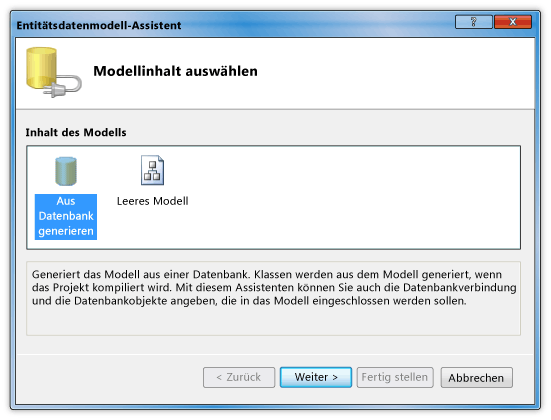
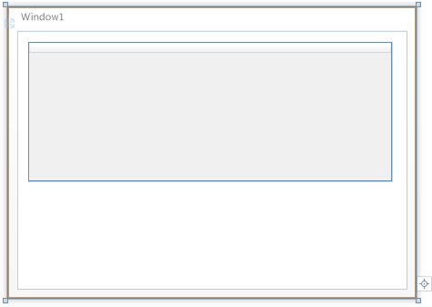

# Exemplarische Vorgehensweise: Anzeigen von Daten aus einer SQL Server-Datenbank in einem DataGrid-Steuerelement
In dieser exemplarischen Vorgehensweise rufen Sie Daten aus einer SQL Server\-Datenbank ab und zeigen diese Daten in einem <xref:System.Windows.Controls.DataGrid>\-Steuerelement an.  Sie erstellen die Entitätsklassen, die die Daten darstellen, mit dem ADO.NET Entity Framework und verwenden LINQ, um eine Abfrage zu schreiben, die die angegebenen Daten aus einer Entitätsklasse abruft.  
  
## Vorbereitungsmaßnahmen  
 Zum Durchführen dieser exemplarischen Vorgehensweise benötigen Sie die folgenden Komponenten:  
  
-   [!INCLUDE[vs_dev11_long](../../../../includes/vs-dev11-long-md.md)].  
  
-   Zugriff auf eine gegenwärtig ausgeführte Instanz von SQL Server oder SQL Server Express, die mit der AdventureWorksLT2008\-Beispieldatenbank verknüpft ist.  Sie können die AdventureWorksLT2008\-Datenbank von der [CodePlex\-Website](http://go.microsoft.com/fwlink/?LinkId=159848) herunterladen.  
  
### So erstellen Sie Entitätsklassen  
  
1.  Erstellen Sie in Visual Basic oder C\# ein neues WPF\-Projekt, und nennen Sie es `DataGridSQLExample`.  
  
2.  Klicken Sie im Projektmappen\-Explorer mit der rechten Maustaste auf das Projekt, zeigen Sie auf **Hinzufügen**, und wählen Sie anschließend  **Neues Element** aus.  
  
     Das Dialogfeld "Neues Element hinzufügen" wird angezeigt.  
  
3.  Wählen Sie im Bereich für die installierten Vorlagen die Option **Daten, und wählen Sie in der Vorlagenliste ADO.NET Entity Data Model** aus.  
  
       
  
4.  Nennen Sie die Datei `AdventureWorksModel.edmx`, und klicken Sie anschließend auf **Hinzufügen**.  
  
     Der Assistent für Entity Data Model wird angezeigt.  
  
5.  Wählen Sie im Bildschirm Modellinhalt auswählen **Aus Datenbank generieren** aus, und klicken Sie anschließend auf **Weiter**.  
  
       
  
6.  Stellen Sie auf dem Bildschirm Wählen Sie Ihre Datenverbindung aus die Verbindung für die AdventureWorksLT2008\-Datenbank bereit.  Weitere Informationen finden Sie unter [Dialogfeld "Wählen Sie Ihre Datenverbindung aus"](http://go.microsoft.com/fwlink/?LinkId=160190).  
  
       
  
7.  Stellen Sie sicher, dass der Name `AdventureWorksLT2008Entities` lautet und dass das Kontrollkästchen **Speichern Sie die Entitätsverbindungseinstellungen in App.Config als** aktiviert ist, und klicken Sie anschließend auf **Weiter**.  
  
8.  Erweitern Sie auf dem Bildschirm Datenbankobjekte auswählen den Knoten Tabellen, und wählen Sie die Tabellen **Product** und **ProductCategory** aus.  
  
     Sie können Entitätsklassen für alle Tabellen generieren; in diesem Beispiel rufen Sie nur jedoch Daten aus diesen zwei Tabellen ab.  
  
       
  
9. Klicken Sie auf **Fertig stellen**.  
  
     Die Product\-Entität und die ProductCategory\-Entität werden im Entity Designer angezeigt.  
  
       
  
### So rufen Sie die Daten ab und präsentieren sie  
  
1.  Öffnen Sie die Datei "MainWindow.xaml".  
  
2.  Legen Sie die <xref:System.Windows.FrameworkElement.Width%2A>\-Eigenschaft im <xref:System.Windows.Window> auf 450 fest.  
  
3.  Fügen Sie im XAML\-Editor das <xref:System.Windows.Controls.DataGrid>\-Tag zwischen das `<Grid>`\-Tag und das `</Grid>`\-Tag ein, um ein <xref:System.Windows.Controls.DataGrid>\-Element mit der Bezeichnung `dataGrid1` hinzuzufügen.  
  
     [!code-xml[DataGrid_SQL_EF_Walkthrough#3](../../../../samples/snippets/csharp/VS_Snippets_Wpf/DataGrid_SQL_EF_Walkthrough/CS/MainWindow.xaml#3)]  
  
       
  
4.  Wählen Sie das <xref:System.Windows.Window>\-Steuerelement aus.  
  
5.  Erstellen Sie im Eigenschaftenfenster oder mit dem XAML\-Editor einen Ereignishandler für das <xref:System.Windows.Window>\-Element mit der Bezeichnung `Window_Loaded` für das <xref:System.Windows.FrameworkElement.Loaded>\-Ereignis.  Weitere Informationen finden Sie unter [Gewusst wie: Erstellen eines einfachen Ereignishandlers](http://msdn.microsoft.com/de-de/b1456e07-9dec-4354-99cf-18666b64f480).  
  
     Im Folgenden wird die XAML für "MainWindow.xaml" dargestellt.  
  
    > [!NOTE]
    >  Ersetzen Sie bei Verwendung von Visual Basic in der ersten Zeile von "MainWindow.xaml" den `x:Class="DataGridSQLExample.MainWindow"`\-Code durch `x:Class="MainWindow"`.  
  
     [!code-xml[DataGrid_SQL_EF_Walkthrough#1](../../../../samples/snippets/csharp/VS_Snippets_Wpf/DataGrid_SQL_EF_Walkthrough/CS/MainWindow.xaml#1)]  
  
6.  Öffnen Sie die CodeBehind\-Datei \(MainWindow.xaml.vb oder MainWindow.xaml.cs\) für das <xref:System.Windows.Window>\-Element.  
  
7.  Fügen Sie den folgenden Code hinzu, um nur bestimmte Werte aus den verknüpften Tabellen abzurufen und die <xref:System.Windows.Controls.ItemsControl.ItemsSource%2A>\-Eigenschaft vom <xref:System.Windows.Controls.DataGrid> auf die Ergebnisse der Abfrage festzulegen.  
  
     [!code-csharp[DataGrid_SQL_EF_Walkthrough#2](../../../../samples/snippets/csharp/VS_Snippets_Wpf/DataGrid_SQL_EF_Walkthrough/CS/MainWindow.xaml.cs#2)]
     [!code-vb[DataGrid_SQL_EF_Walkthrough#2](../../../../samples/snippets/visualbasic/VS_Snippets_Wpf/DataGrid_SQL_EF_Walkthrough/VB/MainWindow.xaml.vb#2)]  
  
8.  Führen Sie das Beispiel aus.  
  
     Jetzt sollte ein <xref:System.Windows.Controls.DataGrid>\-Element mit Daten angezeigt werden.  
  
       
  
## Nächste Schritte  
  
## Siehe auch  
 <xref:System.Windows.Controls.DataGrid>   
 [How Do I: Erste Schritte mit Entity Framework in WPF\-Anwendungen?](http://go.microsoft.com/fwlink/?LinkId=159868)