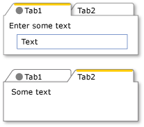
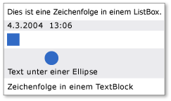

# WPF-Inhaltsmodell
[!INCLUDE[TLA#tla_winclient](../../../../includes/tlasharptla-winclient-md.md)] ist eine Präsentationsplattform, die viele Steuerelemente und steuerelementähnliche Typen bereitstellt, deren Hauptaufgabe in der Anzeige unterschiedlicher Inhaltstypen besteht. Um zu bestimmen, welches Steuerelement verwendet oder von welchem Steuerelement abgeleitet werden soll, sollten Sie mit den Objektarten vertraut sein, die ein bestimmtes Steuerelement am besten anzeigen können.  
  
 In diesem Thema wird das Inhaltsmodell für [!INCLUDE[TLA2#tla_winclient](../../../../includes/tla2sharptla-winclient-md.md)]-Steuerelemente und steuerelementähnliche Typen zusammengefasst. Das Inhaltsmodell beschreibt, welche Inhalte in einem Steuerelement verwendet werden können. In diesem Thema werden ebenfalls die Inhaltseigenschaften für jedes Inhaltsmodell aufgezählt. Eine Inhaltseigenschaft ist eine Eigenschaft, die zum Speichern des Inhalts des Objekts verwendet wird.  
  
 
  
   
## Klassen mit beliebigem Inhalt  
 Einige Steuerelemente können ein Objekt eines beliebigen Typs, z. B. eine Zeichenfolge enthalten eine <xref:System.DateTime> -Objekt, oder ein <xref:System.Windows.UIElement> also ein Container für zusätzliche Elemente. Z. B. eine <xref:System.Windows.Controls.Button> darf ein Bild und Text; oder ein <xref:System.Windows.Controls.CheckBox> darf den Wert des <xref:System.DateTime.Now%2A?displayProperty=nameWithType>.  
  
 In [!INCLUDE[TLA2#tla_winclient](../../../../includes/tla2sharptla-winclient-md.md)] gibt es vier Klassen, die beliebigen Inhalt enthalten. Die folgende Tabelle enthält die Klassen, die von erben <xref:System.Windows.Controls.Control>.  
  
|Klassen mit beliebigem Inhalt|Inhalt|  
|-------------------------------------------|-------------|  
|<xref:System.Windows.Controls.ContentControl>|Ein einzelnes beliebiges Objekt|  
|<xref:System.Windows.Controls.HeaderedContentControl>|Ein Header und ein einzelnes Element, die beide beliebige Objekte sind|  
|<xref:System.Windows.Controls.ItemsControl>|Eine Auflistung beliebiger Objekte|  
|<xref:System.Windows.Controls.HeaderedItemsControl>|Ein Header und eine Auflistung von Elementen, die alle beliebige Objekte sind|  
  
 Steuerelemente, die von diesen Klassen erben, können dieselbe Art von Inhalt enthalten und den Inhalt auf die gleiche Weise behandeln. Die folgende Abbildung zeigt ein Steuerelement aus den einzelnen Inhaltsmodellen, das ein Bild und Text enthält.  
  
   
  
### Steuerelemente mit einem einzelnen beliebigen Objekt  
 Die <xref:System.Windows.Controls.ContentControl> Klasse enthält ein einzelnes Stück beliebiger Inhalt. Die Inhaltseigenschaft ist <xref:System.Windows.Controls.ContentControl.Content%2A>. Die folgenden Steuerelemente, die von erben <xref:System.Windows.Controls.ContentControl> und Inhaltsmodell verwenden:  
  
-   <xref:System.Windows.Controls.Button>  
  
-   <xref:System.Windows.Controls.Primitives.ButtonBase>  
  
-   <xref:System.Windows.Controls.CheckBox>  
  
-   <xref:System.Windows.Controls.ComboBoxItem>  
  
-   <xref:System.Windows.Controls.ContentControl>  
  
-   <xref:System.Windows.Controls.Frame>  
  
-   <xref:System.Windows.Controls.GridViewColumnHeader>  
  
-   <xref:System.Windows.Controls.GroupItem>  
  
-   <xref:System.Windows.Controls.Label>  
  
-   <xref:System.Windows.Controls.ListBoxItem>  
  
-   <xref:System.Windows.Controls.ListViewItem>  
  
-   <xref:System.Windows.Navigation.NavigationWindow>  
  
-   <xref:System.Windows.Controls.RadioButton>  
  
-   <xref:System.Windows.Controls.Primitives.RepeatButton>  
  
-   <xref:System.Windows.Controls.ScrollViewer>  
  
-   <xref:System.Windows.Controls.Primitives.StatusBarItem>  
  
-   <xref:System.Windows.Controls.Primitives.ToggleButton>  
  
-   <xref:System.Windows.Controls.ToolTip>  
  
-   <xref:System.Windows.Controls.UserControl>  
  
-   <xref:System.Windows.Window>  
  
 Die folgende Abbildung zeigt vier Schaltflächen, deren <xref:System.Windows.Controls.ContentControl.Content%2A> festgelegt ist, in eine Zeichenfolge ein <xref:System.DateTime> -Objekt, eine <xref:System.Windows.Shapes.Rectangle>, und ein <xref:System.Windows.Controls.Panel> , enthält eine <xref:System.Windows.Shapes.Ellipse> und ein <xref:System.Windows.Controls.TextBlock>.  
  
   
Vier Schaltflächen mit verschiedenen Arten von Inhalten  
  
 Ein Beispiel zum Festlegen der <xref:System.Windows.Controls.ContentControl.Content%2A> Eigenschaft finden Sie unter <xref:System.Windows.Controls.ContentControl>.  
  
### Steuerelemente mit einem Header und einzelnen beliebigen Objekt  
 Die <xref:System.Windows.Controls.HeaderedContentControl> Klasse erbt von <xref:System.Windows.Controls.ContentControl> und zeigt den Inhalt mit einem Header an. Erbt die Content-Eigenschaft <xref:System.Windows.Controls.ContentControl.Content%2A>, aus <xref:System.Windows.Controls.ContentControl> und definiert die <xref:System.Windows.Controls.HeaderedContentControl.Header%2A> -Eigenschaft, die vom Typ <xref:System.Object>; aus diesem Grund dürfen ein beliebiges Objekt sein.  
  
 Die folgenden Steuerelemente, die von erben <xref:System.Windows.Controls.HeaderedContentControl> und Inhaltsmodell verwenden:  
  
-   <xref:System.Windows.Controls.Expander>  
  
-   <xref:System.Windows.Controls.GroupBox>  
  
-   <xref:System.Windows.Controls.TabItem>  
  
 Die folgende Abbildung zeigt zwei <xref:System.Windows.Controls.TabItem> Objekte. Die erste <xref:System.Windows.Controls.TabItem> hat <xref:System.Windows.UIElement> Objekte wie die <xref:System.Windows.Controls.HeaderedContentControl.Header%2A> und die <xref:System.Windows.Controls.ContentControl.Content%2A>. Die <xref:System.Windows.Controls.HeaderedContentControl.Header%2A> festgelegt ist, um eine <xref:System.Windows.Controls.StackPanel> , enthält ein <xref:System.Windows.Shapes.Ellipse> und ein <xref:System.Windows.Controls.TextBlock>. Der <xref:System.Windows.Controls.ContentControl.Content%2A> festgelegt ist, um eine <xref:System.Windows.Controls.StackPanel> , enthält eine <xref:System.Windows.Controls.TextBlock> und eine <xref:System.Windows.Controls.Label>. Die zweite <xref:System.Windows.Controls.TabItem> hat eine Zeichenfolge der <xref:System.Windows.Controls.HeaderedContentControl.Header%2A> und ein <xref:System.Windows.Controls.TextBlock> in der <xref:System.Windows.Controls.ContentControl.Content%2A>.  
  
   
TabControl, das unterschiedliche Typen in der Header-Eigenschaft verwendet  
  
 Ein Beispiel zum Erstellen von <xref:System.Windows.Controls.TabItem> Objekte finden Sie unter <xref:System.Windows.Controls.HeaderedContentControl>.  
  
### Steuerelemente mit einer Auflistung von beliebigen Objekten  
 Die <xref:System.Windows.Controls.ItemsControl> Klasse erbt von <xref:System.Windows.Controls.Control> und können mehrere Elemente enthalten, z. B. Zeichenfolgen, Objekte oder andere Elemente. Die Inhaltseigenschaften sind <xref:System.Windows.Controls.ItemsControl.ItemsSource%2A> und <xref:System.Windows.Controls.ItemsControl.Items%2A>. <xref:System.Windows.Controls.ItemsControl.ItemsSource%2A> dient normalerweise zum Auffüllen der <xref:System.Windows.Controls.ItemsControl> mit einer Datensammlung. Wenn Sie nicht, verwenden Sie eine Auflistung zum Auffüllen möchten der <xref:System.Windows.Controls.ItemsControl>, können Sie Elemente hinzufügen, mit der <xref:System.Windows.Controls.ItemsControl.Items%2A> Eigenschaft.  
  
 Die folgenden Steuerelemente, die von erben <xref:System.Windows.Controls.ItemsControl> und Inhaltsmodell verwenden:  
  
-   <xref:System.Windows.Controls.Menu>  
  
-   <xref:System.Windows.Controls.Primitives.MenuBase>  
  
-   <xref:System.Windows.Controls.ContextMenu>  
  
-   <xref:System.Windows.Controls.ComboBox>  
  
-   <xref:System.Windows.Controls.ItemsControl>  
  
-   <xref:System.Windows.Controls.ListBox>  
  
-   <xref:System.Windows.Controls.ListView>  
  
-   <xref:System.Windows.Controls.TabControl>  
  
-   <xref:System.Windows.Controls.TreeView>  
  
-   <xref:System.Windows.Controls.Primitives.Selector>  
  
-   <xref:System.Windows.Controls.Primitives.StatusBar>  
  
 Die folgende Abbildung zeigt eine <xref:System.Windows.Controls.ListBox> , die diese Typen von Elementen enthält:  
  
-   Eine Zeichenfolge.  
  
-   Ein <xref:System.DateTime>-Objekt.  
  
-   Ein <xref:System.Windows.UIElement>.  
  
-   Ein <xref:System.Windows.Controls.Panel> , enthält eine <xref:System.Windows.Shapes.Ellipse> und ein <xref:System.Windows.Controls.TextBlock>.  
  
   
Ein Listenfeld, das mehrere Inhaltstypen enthält  
  
### Steuerelemente mit einem Header und einer Auflistung von beliebigen Objekten  
 Die <xref:System.Windows.Controls.HeaderedItemsControl> Klasse erbt von <xref:System.Windows.Controls.ItemsControl> und können mehrere Elemente enthalten, z. B. Zeichenfolgen, Objekte oder andere Elemente und einen Header. Sie erbt die <xref:System.Windows.Controls.ItemsControl> Inhaltseigenschaften, <xref:System.Windows.Controls.ItemsControl.ItemsSource%2A>, und <xref:System.Windows.Controls.ItemsControl.Items%2A>, und definiert die <xref:System.Windows.Controls.HeaderedItemsControl.Header%2A> -Eigenschaft, die ein beliebiges Objekt sein kann.  
  
 Die folgenden Steuerelemente, die von erben <xref:System.Windows.Controls.HeaderedItemsControl> und Inhaltsmodell verwenden:  
  
-   <xref:System.Windows.Controls.MenuItem>  
  
-   <xref:System.Windows.Controls.ToolBar>  
  
-   <xref:System.Windows.Controls.TreeViewItem>  
  
   
## Klassen mit einer Auflistung von UIElement-Objekten  
 Die <xref:System.Windows.Controls.Panel> Klasse positioniert und ordnet untergeordnete <xref:System.Windows.UIElement> Objekte. Die Inhaltseigenschaft ist <xref:System.Windows.Controls.Panel.Children%2A>.  
  
 Die folgenden Klassen erben von der <xref:System.Windows.Controls.Panel> Klasse erstellt und dessen Inhaltsmodell:  
  
-   <xref:System.Windows.Controls.Canvas>  
  
-   <xref:System.Windows.Controls.DockPanel>  
  
-   <xref:System.Windows.Controls.Grid>  
  
-   <xref:System.Windows.Controls.Primitives.TabPanel>  
  
-   <xref:System.Windows.Controls.Primitives.ToolBarOverflowPanel>  
  
-   <xref:System.Windows.Controls.Primitives.ToolBarPanel>  
  
-   <xref:System.Windows.Controls.Primitives.UniformGrid>  
  
-   <xref:System.Windows.Controls.StackPanel>  
  
-   <xref:System.Windows.Controls.VirtualizingPanel>  
  
-   <xref:System.Windows.Controls.VirtualizingStackPanel>  
  
-   <xref:System.Windows.Controls.WrapPanel>  
  
 Weitere Informationen finden Sie unter [Übersicht über Panel-Elemente](../../../../docs/framework/wpf/controls/panels-overview.md).  
  
   
## Klassen, die sich auf die Anzeige eines UIElement-Objekts auswirken  
 Die <xref:System.Windows.Controls.Decorator> Klasse gilt visuelle Effekte auf oder um ein einzelnes untergeordnetes <xref:System.Windows.UIElement>. Die Inhaltseigenschaft ist <xref:System.Windows.Controls.Decorator.Child%2A>. Die folgenden Klassen erben von <xref:System.Windows.Controls.Decorator> und Inhaltsmodell verwenden:  
  
-   <xref:System.Windows.Documents.AdornerDecorator>  
  
-   <xref:System.Windows.Controls.Border>  
  
-   <xref:System.Windows.Controls.Primitives.BulletDecorator>  
  
-   <xref:Microsoft.Windows.Themes.ButtonChrome>  
  
-   <xref:Microsoft.Windows.Themes.ClassicBorderDecorator>  
  
-   <xref:System.Windows.Controls.InkPresenter>  
  
-   <xref:Microsoft.Windows.Themes.ListBoxChrome>  
  
-   <xref:Microsoft.Windows.Themes.SystemDropShadowChrome>  
  
-   <xref:System.Windows.Controls.Viewbox>  
  
 Die folgende Abbildung zeigt eine <xref:System.Windows.Controls.TextBox> mit dem (ergänzt wird mit) eine <xref:System.Windows.Controls.Border> herum.  
  
   
Textfeld mit einem Rahmen  
  
   
## Klassen, die visuelles Feedback zu einem UIElement bereitstellen  
 Die <xref:System.Windows.Documents.Adorner> -Klasse bietet visuelle Hinweise für einen Benutzer. Verwenden Sie z. B. eine <xref:System.Windows.Documents.Adorner> funktionale Handles Elemente hinzufügen oder Zustandsinformationen zu einem Steuerelement bereitzustellen. Die <xref:System.Windows.Documents.Adorner> Klasse stellt ein Framework bereit, sodass Sie eigene Adorner erstellen können. [!INCLUDE[TLA2#tla_winclient](../../../../includes/tla2sharptla-winclient-md.md)] stellt keine implementierten Adorner bereit. Weitere Informationen finden Sie unter [Übersicht über Adorner](../../../../docs/framework/wpf/controls/adorners-overview.md).  
  
   
## Klassen, mit denen Benutzer Text eingeben können  
 WPF bietet drei primäre Steuerelemente, mit denen Benutzer Text eingeben können. Jedes Steuerelement zeigt den Text unterschiedlich an. Die folgende Tabelle enthält diese drei textbezogene Steuerelemente, ihre Funktionen bei der Textanzeige und ihre Eigenschaften, die den Text des Steuerelements enthalten.  
  
|Steuerelement|Text wird angezeigt als|Inhaltseigenschaft|  
|-------------|--------------------------|----------------------|  
|<xref:System.Windows.Controls.TextBox>|Nur-Text|<xref:System.Windows.Controls.TextBox.Text%2A>|  
|<xref:System.Windows.Controls.RichTextBox>|Formatierter Text|<xref:System.Windows.Controls.RichTextBox.Document%2A>|  
|<xref:System.Windows.Controls.PasswordBox>|Ausgeblendeter Text (Zeichen werden maskiert)|<xref:System.Windows.Controls.PasswordBox.Password%2A>|  
  
   
## Klassen, die Ihren Text anzeigen  
 Es können mehrere Klassen verwendet werden, um einfachen oder formatierten Text anzuzeigen. Sie können <xref:System.Windows.Controls.TextBlock> um kleine Mengen von Text anzuzeigen. Wenn Sie große Mengen von Text anzeigen möchten, verwenden Sie die <xref:System.Windows.Controls.FlowDocumentReader>, <xref:System.Windows.Controls.FlowDocumentPageViewer>, oder <xref:System.Windows.Controls.FlowDocumentScrollViewer> Steuerelemente.  
  
 Die <xref:System.Windows.Controls.TextBlock> verfügt über zwei Inhaltseigenschaften: <xref:System.Windows.Controls.TextBlock.Text%2A> und <xref:System.Windows.Controls.TextBlock.Inlines%2A>. Wenn der Text angezeigt, die konsistente Formatierung verwendet werden soll die <xref:System.Windows.Controls.TextBlock.Text%2A> Eigenschaft ist häufig die beste Wahl. Wenn Sie andere Formatierung im gesamten Text verwenden möchten, verwenden Sie die <xref:System.Windows.Controls.TextBlock.Inlines%2A> Eigenschaft. Die <xref:System.Windows.Controls.TextBlock.Inlines%2A> Eigenschaft ist eine Auflistung von <xref:System.Windows.Documents.Inline> -Objekten, die angeben, wie Text zu formatieren.  
  
 Die folgende Tabelle enthält die Content-Eigenschaft für <xref:System.Windows.Controls.FlowDocumentReader>, <xref:System.Windows.Controls.FlowDocumentPageViewer>, und <xref:System.Windows.Controls.FlowDocumentScrollViewer> Klassen.  
  
|Steuerelement|Inhaltseigenschaft|Inhaltseigenschaftstyp|  
|-------------|----------------------|---------------------------|  
|<xref:System.Windows.Controls.FlowDocumentPageViewer>|Dokument|<xref:System.Windows.Documents.IDocumentPaginatorSource>|  
|<xref:System.Windows.Controls.FlowDocumentReader>|Dokument|<xref:System.Windows.Documents.FlowDocument>|  
|<xref:System.Windows.Controls.FlowDocumentScrollViewer>|Dokument|<xref:System.Windows.Documents.FlowDocument>|  
  
 Die <xref:System.Windows.Documents.FlowDocument> implementiert die <xref:System.Windows.Documents.IDocumentPaginatorSource> Schnittstelle; alle drei Klassen können Schalten Sie daher eine <xref:System.Windows.Documents.FlowDocument> als Inhalt.  
  
   
## Klassen, die den Text formatieren  
 <xref:System.Windows.Documents.TextElement> und seinen verwandten Klassen ermöglichen es Ihnen, Text zu formatieren. <xref:System.Windows.Documents.TextElement> -Objekte enthalten und Formatieren von Text in <xref:System.Windows.Controls.TextBlock> und <xref:System.Windows.Documents.FlowDocument> Objekte. Die zwei Haupttypen von <xref:System.Windows.Documents.TextElement> Objekte sind <xref:System.Windows.Documents.Block> Elemente und <xref:System.Windows.Documents.Inline> Elemente. Ein <xref:System.Windows.Documents.Block> -Element stellt einen Textblock, z. B. einen Absatz oder eine Liste dar. Ein <xref:System.Windows.Documents.Inline> -Element stellt einen Teil des Texts in einem Block dar. Viele <xref:System.Windows.Documents.Inline> Klassen geben Formatierung für den Text, der auf die sie angewendet werden. Jede <xref:System.Windows.Documents.TextElement> verfügt über einen eigenen Inhaltsmodell. Weitere Informationen finden Sie unter [Übersicht über das TextElement-Inhaltsmodell](../../../../docs/framework/wpf/advanced/textelement-content-model-overview.md).  
  
## Siehe auch  
 [Erweitert](../../../../docs/framework/wpf/advanced/index.md)
