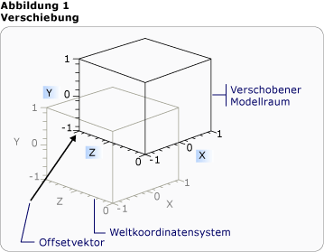
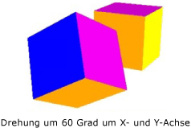

# &#220;bersicht &#252;ber 3D-Transformationen
In diesem Thema wird beschrieben, wie Transformationen für 3D\-Modelle im [!INCLUDE[TLA#tla_winclient](../../../../includes/tlasharptla-winclient-md.md)]\-Grafiksystem angewendet werden.  Mithilfe von Transformationen können Entwickler Modelle neu positionieren, ihre Größe ändern und sie neu ausrichten, ohne die Basiswerte zu ändern, die sie definieren.  
  
   
  
## 3D\-Koordinatenraum  
 3D\-Grafikinhalte in [!INCLUDE[TLA#tla_winclient](../../../../includes/tlasharptla-winclient-md.md)] werden in einem Element gekapselt, <xref:System.Windows.Controls.Viewport3D>, das an der zweidimensionalen Elementstruktur beteiligt sein kann.  Das Grafiksystem behandelt Viewport3D in [!INCLUDE[TLA#tla_winclient](../../../../includes/tlasharptla-winclient-md.md)] wie viele andere Elemente als zweidimensionales visuelles Element.  Viewport3D funktioniert als Fenster \(Viewport\) in eine dreidimensionale Szene.  Genauer gesagt handelt es sich um eine Oberfläche, auf die eine 3D\-Szene projiziert wird.  Auch wenn Sie Viewport3D mit anderen 2D\-Zeichnungsobjekten in demselben Szenendiagramm verwenden können, dürfen sich 2D\- und 3D\-Objekte in einem Viewport3D nicht überschneiden.  In der folgenden Erläuterung ist der beschriebene Koordinatenraum im Viewport3D\-Element enthalten.  
  
 Im [!INCLUDE[TLA#tla_winclient](../../../../includes/tlasharptla-winclient-md.md)]\-Koordinatensystem für 2D\-Grafiken befindet sich der Ursprung in der linken oberen Ecke der Renderingoberfläche \(in der Regel der Bildschirm\).  Im 2D\-System verlaufen die positiven x\-Achsenwerte nach rechts und die positiven y\-Achsenwerte nach unten.  Im 3D\-Koordinatensystem befindet sich der Ursprung hingegen in der Mitte des Bildschirms. In diesem Fall verlaufen die positiven x\-Achsenwerte nach rechts, die positiven y\-Achsenwerte aber nach oben und die positiven z\-Achsenwerte vom Ursprung nach außen in Richtung des Betrachters.  
  
   
Vergleich der Koordinatensysteme  
  
 Der von diesen Achsen definierte Bereich ist der feststehende Verweisrahmen für 3D\-Objekte in [!INCLUDE[TLA#tla_winclient](../../../../includes/tlasharptla-winclient-md.md)].  Wenn Sie in diesem Bereich Modelle und Lichter und Kameras zur Anzeige der Modelle erstellen, ist es hilfreich, diesen feststehenden Verweisrahmen \(auch "Weltkoordinatensystem" genannt\) vom lokalen Verweisrahmen zu unterscheiden, den Sie beim Anwenden von Transformationen für jedes Modell erstellen.  Beachten Sie außerdem, dass je nach Licht\- und Kameraeinstellung die Objekte innerhalb des Weltkoordinatensystems möglicherweise komplett unterschiedlich oder überhaupt nicht angezeigt werden. Die Position der Kamera verändert die Position der Objekte innerhalb des Weltkoordinatensystems jedoch nicht.  
  
## Transformieren von Modellen  
 Wenn Sie Modelle erstellen, haben sie eine bestimmte Position in der Szene.  Um diese Modelle in der Szene zu verschieben, zu drehen oder um ihre Größe zu ändern, sollten Sie nicht die Eckpunkte ändern, die das Modell selbst definieren.  Stattdessen wenden Sie wie in 2D Transformationen auf die Modelle an.  
  
 Jedes Modellobjekt verfügt über eine <xref:System.Windows.Media.Media3D.Model3D.Transform%2A>\-Eigenschaft, mit der Sie das Modell verschieben, neu ausrichten oder in der Größe verändern können.  Wenn Sie eine Transformation anwenden, versetzen Sie alle Punkte im Modell um den durch die Transformation angegebenen Vektor oder Wert.  Mit anderen Worten: Sie haben den Koordinatenraum transformiert, in dem das Modell definiert ist \("Modellraum"\). Dabei haben Sie jedoch nicht die Werte geändert, aus denen sich die Geometrie des Modells im Koordinatensystem der gesamten Szene \("Weltkoordinatensystem"\) zusammensetzt.  
  
## Übersetzungstransformationen  
 3D\-Transformationen erben von der abstrakten <xref:System.Windows.Media.Media3D.Transform3D>\-Basisklasse. Dazu zählen die affinen Transformationsklassen <xref:System.Windows.Media.Media3D.TranslateTransform3D>, <xref:System.Windows.Media.Media3D.ScaleTransform3D> und <xref:System.Windows.Media.Media3D.RotateTransform3D>.  Das [!INCLUDE[TLA#tla_winclient](../../../../includes/tlasharptla-winclient-md.md)]\-3D\-System stellt außerdem eine <xref:System.Windows.Media.Media3D.MatrixTransform3D>\-Klasse bereit, mit der Sie dieselben Transformationen in mehreren präzisen Matrixvorgängen angeben können.  
  
 <xref:System.Windows.Media.Media3D.TranslateTransform3D> verschiebt alle Punkte im Model3D in die Richtung des Offsetvektors, den Sie mit den Eigenschaften <xref:System.Windows.Media.Media3D.TranslateTransform3D.OffsetX%2A>, <xref:System.Windows.Media.Media3D.TranslateTransform3D.OffsetY%2A> und <xref:System.Windows.Media.Media3D.TranslateTransform3D.OffsetZ%2A> angeben.  Beispiel: Wenn der Eckpunkt eines Würfels \(2,2,2\) lautet, verschiebt ein Offsetvektor von \(0,1.6,1\) diesen Eckpunkt \(2,2,2\) nach \(2,3.6,3\).  Der Eckpunkt des Würfels im Modellraum lautet immer noch \(2,2,2\). Dieser Modellraum hat jedoch die Beziehung zum Weltkoordinatensystem geändert, sodass \(2,2,2\) im Modellraum jetzt \(2,3.6,3\) im Weltkoordinatensystem entspricht.  
  
   
Übersetzung mit Offset  
  
 Die folgenden Codebeispiele zeigen, wie eine Übersetzung angewendet wird.  
  
 [!code-xml[animation3dgallery_snip#Translation3DAnimationExampleWholePage](../../../../samples/snippets/csharp/VS_Snippets_Wpf/Animation3DGallery_snip/CS/Translation3DAnimationExample.xaml#translation3danimationexamplewholepage)]  
  
## Skalieren von Transformationen  
 <xref:System.Windows.Media.Media3D.ScaleTransform3D> ändert die Skalierung des Modells um einen angegebenen Skalierungsvektor mit Bezug auf einen Mittelpunkt.  Geben Sie eine einheitliche Skalierung an, die das Modell an x\-, y\- und z\-Achse um denselben Wert skaliert, um die Größe des Modells proportional zu ändern.  Beispiel: Wenn die Transformationseigenschaften <xref:System.Windows.Media.ScaleTransform.ScaleX%2A>, <xref:System.Windows.Media.ScaleTransform.ScaleY%2A> und <xref:System.Windows.Media.Media3D.ScaleTransform3D.ScaleZ%2A> auf 0,5 festgelegt werden, wird die Größe des Modells halbiert. Werden dieselben Eigenschaften auf 2 festgelegt, wird die Skalierung an allen drei Achsen verdoppelt.  
  
   
ScaleVector\-Beispiel  
  
 Wenn Sie keine einheitliche Skalierungstransformation angeben \(eine Skalierungstransformation, bei der die x\-, y\- und z\-Werte nicht gleich sind\) hat das zur Folge, dass das Modell nur eindimensional oder zweidimensional gestreckt oder verkleinert wird, und die anderen Dimensionen unverändert bleiben.  Beispiel: Wenn Sie <xref:System.Windows.Media.ScaleTransform.ScaleX%2A> auf 1, <xref:System.Windows.Media.ScaleTransform.ScaleY%2A> auf 2 und <xref:System.Windows.Media.Media3D.ScaleTransform3D.ScaleZ%2A> auf 1 festlegen, wird die Höhe des transformierten Modells verdoppelt, während an x\- und y\-Achse keine Änderung erfolgt.  
  
 Standardmäßig bewirkt ScaleTransform3D, dass Eckpunkte um den Ursprung \(0,0,0\) erweitert oder verkleinert werden.  Wenn das zu transformierende Modell nicht vom Ursprung aus gezeichnet ist, bewirkt eine Skalierung des Modells um den Ursprung keine Skalierung des Modells "an der Stelle". Wenn die Eckpunkte des Modells mit dem Skalierungsvektor multipliziert werden, wirkt sich der Skalierungsvorgang stattdessen sowohl auf die Übersetzung als auch auf die Skalierung des Modells aus.  
  
   
ScaleCenter\-Beispiel  
  
 Um das Modell "an der Stelle" zu skalieren, geben Sie den Mittelpunkt des Modells an, indem Sie die ScaleTransform3D\-Eigenschaften <xref:System.Windows.Media.ScaleTransform.CenterX%2A>, <xref:System.Windows.Media.ScaleTransform.CenterY%2A> und <xref:System.Windows.Media.Media3D.ScaleTransform3D.CenterZ%2A> festlegen.  Auf diese Weise wird sichergestellt, dass das Grafiksystem den Modellraum skaliert und anschließend in den Mittelpunkt für das angegebene <xref:System.Windows.Media.Media3D.Point3D> übersetzt.  Wenn Sie das Modell dagegen um den Ursprung erstellt haben und einen anderen Mittelpunkt angeben, wird das Modell vom Ursprung weg übersetzt.  
  
## Drehungstransformationen  
 Sie können ein Modell in 3D auf mehrere Weisen drehen.  Eine typische Drehungstransformation gibt eine Achse und einen Drehungswinkel um diese Achse an.  Die <xref:System.Windows.Media.Media3D.RotateTransform3D>\-Klasse ermöglicht es Ihnen, ein <xref:System.Windows.Media.Media3D.Rotation3D> mit der zugehörigen <xref:System.Windows.Media.Media3D.RotateTransform3D.Rotation%2A>\-Eigenschaft zu definieren.  Dann geben Sie die Eigenschaften <xref:System.Windows.Media.Media3D.AxisAngleRotation3D.Axis%2A> und <xref:System.Windows.Media.Media3D.AxisAngleRotation3D.Angle%2A> für Rotation3D an, in diesem Fall <xref:System.Windows.Media.Media3D.AxisAngleRotation3D>, um die Transformation zu definieren.  In den folgenden Beispielen wird ein Modell um 60 Grad um die y\-Achse gedreht.  
  
 [!code-xml[animation3dgallery_snip#Rotate3DUsingAxisAngleRotation3DExampleWholePage](../../../../samples/snippets/csharp/VS_Snippets_Wpf/Animation3DGallery_snip/CS/Rotat3DUsingAxisAngleRotation3DExample.xaml#rotate3dusingaxisanglerotation3dexamplewholepage)]  
  
 Hinweis: Das [!INCLUDE[TLA#tla_winclient](../../../../includes/tlasharptla-winclient-md.md)]\-3D\-System ist ein rechtshändiges System. Daher führt ein positiver Wert für den Drehungswinkel zu einer Drehung gegen den Uhrzeigersinn um die Achse.  
  
 Bei Achsen\-\/Winkeldrehungen wird eine Drehung um den Ursprung angenommen, wenn kein Wert für die Eigenschaften <xref:System.Windows.Media.Media3D.RotateTransform3D.CenterX%2A>, <xref:System.Windows.Media.Media3D.RotateTransform3D.CenterY%2A> und <xref:System.Windows.Media.Media3D.RotateTransform3D.CenterZ%2A> für RotateTransform3D angegeben ist.  Wie bei der Skalierung sollte beachtet werden, dass die Drehung den ganzen Koordinatenraum des Modells transformiert.  Wenn das Modell nicht um den Ursprung erstellt oder bereits übersetzt wurde, erfolgt die Drehung möglicherweise um den Ursprung und nicht an der Stelle.  
  
   
Drehung mit angegebenem neuen Mittelpunkt  
  
 Um das Modell "an der Stelle" zu drehen, geben Sie den tatsächlichen Mittelpunkt des Modells als Mittelpunkt der Drehung an.  Da die Geometrie in der Regel um den Ursprung modelliert wird, erhalten Sie das erwartete Ergebnis eines Transformationssatzes häufig dann, wenn Sie zunächst die Größe des Modells ändern \(skalieren\), dann die Ausrichtung festlegen \(drehen\) und es abschließend an die gewünschte Position verschieben \(übersetzen\).  
  
   
Drehungsbeispiel  
  
 Achsen\-\/Winkeldrehungen sind für statische Transformationen und einige Animationen gut geeignet.  Gehen Sie aber nun davon aus, dass Sie ein Würfelmodell um 60 Grad um die x\-Achse und dann um 45 Grad um die z\-Achse drehen.  Sie können diese Transformation als zwei einzelne affine Transformationen beschreiben oder als Matrix.  Es könnte jedoch schwierig sein, eine auf diese Weise definierte Drehung reibungslos zu animieren.  Obwohl die in beiden Ansätzen berechneten Start\- und Endpositionen des Modells übereinstimmen, sind die Zwischenpositionen des Objekts rechnerisch unbestimmt.  Quaternionen stellen eine alternative Möglichkeit zur Berechnung der Interpolation zwischen Start und Ende einer Drehung dar.  
  
 Eine Quaternion stellt eine Achse in einem 3D\-Raum und eine Drehung um diese Achse dar.  Beispielsweise könnte eine Quaternion eine \(1,1,2\)\-Achse und eine Drehung von 50 Grad darstellen.  Die Leistungsfähigkeit von Quaternionen bei der Definition von Drehungen lässt sich auf zwei Vorgänge zurückführen, die für sie ausgeführt werden können: Komposition und Interpolation.  Die Komposition von zwei Quaternionen, die auf eine Geometrie angewendet werden, bedeutet Folgendes: "Drehen Sie die Geometrie um Drehung2 um Achse2 und anschließend um Drehung1 um Achse1." Durch Verwenden der Komposition können Sie zwei Drehungen der Geometrie kombinieren, um eine einzelne Quaternion zu erhalten, die das Ergebnis darstellt.  Da mit der Quaternionsinterpolation ein glatter und sinnvoller Pfad von einer Achse und ihrer Ausrichtung zu einer anderen berechnet werden kann, können Sie eine Interpolation von der ursprünglichen zur komponierten Quaternion ausführen, um einen glatten Übergang zu erzielen, damit Sie die Transformation animieren können.  Sie können für Modelle, die Sie animieren möchten, eine Ziel\-<xref:System.Windows.Media.Media3D.Quaternion> für die Drehung mit einem <xref:System.Windows.Media.Media3D.QuaternionRotation3D> für die <xref:System.Windows.Media.Media3D.RotateTransform3D.Rotation%2A>\-Eigenschaft angeben.  
  
## Verwenden von Transformationsauflistungen  
 Beim Erstellen einer Szene werden in der Regel mehrere Transformationen auf ein Modell angewendet.  Fügen Sie Transformationen zur <xref:System.Windows.Media.Media3D.Transform3DGroup.Children%2A>\-Auflistung der <xref:System.Windows.Media.Media3D.Transform3DGroup>\-Klasse hinzu, um Transformationen bequem für die Anwendung auf verschiedene Modelle in der Szene zu gruppieren.  Häufig ist es bequem, eine Transformation in mehreren verschiedenen Gruppen wieder zu verwenden, so wie Sie ein Modell wieder verwenden können, indem Sie auf jede Instanz einen anderen Satz von Transformationen anwenden.  Beachten Sie, dass die Reihenfolge, in der Transformationen der Auflistung hinzugefügt werden, wichtig ist: Die Transformationen in der Auflistung werden von der ersten zur letzten angewendet.  
  
## Animieren von Transformationen  
 Die [!INCLUDE[TLA#tla_winclient](../../../../includes/tlasharptla-winclient-md.md)]\-3D\-Implementierung gehört zum gleichen Zeitsteuerungs\- und Animationssystem wie 2D\-Grafiken.  Mit anderen Worten: Zur Animation einer 3D\-Szene animieren Sie die Eigenschaften ihrer Modelle.  Sie können die Eigenschaften von Primitiven direkt animieren. In der Regel ist es jedoch einfacher, die Transformationen zu animieren, anhand derer die Position oder die Darstellung der Modelle geändert werden.  Da sich Transformationen sowohl auf <xref:System.Windows.Media.Media3D.Model3DGroup>\-Objekte als auch auf einzelne Modelle anwenden lassen, können Sie einen Satz von Animationen auf die Elemente einer Model3DGroup und einen weiteren Satz von Animationen auf eine Gruppe von Objekten anwenden.  Hintergrundinformationen über das [!INCLUDE[TLA#tla_winclient](../../../../includes/tlasharptla-winclient-md.md)]\-Zeitsteuerungs\- und Animationssystem finden Sie unter [Übersicht über Animationen](../../../../docs/framework/wpf/graphics-multimedia/animation-overview.md) und unter [Übersicht über Storyboards](../../../../docs/framework/wpf/graphics-multimedia/storyboards-overview.md).  
  
 Um ein Objekt in [!INCLUDE[TLA#tla_winclient](../../../../includes/tlasharptla-winclient-md.md)] zu animieren, erstellen Sie eine Zeitachse, definieren eine Animation \(tatsächlich eine Änderung einiger Eigenschaftswerte im Zeitablauf\) und geben die Eigenschaft an, auf die die Animation angewendet werden soll.  Diese Eigenschaft muss eine Eigenschaft für ein FrameworkElement sein.  Da alle Objekte in einer 3D\-Szene untergeordnete Elemente von Viewport3D sind, handelt es sich bei den Eigenschaften, auf die sich die in der Szene anzuwendenden Animationen beziehen, um Eigenschaften von Viewport3D.  Arbeiten Sie den Eigenschaftenpfad für die Animation sorgfältig aus, da die Syntax sehr ausführlich sein kann.  
  
 Angenommen, Sie möchten ein Objekt an der Stelle drehen, aber auch eine schwingende Bewegung anwenden, um einen größeren Teil des Objekts in der Ansicht verfügbar zu machen.  Dazu sollten Sie RotateTransform3D auf das Modell anwenden und dessen Drehungsachse von einem Vektor auf einen anderen animieren.  Im folgenden Codebeispiel wird das Anwenden einer <xref:System.Windows.Media.Animation.Vector3DAnimation> auf die Achseneigenschaft der Rotation3D\-Transformation veranschaulicht. Es wird angenommen, dass RotateTransform3D als eine von mehreren Transformationen mit einer <xref:System.Windows.Media.TransformGroup> auf das Modell angewendet wird.  
  
 [!code-csharp[3doverview#3DOverview3DN1](../../../../samples/snippets/csharp/VS_Snippets_Wpf/3DOverview/CSharp/Window1.xaml.cs#3doverview3dn1)]
 [!code-vb[3doverview#3DOverview3DN1](../../../../samples/snippets/visualbasic/VS_Snippets_Wpf/3DOverview/visualbasic/window1.xaml.vb#3doverview3dn1)]  
  
 [!code-csharp[3doverview#3DOverview3DN3](../../../../samples/snippets/csharp/VS_Snippets_Wpf/3DOverview/CSharp/Window1.xaml.cs#3doverview3dn3)]
 [!code-vb[3doverview#3DOverview3DN3](../../../../samples/snippets/visualbasic/VS_Snippets_Wpf/3DOverview/visualbasic/window1.xaml.vb#3doverview3dn3)]  
  
 Verwenden Sie eine ähnliche Syntax, um das Objekt mit anderen Transformationseigenschaften zu verschieben oder zu skalieren.  Wenden Sie z. B. bei einer Skalierungstransformation eine <xref:System.Windows.Media.Animation.Point3DAnimation> auf die ScaleCenter\-Eigenschaft an, damit bei einem Modell dessen Form geglättet verzerrt wird.  
  
 Auch wenn in den vorherigen Beispielen die Eigenschaften von <xref:System.Windows.Media.Media3D.GeometryModel3D> transformiert werden, ist auch eine Transformation von Eigenschaften anderer Modelle in der Szene möglich.  Durch Animieren von Übersetzungen, die auf Lichtobjekte angewendet wurden, können Sie sich bewegende Licht\- und Schatteneffekte erzeugen, die die Darstellung der Modelle erheblich verändern können.  
  
 Da Kameras auch Modelle sind, ist auch eine Transformation von Kameraeigenschaften möglich.  Sie können die Darstellung der Szene durch die Transformation von Kameraposition oder Ebenenabständen \(also durch Transformation der gesamten Szenenprojektion\) durchaus ändern. Beachten Sie jedoch, dass viele Effekte, die Sie auf diese Weise erzielen, für den Betrachter visuell nicht nachvollziehbar sind, da die Transformationen auf die Position des Modells in der Szene angewendet werden.  
  
## Siehe auch  
 [Übersicht über 3D\-Grafiken](../../../../docs/framework/wpf/graphics-multimedia/3-d-graphics-overview.md)   
 [Übersicht über Transformationen](../../../../docs/framework/wpf/graphics-multimedia/transforms-overview.md)   
 [Beispiel für 2D\-Transformation](http://go.microsoft.com/fwlink/?LinkID=158252)