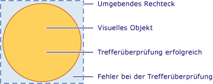
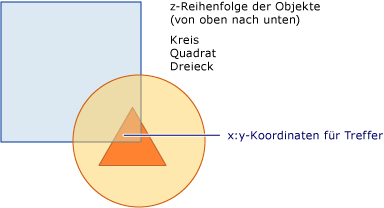

# Treffertests in der visuellen Ebene
Dieses Thema enthält eine Übersicht über die Treffertestfunktionen der visuellen Ebene.  Der Treffertest ermöglicht Ihnen, zu bestimmen, ob ein Geometrie\- oder Punktwert im Bereich des gerenderten Inhalts eines <xref:System.Windows.Media.Visual> liegt, und erlaubt Ihnen die Implementierung von Benutzeroberflächenverhalten wie einem Positionierungsrechteck zum Auswählen mehrerer Objekte.  
  
   
  
   
## Treffertestszenarien  
 Die <xref:System.Windows.UIElement>\-Klasse stellt die <xref:System.Windows.UIElement.InputHitTest%2A>\-Methode zur Verfügung, die Ihnen gestattet, einen erneuten Treffertest für ein Element mithilfe eines bestimmten Koordinatenwerts durchzuführen.  In vielen Fällen stellt die <xref:System.Windows.UIElement.InputHitTest%2A>\-Methode die gewünschte Funktionalität zum Implementieren des Treffertests für Elemente bereit.  Es gibt jedoch mehrere Szenarien, bei denen es möglicherweise erforderlich ist, den Treffertest auf der visuellen Ebene zu implementieren.  
  
-   Treffertest für Nicht\-<xref:System.Windows.UIElement>\-Objekte: Gilt beim Treffertest für Nicht\-<xref:System.Windows.UIElement>\-Objekte wie <xref:System.Windows.Media.DrawingVisual> oder Grafikobjekte.  
  
-   Treffertest unter Verwendung einer Geometrie: Gilt beim Treffertest unter Verwendung eines Geometrieobjekts statt des Koordinatenwerts eines Punkts.  
  
-   Treffertest für mehrere Objekte: Gilt beim Treffertest für mehrere Objekte wie überlappende Objekte.  Sie können Ergebnisse für alle grafischen Elemente abrufen, die eine Geometrie oder einen Punkt kreuzen, nicht nur für das erste.  
  
-   Ignorieren der Richtlinie für den <xref:System.Windows.UIElement>\-Treffertest: Gilt beim Ignorieren der Richtlinie für den <xref:System.Windows.UIElement>\-Treffertest, wobei Faktoren wie die Tatsache, ob ein Element deaktiviert oder ausgeblendet ist, berücksichtigt werden.  
  
> [!NOTE]
>  Ein vollständiges Codebeispiel, in dem der Treffertest in der visuellen Ebene veranschaulicht wird, finden Sie unter [Beispiel für Treffertests mit "DrawingVisuals"](http://go.microsoft.com/fwlink/?LinkID=159994) und [Beispiel für Treffertests mit Win32\-Interoperabilität](http://go.microsoft.com/fwlink/?LinkID=159995).  
  
   
## Unterstützung für den Treffertest  
 Der Zweck der <xref:System.Windows.Media.VisualTreeHelper.HitTest%2A>\-Methoden in der <xref:System.Windows.Media.VisualTreeHelper>\-Klasse besteht darin, zu bestimmen, ob eine Geometrie oder ein Punktkoordinatenwert sich im Bereich des gerenderten Inhalts eines bestimmten Objekts, z. B. eines Steuerelements oder eines grafischen Elements, befindet.  Sie können beispielsweise den Treffertest verwenden, um zu bestimmen, ob ein Mausklick innerhalb des umgebenden Rechtecks eines Objekts in die Geometrie eines Kreises fällt.  Sie können auch die Standardimplementierung für den Treffertest überschreiben, um Ihre eigenen benutzerdefinierten Treffertestberechnungen durchzuführen.  
  
 Die folgende Abbildung zeigt die Beziehung zwischen dem Bereich eines nicht rechteckigen Objekts und seinem umschließenden Rechteck.  
  
   
Diagramm des gültigen Treffertestbereichs  
  
   
## Treffertest und Z\-Reihenfolge  
 Die visuelle Ebene für [!INCLUDE[TLA#tla_winclient](../../../../includes/tlasharptla-winclient-md.md)] unterstützt den Treffertest für alle Objekte unter einem Punkt oder einer Geometrie und nicht nur für das oberste Objekt.  Ergebnisse werden in [Z\-Reihenfolge](GTMT) zurückgegeben.  Das visuelle Objekt, das Sie als Parameter an die <xref:System.Windows.Media.VisualTreeHelper.HitTest%2A>\-Methode weitergeben, bestimmt jedoch, welcher Bereich der [visuellen Struktur](GTMT) dem Treffertest unterzogen wird.  Sie können einen Treffertest für die ganze visuelle Struktur oder einen beliebigen Teil davon durchführen.  
  
 In der folgenden Abbildung befindet sich das Kreisobjekt sowohl auf dem Quadrat als auch auf dem Dreieck.  Wenn Sie nur einen Treffertest für das visuelle Objekt vornehmen möchten, dessen Wert für die [Z\-Reihenfolge](GTMT) der oberste ist, können Sie die Enumeration für den visuellen Treffertest so festlegen, dass er <xref:System.Windows.Media.HitTestResultBehavior> von <xref:System.Windows.Media.HitTestResultCallback> zurückgibt, um das Durchlaufen des Treffertests nach dem ersten Element zu beenden.  
  
   
Diagramm der Z\-Reihenfolge einer visuellen Struktur  
  
 Wenn Sie alle visuellen Objekte unter einem bestimmten Punkt oder einer Geometrie auflisten möchten, geben Sie <xref:System.Windows.Media.HitTestResultBehavior> von <xref:System.Windows.Media.HitTestResultCallback> zurück.  Das heißt, dass Sie den Treffertest für visuelle Objekte durchführen können, die unter anderen Objekten liegen, selbst wenn sie vollständig verdeckt werden.  Weitere Informationen finden Sie im Beispielcode im Abschnitt "Verwenden eines Treffertest\-Ergebnisrückrufs".  
  
> [!NOTE]
>  Auch für transparente visuelle Objekte kann der Treffertest durchgeführt werden.  
  
   
## Verwenden des Standardtreffertests  
 Sie können feststellen, ob sich ein Punkt innerhalb der Geometrie eines Objekts befindet, indem Sie die <xref:System.Windows.Media.VisualTreeHelper.HitTest%2A>\-Methode verwenden, um ein visuelles Objekt und einen Punktkoordinatenwert für den Test anzugeben.  Der visuelle Objektparameter identifiziert den Ausgangspunkt in der visuellen Struktur für die Treffertestsuche.  Wenn in der visuellen Struktur ein visuelles Objekt entdeckt wird, dessen Geometrie die Koordinaten aufweist, wird es auf die <xref:System.Windows.Media.HitTestResult.VisualHit%2A>\-Eigenschaft eines <xref:System.Windows.Media.HitTestResult>\-Objekts festgelegt.  Das <xref:System.Windows.Media.HitTestResult> wird dann von der <xref:System.Windows.Media.VisualTreeHelper.HitTest%2A>\-Methode zurückgegeben.  Wenn der Punkt in der visuellen Teilstruktur nicht enthalten ist, für die Sie den Treffertest durchführen, gibt <xref:System.Windows.Media.VisualTreeHelper.HitTest%2A> `null` zurück.  
  
> [!NOTE]
>  Der Standardtreffertest gibt immer das oberste Objekt in der [Z\-Reihenfolge](GTMT) zurück.  Wenn Sie alle visuellen Objekte identifizieren möchten \(auch diejenigen, die teilweise oder vollständig verdeckt sind\), verwenden Sie einen Treffertest\-Ergebnisrückruf.  
  
 Der Koordinatenwert, den Sie als Punktparameter für die <xref:System.Windows.Media.VisualTreeHelper.HitTest%2A>\-Methode übergeben, muss relativ zum Koordinatenraum des visuellen Objekts sein, für das Sie den Treffertest durchführen.  Wenn Sie beispielsweise visuelle Objekte geschachtelt haben, die im übergeordneten Koordinatenraum bei \(100, 100\) definiert sind, entspricht der Treffertest eines untergeordneten visuellen Objekts bei \(0, 0\) dem Treffertest bei \(100, 100\) im übergeordneten Koordinatenraum.  
  
 Der folgende Code veranschaulicht, wie Mausereignishandler für ein <xref:System.Windows.UIElement>\-Objekt eingerichtet werden, das zum Aufzeichnen von Ereignissen für den Treffertest dient.  
  
 [!code-csharp[HitTestingOverview#100](../../../../samples/snippets/csharp/VS_Snippets_Wpf/HitTestingOverview/CSharp/Window1.xaml.cs#100)]
 [!code-vb[HitTestingOverview#100](../../../../samples/snippets/visualbasic/VS_Snippets_Wpf/HitTestingOverview/visualbasic/window1.xaml.vb#100)]  
  
### So beeinflusst die visuelle Struktur den Treffertest  
 Der Startpunkt in der visuellen Struktur bestimmt, welche Objekte während der Treffertestenumeration der Objekte zurückgegeben werden.  Wenn Sie für mehrere Objekte einen Treffertest durchführen möchten, muss das in der visuellen Struktur als Startpunkt verwendete Objekt das gemeinsame übergeordnete Element aller betroffenen Objekte sein.  Wenn Sie beispielsweise sowohl für das Schaltflächenelement als auch für das visuelle Zeichnungsobjekt im folgenden Diagramm einen Treffertest durchführen möchten, müssen Sie den Startpunkt in der visuellen Struktur auf das gemeinsame übergeordnete Objekt für diese beiden Elemente festlegen.  In diesem Fall ist das Canvas\-Element das übergeordnete Objekt für das Schaltflächenelement und das visuelle Zeichnungsobjekt.  
  
   
Diagramm der Hierarchie einer visuellen Struktur  
  
> [!NOTE]
>  Die <xref:System.Windows.UIElement.IsHitTestVisible%2A>\-Eigenschaft ruft einen Wert ab oder legt einen Wert fest, der deklariert, ob ein von <xref:System.Windows.UIElement> abgeleitetes Objekt als Treffertestergebnis von einem Bereich seines gerenderten Inhalts zurückgegeben werden kann.  Dadurch haben Sie die Möglichkeit, selektiv Änderungen an der visuellen Struktur vorzunehmen, um zu bestimmen, welche visuellen Objekte an einem Treffertest beteiligt sind.  
  
   
## Verwenden eines Treffertest\-Ergebnisrückrufs  
 Sie können alle visuellen Objekte in einer visuellen Struktur auflisten, deren Geometrie einen angegebenen Koordinatenwert enthält.  Dadurch können Sie alle visuellen Objekte identifizieren, auch diejenigen, die teilweise oder vollständig von anderen visuellen Objekten verdeckt sind.  Um visuelle Objekte in einer visuellen Struktur aufzulisten, verwenden Sie die <xref:System.Windows.Media.VisualTreeHelper.HitTest%2A>\-Methode mit einer Treffertest\-Rückruffunktion.  Die Treffertest\-Rückruffunktion wird vom System aufgerufen, wenn der von Ihnen angegebene Koordinatenwert in einem visuellen Objekt enthalten ist.  
  
 Während der Auflistung der Treffertestergebnisse sollten Sie keine Vorgänge ausführen, die die visuelle Struktur ändern.  Das Hinzufügen oder Entfernen eines Objekts aus der visuellen Struktur, während diese durchlaufen wird, kann zu unvorhersehbarem Verhalten führen.  Sie können die visuelle Struktur sicher ändern, nachdem die <xref:System.Windows.Media.VisualTreeHelper.HitTest%2A>\-Methode einen Wert zurückgegeben hat.  Es kann sinnvoll sein, eine Datenstruktur anzugeben, beispielsweise eine <xref:System.Collections.ArrayList>, um während der Auflistung der Treffertestergebnisse dort Werte zu speichern.  
  
 [!code-csharp[HitTestingOverview#101](../../../../samples/snippets/csharp/VS_Snippets_Wpf/HitTestingOverview/CSharp/Window1.xaml.cs#101)]
 [!code-vb[HitTestingOverview#101](../../../../samples/snippets/visualbasic/VS_Snippets_Wpf/HitTestingOverview/visualbasic/window1.xaml.vb#101)]  
  
 Die Treffertest\-Rückrufmethode definiert die Aktionen, die ausgeführt werden, wenn ein Treffertest für ein bestimmtes visuelles Objekt in der visuellen Struktur identifiziert wird.  Nachdem diese Aktionen ausgeführt wurden, wird ein <xref:System.Windows.Media.HitTestResultBehavior>\-Wert zurückgegeben, der bestimmt, ob die Auflistung weiterer vorhandener visueller Objekte fortgesetzt werden soll oder nicht.  
  
 [!code-csharp[HitTestingOverview#102](../../../../samples/snippets/csharp/VS_Snippets_Wpf/HitTestingOverview/CSharp/Window1.xaml.cs#102)]
 [!code-vb[HitTestingOverview#102](../../../../samples/snippets/visualbasic/VS_Snippets_Wpf/HitTestingOverview/visualbasic/window1.xaml.vb#102)]  
  
> [!NOTE]
>  Die Auflistung der visuellen Objekttreffer erfolgt in [Z\-Reihenfolge](GTMT).  Das visuelle Objekt auf der obersten [Z\-Reihenfolgen](GTMT)\-Ebene ist das erste aufgelistete Objekt.  Alle anderen visuellen Objekte werden absteigend gemäß der [Z\-Reihenfolge](GTMT) aufgelistet.  Diese Reihenfolge der Auflistung entspricht der Renderingreihenfolge der grafischen Elemente.  
  
 Sie können die Auflistung visueller Objekte mit der Treffertest\-Rückruffunktion jederzeit anhalten, indem Sie <xref:System.Windows.Media.HitTestResultBehavior> zurückgeben.  
  
 [!code-csharp[HitTestingOverview#103](../../../../samples/snippets/csharp/VS_Snippets_Wpf/HitTestingOverview/CSharp/Window1.xaml.cs#103)]
 [!code-vb[HitTestingOverview#103](../../../../samples/snippets/visualbasic/VS_Snippets_Wpf/HitTestingOverview/visualbasic/window1.xaml.vb#103)]  
  
   
## Verwenden eines Treffertestfilter\-Rückrufs  
 Sie können einen optionalen Treffertestfilter verwenden, um die Objekte zu begrenzen, die an die Treffertestergebnisse weitergeleitet werden.  Dadurch können Sie Teile der visuellen Struktur ignorieren, die nicht in Ihren Treffertestergebnissen verarbeitet werden sollen.  Um einen Treffertestfilter zu implementieren, müssen Sie eine Treffertestfilter\-Rückruffunktion definieren und als Parameterwert weitergeben, wenn Sie die <xref:System.Windows.Media.VisualTreeHelper.HitTest%2A>\-Methode aufrufen.  
  
 [!code-csharp[HitTestingOverview#104](../../../../samples/snippets/csharp/VS_Snippets_Wpf/HitTestingOverview/CSharp/Window1.xaml.cs#104)]
 [!code-vb[HitTestingOverview#104](../../../../samples/snippets/visualbasic/VS_Snippets_Wpf/HitTestingOverview/visualbasic/window1.xaml.vb#104)]  
  
 Wenn Sie die optionale Treffertestfilter\-Rückruffunktion nicht angeben möchten, übergeben Sie einen `null`\-Wert als Parameter für die <xref:System.Windows.Media.VisualTreeHelper.HitTest%2A>\-Methode.  
  
 [!code-csharp[HitTestingOverview#105](../../../../samples/snippets/csharp/VS_Snippets_Wpf/HitTestingOverview/CSharp/Window1.xaml.cs#105)]
 [!code-vb[HitTestingOverview#105](../../../../samples/snippets/visualbasic/VS_Snippets_Wpf/HitTestingOverview/visualbasic/window1.xaml.vb#105)]  
  
   
Verringern der Verzweigungen in einer visuellen Struktur  
  
 Die Treffertestfilter\-Rückruffunktion gestattet Ihnen, alle visuellen Objekte aufzulisten, deren gerenderte Inhalte die von Ihnen angegebenen Koordinaten enthalten.  Sie können jedoch auch bestimmte Verzweigungen der visuellen Struktur ignorieren, die im Rahmen Ihrer Treffertestergebnis\-Rückruffunktion nicht verarbeitet werden sollen.  Der Rückgabewert der Treffertestfilter\-Rückruffunktion bestimmt, welcher Typ von Aktion von der Enumeration der visuellen Objekte ausgeführt werden soll.  Wenn beispielsweise der Wert <xref:System.Windows.Media.HitTestFilterBehavior> zurückgegeben wird, können Sie das aktuelle visuelle Objekt und seine untergeordneten Elemente aus der Auflistung der Treffertestergebnisse entfernen.  Dies bedeutet, dass für die Treffertestergebnis\-Rückruffunktion diese Objekte nicht in der Auflistung enthalten sind.  Durch das Verringern der Verzweigungen in der visuellen Struktur von Objekten wird der Verarbeitungsaufwand während der Übergabe der Auflistung von Treffertestergebnissen verringert.  Im folgenden Codebeispiel überspringt der Filter Bezeichnungen und ihre Nachfolgerelemente und führt für alle anderen Elemente Treffertests durch.  
  
 [!code-csharp[HitTestingOverview#106](../../../../samples/snippets/csharp/VS_Snippets_Wpf/HitTestingOverview/CSharp/Window1.xaml.cs#106)]
 [!code-vb[HitTestingOverview#106](../../../../samples/snippets/visualbasic/VS_Snippets_Wpf/HitTestingOverview/visualbasic/window1.xaml.vb#106)]  
  
> [!NOTE]
>  Der Treffertestfilter\-Rückruf wird gelegentlich aufgerufen, wenn der Treffertestergebnis\-Rückruf nicht aufgerufen wird.  
  
   
## Überschreiben des Standardtreffertests  
 Sie können die Unterstützung des Standardtreffertests für ein visuelles Objekt überschreiben, indem Sie die <xref:System.Windows.Media.Visual.HitTestCore%2A>\-Methode überschreiben.  In diesem Fall wird beim Aufrufen der <xref:System.Windows.Media.VisualTreeHelper.HitTest%2A>\-Methode die überschriebene Implementierung von <xref:System.Windows.Media.Visual.HitTestCore%2A> aufgerufen.  Ihre überschriebene Methode wird aufgerufen, wenn sich ein Treffertest innerhalb des umgebenden Rechtecks für das visuelle Objekt befindet. Dies gilt auch dann, wenn die Koordinate außerhalb des gerenderten Inhalts des visuellen Objekts liegt.  
  
 [!code-csharp[HitTestingOverview#107](../../../../samples/snippets/csharp/VS_Snippets_Wpf/HitTestingOverview/CSharp/Window1.xaml.cs#107)]
 [!code-vb[HitTestingOverview#107](../../../../samples/snippets/visualbasic/VS_Snippets_Wpf/HitTestingOverview/visualbasic/window1.xaml.vb#107)]  
  
 Es kann vorkommen, dass Sie einen Treffertest sowohl für das umschließende Rechteck als auch für den gerenderten Inhalt eines visuellen Objekts durchführen möchten.  Indem Sie den `PointHitTestParameters`\-Parameterwert in der überschriebenen <xref:System.Windows.Media.Visual.HitTestCore%2A>\-Methode als Parameter für die Basismethode <xref:System.Windows.Media.Visual.HitTestCore%2A> verwenden, können Sie basierend auf einem Treffer für das umschließende Rechteck eines visuellen Objekts Aktionen ausführen und anschließend einen zweiten Treffertest für den gerenderten Inhalt des visuellen Objekts vornehmen.  
  
 [!code-csharp[HitTestingOverview#108](../../../../samples/snippets/csharp/VS_Snippets_Wpf/HitTestingOverview/CSharp/Window1.xaml.cs#108)]
 [!code-vb[HitTestingOverview#108](../../../../samples/snippets/visualbasic/VS_Snippets_Wpf/HitTestingOverview/visualbasic/window1.xaml.vb#108)]  
  
## Siehe auch  
 <xref:System.Windows.Media.VisualTreeHelper.HitTest%2A>   
 <xref:System.Windows.Media.HitTestResult>   
 <xref:System.Windows.Media.HitTestResultCallback>   
 <xref:System.Windows.Media.HitTestFilterCallback>   
 <xref:System.Windows.UIElement.IsHitTestVisible%2A>   
 [Beispiel für Treffertests mit "DrawingVisuals"](http://go.microsoft.com/fwlink/?LinkID=159994)   
 [Beispiel für Treffertests mit Win32\-Interoperabilität](http://go.microsoft.com/fwlink/?LinkID=159995)   
 [Treffertest für eine Geometrie in einem visuellen Objekt](../../../../docs/framework/wpf/graphics-multimedia/how-to-hit-test-geometry-in-a-visual.md)   
 [Treffertest mithilfe eines Win32\-Hostcontainers](../../../../docs/framework/wpf/graphics-multimedia/how-to-hit-test-using-a-win32-host-container.md)