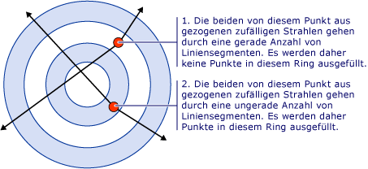
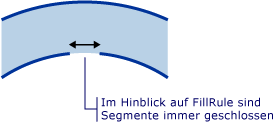

# Gewusst wie: Steuern des Ausf&#252;llens einer zusammengesetzten Form
Die <xref:System.Windows.Media.GeometryGroup.FillRule%2A> Eigenschaft ein <xref:System.Windows.Media.GeometryGroup> oder <xref:System.Windows.Media.PathGeometry>, gibt eine "Regel" der zusammengesetzte Form verwendet wird, um zu bestimmen, ob ein bestimmter Punkt Teil der Geometrie ist. Es gibt zwei mögliche Werte für <xref:System.Windows.Media.FillRule>: <xref:System.Windows.Media.FillRule> und <xref:System.Windows.Media.FillRule>. In den folgenden Abschnitten werden beschrieben, wie diese beiden Regeln verwendet.  
  
 **EvenOdd:** dieser Regel wird bestimmt, ob ein Punkt in der Region ausfüllen, ist indem ein unendlicher Strahl von diesem Punkt in eine beliebige Richtung gezeichnet und die Anzahl der Pfadsegmente in der Form, die vom Strahl gezählt. Bei einer ungeraden Zahl liegt der Punkt innen, und bei einer geraden Zahl liegt er außen.  
  
 Beispielsweise erstellt das unten aufgeführte XAML eine zusammengesetzte Form, bestehend aus einer Reihe von konzentrische Ringe (Ziel) mit einem <xref:System.Windows.Media.GeometryGroup.FillRule%2A> festgelegt <xref:System.Windows.Media.FillRule>.  
  
 [!code-xml[GeometriesMiscSnippets_snip#FillRuleEvenOddValue](../../../../samples/snippets/xaml/VS_Snippets_Wpf/GeometriesMiscSnippets_snip/XAML/FillRuleExample.xaml#fillruleevenoddvalue)]  
  
 Die folgende Abbildung zeigt die im vorherigen Beispiel erstellte Form.  
  
   
  
 Beachten Sie in der Abbildung oben, dass es sich bei dem Mittelpunkt und dem 3. Ring nicht ausgefüllt sind. Dies ist ein Strahl von einem beliebigen Punkt innerhalb eines dieser beiden Ringe über eine gerade Anzahl von Segmenten weiterleitet. Siehe folgende Abbildung:  
  
   
  
 **NonZero:** dieser Regel wird bestimmt, ob ein Punkt in der Region Füllung des Pfads, ist indem ein unendlicher Strahl von diesem Punkt in eine beliebige Richtung und anschließend die Stellen, an denen ein Segment der Form den Strahl schneidet, überprüft. Beginnend mit dem Wert&0; (null), fügen Sie eine jedes Mal, die ein Segment den Strahl von links nach rechts und einen einzelnen subtrahieren schneidet Mal einen Pfad Segment schneidet den Strahl von rechts nach links. Wenn das Ergebnis nach dem Zählen der Überschneidungen&0; (null) ist, liegt der Punkt außerhalb des Pfads. Andernfalls liegt er innerhalb des Pfads.  
  
 [!code-xml[GeometriesMiscSnippets_snip#FillRuleNonZeroValueEllipseGeometry](../../../../samples/snippets/xaml/VS_Snippets_Wpf/GeometriesMiscSnippets_snip/XAML/FillRuleExample.xaml#fillrulenonzerovalueellipsegeometry)]  
  
 Im Beispiel oben, der Wert <xref:System.Windows.Media.FillRule> für <xref:System.Windows.Media.GeometryGroup.FillRule%2A> daher ergibt die folgende Abbildung:  
  
   
  
 Wie Sie sehen können, sind alle Ringe ausgefüllt. Dies ist, da alle Segmente in der gleichen Richtung ausgeführt werden und daher ein Strahl von einem beliebigen Zeitpunkt eine plattformübergreifende wird oder weitere Segmente und die Summe der überschreitungen nicht gleich&0; (null ist). In der folgenden Abbildung z. B. die rote Pfeile stellen die Richtung, in die Segmente gezeichnet werden und der weiße Pfeil stellt einen zufälligen Strahl von einem Punkt im innersten Ring. Beginnend mit dem Wert&0; (null), für die einzelnen Segmente, die vom Strahl, wird Wert&1; hinzugefügt werden, da das Segment den Strahl von links nach rechts schneidet.  
  
   
  
 Um das Verhalten besser zu veranschaulichen <xref:System.Windows.Media.FillRule> Regel eine komplexere Form Segmente in verschiedene Richtungen ausgeführt ist erforderlich. Der folgende XAML-Code wird eine ähnliche Form wie im vorherigen Beispiel, außer dass sie mit erstellt wird ein <xref:System.Windows.Media.PathGeometry> anstelle einer <xref:System.Windows.Media.EllipseGeometry> erstellt vier konzentrische Bogen statt vollständig geschlossene konzentrische Kreise.  
  
 [!code-xml[GeometriesMiscSnippets_snip#FillRuleNonZeroValuePathGeometry](../../../../samples/snippets/xaml/VS_Snippets_Wpf/GeometriesMiscSnippets_snip/XAML/FillRuleExample.xaml#fillrulenonzerovaluepathgeometry)]  
  
 Die folgende Abbildung zeigt die im vorherigen Beispiel erstellte Form.  
  
   
  
 Beachten Sie, dass der dritte Bogen von der Mitte nicht ausgefüllt ist. Die folgende Abbildung zeigt, warum dies ist. In der Abbildung stellen die roten Pfeile die Richtung, in die Segmente gezeichnet werden dar. Die beiden weißen Pfeile stellen zwei beliebige Strahlung, die von einem Punkt in der Region "nicht ausgefüllte" verschieben dar. Wie aus der Abbildung ersichtlich, ist die Summe der Werte eines bestimmten Strahls überschreiten die Segmente in seinem Pfad&0; (null). Wie oben bereits definiert, bedeutet eine Summe&0; (null), dass der Punkt nicht Teil der Geometrie (nicht Teil der Füllung) während einer Summe ist *nicht*&0; (null), einschließlich eines negativen Werts, Teil der Geometrie ist.  
  
   
  
 **Hinweis:** für die Zwecke des <xref:System.Windows.Media.FillRule>, alle Formen werden als geschlossen betrachtet. Wenn eine Lücke in einem Segment vorhanden ist, zeichnen Sie eine gedachte Linie, um es zu schließen. Im obigen Beispiel stehen die Ringe kleine Lücken. Angesichts erwarten einer Strahl, die durch die Lücke ein anderes Ergebnis führt dann einen Strahl in einer anderen Richtung. Im folgenden finden Sie eine vergrößerte Abbildung einer dieser Lücken und des "gedachten"Segments dargestellt (Segment, das Anwenden von gezeichnet wird die <xref:System.Windows.Media.FillRule>), die geschlossen wird.  
  
   
  
## Beispiel  
  
## Siehe auch  
 [Erstellen einer zusammengesetzten Form](../../../../docs/framework/wpf/graphics-multimedia/how-to-create-a-composite-shape.md)   
 [Übersicht über die Geometrie](../../../../docs/framework/wpf/graphics-multimedia/geometry-overview.md)