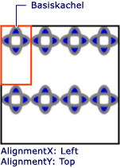
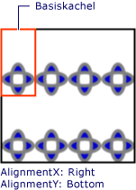

# Gewusst wie: Festlegen von horizontaler und vertikaler Ausrichtung bei einem TileBrush
In diesem Beispiel wird gezeigt, wie die horizontale und die vertikale Ausrichtung des Inhalts in einer Fläche gesteuert werden. Steuern Sie die horizontale und vertikale Ausrichtung des eine <xref:System.Windows.Media.TileBrush>, verwenden Sie die <xref:System.Windows.Media.TileBrush.AlignmentX%2A> und <xref:System.Windows.Media.TileBrush.AlignmentY%2A> Eigenschaften.  
  
 Die <xref:System.Windows.Media.TileBrush.AlignmentX%2A> und <xref:System.Windows.Media.TileBrush.AlignmentY%2A> Eigenschaften einer <xref:System.Windows.Media.TileBrush> werden verwendet, wenn eine der folgenden Bedingungen zutrifft:  
  
-   Die <xref:System.Windows.Media.TileBrush.Stretch%2A> Eigenschaft <xref:System.Windows.Media.Stretch.Uniform> oder <xref:System.Windows.Media.Stretch.UniformToFill> und <xref:System.Windows.Media.TileBrush.Viewbox%2A> und <xref:System.Windows.Media.TileBrush.Viewport%2A> haben unterschiedliche Seitenverhältnissen.  
  
-   Die <xref:System.Windows.Media.TileBrush.Stretch%2A> Eigenschaft <xref:System.Windows.Media.Stretch.None> und <xref:System.Windows.Media.TileBrush.Viewbox%2A> und <xref:System.Windows.Media.TileBrush.Viewport%2A> unterschiedlich lang sind.  
  
## Beispiel  
 Das folgende Beispiel richtet den Inhalt einer <xref:System.Windows.Media.DrawingBrush>, d. h. einen Typ von <xref:System.Windows.Media.TileBrush>, auf der linken oberen Ecke der Kachel. Zum Ausrichten von Inhalt, der im Beispiel wird die <xref:System.Windows.Media.TileBrush.AlignmentX%2A> Eigenschaft der <xref:System.Windows.Media.DrawingBrush> auf <xref:System.Windows.Media.AlignmentX.Left> und die <xref:System.Windows.Media.TileBrush.AlignmentY%2A> Eigenschaft <xref:System.Windows.Media.AlignmentY.Top>. Folgende Ergebnisse werden zurückgegeben:  
  
   
TileBrush mit an der linken oberen Ecke ausgerichtetem Inhalt  
  
 [!code-csharp[brushoverviewexamples_snip#TileBrushTopLeftAlignmentInline](../../../../samples/snippets/csharp/VS_Snippets_Wpf/BrushOverviewExamples_snip/CSharp/TileBrushAlignmentExample.cs#tilebrushtopleftalignmentinline)]
 [!code-vb[brushoverviewexamples_snip#TileBrushTopLeftAlignmentInline](../../../../samples/snippets/visualbasic/VS_Snippets_Wpf/BrushOverviewExamples_snip/visualbasic/tilebrushalignmentexample.vb#tilebrushtopleftalignmentinline)]
 [!code-xaml[brushoverviewexamples_snip#TileBrushTopLeftAlignmentInline](../../../../samples/snippets/xaml/VS_Snippets_Wpf/BrushOverviewExamples_snip/XAML/TileBrushAlignmentExample.xaml#tilebrushtopleftalignmentinline)]  
  
## Beispiel  
 Im nächste Beispiel richtet den Inhalt des eine <xref:System.Windows.Media.DrawingBrush> zu unten rechts die Kachel durch Festlegen der <xref:System.Windows.Media.TileBrush.AlignmentX%2A> Eigenschaft, um <xref:System.Windows.Media.AlignmentX.Right> und die <xref:System.Windows.Media.TileBrush.AlignmentY%2A> Eigenschaft <xref:System.Windows.Media.AlignmentY.Bottom>. Das Beispiel erzeugt folgende Ausgabe.  
  
   
TileBrush mit an der rechten unteren Ecke ausgerichtetem Inhalt  
  
 [!code-csharp[brushoverviewexamples_snip#TileBrushBottomRightAlignmentInline](../../../../samples/snippets/csharp/VS_Snippets_Wpf/BrushOverviewExamples_snip/CSharp/TileBrushAlignmentExample.cs#tilebrushbottomrightalignmentinline)]
 [!code-vb[brushoverviewexamples_snip#TileBrushBottomRightAlignmentInline](../../../../samples/snippets/visualbasic/VS_Snippets_Wpf/BrushOverviewExamples_snip/visualbasic/tilebrushalignmentexample.vb#tilebrushbottomrightalignmentinline)]
 [!code-xaml[brushoverviewexamples_snip#TileBrushBottomRightAlignmentInline](../../../../samples/snippets/xaml/VS_Snippets_Wpf/BrushOverviewExamples_snip/XAML/TileBrushAlignmentExample.xaml#tilebrushbottomrightalignmentinline)]  
  
## Beispiel  
 Im nächste Beispiel richtet den Inhalt einer <xref:System.Windows.Media.DrawingBrush> auf der linken oberen Ecke der Kachel durch Festlegen der <xref:System.Windows.Media.TileBrush.AlignmentX%2A> Eigenschaft, um <xref:System.Windows.Media.AlignmentX.Left> und die <xref:System.Windows.Media.TileBrush.AlignmentY%2A> Eigenschaft, um <xref:System.Windows.Media.AlignmentY.Top>. Außerdem wird die <xref:System.Windows.Media.TileBrush.Viewport%2A> und <xref:System.Windows.Media.TileBrush.TileMode%2A> von der <xref:System.Windows.Media.DrawingBrush> um ein Kachelmuster zu erzeugen. Das Beispiel erzeugt folgende Ausgabe.  
  
   
Flächenmuster mit in der Basisfläche oben links ausgerichtetem Inhalt  
  
 In der Abbildung ist eine Basisfläche hervorgehoben, damit Sie sehen können, wie der Inhalt ausgerichtet ist. Beachten Sie, dass die <xref:System.Windows.Media.TileBrush.AlignmentX%2A> Einstellung hat keine Wirkung, da der Inhalt der <xref:System.Windows.Media.DrawingBrush> vollständig horizontal füllt die Basiskachel.  
  
 [!code-csharp[brushoverviewexamples_snip#TileBrushTopLeftAlignmentTiledInline](../../../../samples/snippets/csharp/VS_Snippets_Wpf/BrushOverviewExamples_snip/CSharp/TileBrushAlignmentExample.cs#tilebrushtopleftalignmenttiledinline)]
 [!code-vb[brushoverviewexamples_snip#TileBrushTopLeftAlignmentTiledInline](../../../../samples/snippets/visualbasic/VS_Snippets_Wpf/BrushOverviewExamples_snip/visualbasic/tilebrushalignmentexample.vb#tilebrushtopleftalignmenttiledinline)]
 [!code-xaml[brushoverviewexamples_snip#TileBrushTopLeftAlignmentTiledInline](../../../../samples/snippets/xaml/VS_Snippets_Wpf/BrushOverviewExamples_snip/XAML/TileBrushAlignmentExample.xaml#tilebrushtopleftalignmenttiledinline)]  
  
## Beispiel  
 Im letzten Beispiel wird der Inhalt von einem unterteilten ausgerichtet <xref:System.Windows.Media.DrawingBrush> nach rechts unten auf seine Basiskachel durch Festlegen der <xref:System.Windows.Media.TileBrush.AlignmentX%2A> Eigenschaft <xref:System.Windows.Media.AlignmentX.Right> und die <xref:System.Windows.Media.TileBrush.AlignmentY%2A> Eigenschaft <xref:System.Windows.Media.AlignmentY.Bottom>. Das Beispiel erzeugt folgende Ausgabe.  
  
   
Flächenmuster mit in der Basisfläche oben rechts ausgerichtetem Inhalt  
  
 Erneut, die <xref:System.Windows.Media.TileBrush.AlignmentX%2A> Einstellung hat keine Wirkung, da der Inhalt der <xref:System.Windows.Media.DrawingBrush> vollständig horizontal füllt die Basiskachel.  
  
 [!code-csharp[brushoverviewexamples_snip#TileBrushBottomRightAlignmentInline](../../../../samples/snippets/csharp/VS_Snippets_Wpf/BrushOverviewExamples_snip/CSharp/TileBrushAlignmentExample.cs#tilebrushbottomrightalignmentinline)]
 [!code-vb[brushoverviewexamples_snip#TileBrushBottomRightAlignmentInline](../../../../samples/snippets/visualbasic/VS_Snippets_Wpf/BrushOverviewExamples_snip/visualbasic/tilebrushalignmentexample.vb#tilebrushbottomrightalignmentinline)]
 [!code-xaml[brushoverviewexamples_snip#TileBrushBottomRightAlignmentInline](../../../../samples/snippets/xaml/VS_Snippets_Wpf/BrushOverviewExamples_snip/XAML/TileBrushAlignmentExample.xaml#tilebrushbottomrightalignmentinline)]  
  
 In den Beispielen <xref:System.Windows.Media.DrawingBrush> -Objekten, die veranschaulichen, wie die <xref:System.Windows.Media.TileBrush.AlignmentX%2A> und <xref:System.Windows.Media.TileBrush.AlignmentY%2A> Eigenschaften verwendet werden. Diese Eigenschaften verhalten sich identisch, für alle TileBrush-Objekte: <xref:System.Windows.Media.DrawingBrush>, <xref:System.Windows.Media.ImageBrush>, und <xref:System.Windows.Media.VisualBrush>. Weitere Informationen zu TileBrush-Objekten finden Sie unter [Zeichnen mit Bildern, Zeichnungen und visuellen Elementen](../../../../docs/framework/wpf/graphics-multimedia/painting-with-images-drawings-and-visuals.md).  
  
## Siehe auch  
 <xref:System.Windows.Media.DrawingBrush>  
 <xref:System.Windows.Media.ImageBrush>  
 <xref:System.Windows.Media.VisualBrush>  
 [Zeichnen mit Bildern, Zeichnungen und visuellen Elementen](../../../../docs/framework/wpf/graphics-multimedia/painting-with-images-drawings-and-visuals.md)
