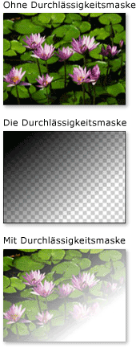
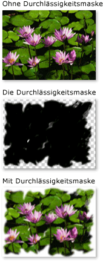
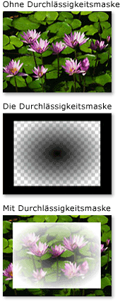

# Übersicht über Durchlässigkeitsmasken
Mit Deckkraftmasken können Sie Teile eines Elements oder visuellen Objekts transparent bzw. teilweise transparent machen. Zum Erstellen einer Deckkraftmaske Sie Anwenden einer <xref:System.Windows.Media.Brush> auf die <xref:System.Windows.UIElement.OpacityMask%2A> Eigenschaft eines Elements oder <xref:System.Windows.Media.Visual>.  Der Pinsel wird dem Element oder visuellen Objekt zugeordnet, und der Durchlässigkeitswert jedes Pinselpixels bestimmt die resultierende Durchlässigkeit der entsprechenden Pixel des Elements oder visuellen Objekts.  
  
   
## Erforderliche Komponenten  
 In dieser Übersicht wird davon ausgegangen, dass Sie kennen <xref:System.Windows.Media.Brush> Objekte. Eine Einführung in die Verwendung von Pinseln finden Sie unter [Übersicht über das Zeichnen mit Volltonfarben und Farbverläufen](../../../../docs/framework/wpf/graphics-multimedia/painting-with-solid-colors-and-gradients-overview.md). Informationen zu <xref:System.Windows.Media.ImageBrush> und <xref:System.Windows.Media.DrawingBrush>, finden Sie unter [Zeichnen mit Bildern, Zeichnungen und visuellen Elementen](../../../../docs/framework/wpf/graphics-multimedia/painting-with-images-drawings-and-visuals.md).  
  
   
## Erstellen von visuellen Effekten mit Deckkraftmasken  
 Eine Deckkraftmaske ordnet seine Inhalte dem Element oder visuellen Objekt zu. Der Alphakanal der einzelnen Pinselpixel bestimmt die resultierende Durchlässigkeit der entsprechenden Pixel des Elements oder visuellen Objekts. Die tatsächliche Farbe des Pinsels wird ignoriert. Wenn ein bestimmter Teil des Pinsels transparent ist, wird der entsprechende Teil des Elements oder visuellen Objekts transparent. Wenn ein bestimmter Teil des Pinsels nicht transparent ist, bleibt die Durchlässigkeit des entsprechenden Teils des Elements oder visuellen Objekts unverändert. Die von der Deckkraftmaske angegebene Deckkraft wird mit allen Deckkrafteinstellungen im Element oder visuellen Objekt kombiniert. Wenn ein Element z.B. zu 25 Prozent deckend ist und eine Deckkraftmaske angewendet wird, die von vollständig deckend in vollständig transparent übergeht, ist das Ergebnis ein Element, das von 25 Prozent deckend in vollständig transparent übergeht.  
  
> [!NOTE]
>  Obwohl in die Beispielen in dieser Übersicht über die Verwendung der Deckkraftmasken für Bildelemente gezeigt wird, kann eine Deckkraftmaske auf jedes Element angewendet werden oder <xref:System.Windows.Media.Visual>, einschließlich der Elemente und Steuerelemente.  
  
 Deckkraftmasken dienen zum Erstellen interessanter visueller Effekte, z.B. zum Erstellen von Bildern oder Schaltflächen, die ausgeblendet werden, zum Hinzufügen von Texturen zu Elementen oder Kombinieren von Farbverläufen, um glasähnliche Oberflächen zu erzeugen. Die folgende Abbildung veranschaulicht die Verwendung einer Deckkraftmaske. Ein Hintergrund im Schachbrettmuster zeigt die transparenten Teile der Maske.  
  
   
Beispiel für eine Deckkraftmaske  
  
   
## Erstellen einer Deckkraftmaske  
 Erstellen eine Deckkraftmaske, erstellen Sie eine <xref:System.Windows.Media.Brush> und wendet ihn auf die <xref:System.Windows.UIElement.OpacityMask%2A> Eigenschaft eines Elements oder Visual. Sie können jede Art von <xref:System.Windows.Media.Brush> als einer Deckkraftmaske.  
  
-   <xref:System.Windows.Media.LinearGradientBrush>, <xref:System.Windows.Media.RadialGradientBrush>: Verwendet, um ein Element oder visuelles Element zu machen.  
  
     Die folgende Abbildung zeigt eine <xref:System.Windows.Media.LinearGradientBrush> als einer Deckkraftmaske verwendet.  
  
       
Beispiel für eine LinearGradientBrush-Deckkraftmaske  
  
-   <xref:System.Windows.Media.ImageBrush>: Wird verwendet, um die Textur und weiche oder zerrissene Edge Auswirkungen zu erstellen.  
  
     Die folgende Abbildung zeigt eine <xref:System.Windows.Media.ImageBrush> als einer Deckkraftmaske verwendet.  
  
       
Beispiel für eine LinearGradientBrush-Deckkraftmaske  
  
-   <xref:System.Windows.Media.DrawingBrush>: Wird verwendet, um komplexe Deckkraftmasken aus Mustern von Formen, Bildern und Farbverläufen zu erstellen.  
  
     Die folgende Abbildung zeigt eine <xref:System.Windows.Media.DrawingBrush> als einer Deckkraftmaske verwendet.  
  
       
Beispiel für eine DrawingBrush-Deckkraftmaske  
  
 Die Farbverlaufspinsel (<xref:System.Windows.Media.LinearGradientBrush> und <xref:System.Windows.Media.RadialGradientBrush>) für die Verwendung als einer Deckkraftmaske besonders gut geeignet sind. Da eine <xref:System.Windows.Media.SolidColorBrush> füllt einen Bereich mit einer einheitlichen Farbe, stellen sie eine schlechte Deckkraft maskiert; mithilfe einer <xref:System.Windows.Media.SolidColorBrush> entspricht dem Festlegen des Elements oder der Visualisierung <xref:System.Windows.UIElement.OpacityMask%2A> Eigenschaft.  
  
   
## Verwenden eines Farbverlaufs als Deckkraftmaske  
 Um eine graduelle Füllung zu erstellen, geben Sie mindestens zwei Farbverlaufsstopp an. Jeder Farbverlaufsstopp beschreibt eine Farbe und eine Position (weitere Informationen zum Erstellen und Verwenden von Farbverläufen finden Sie unter [Übersicht über das Zeichnen mit Volltonfarben und Farbverläufen](../../../../docs/framework/wpf/graphics-multimedia/painting-with-solid-colors-and-gradients-overview.md)). Es handelt sich um den gleichen Vorgang wie bei der Verwendung eines Farbverlaufs als Deckkraftmaske, außer dass der Farbverlauf der Deckkraftmaske anstelle von Farben Alphakanalwerte mischt. Daher spielt die tatsächliche Farbe der Farbverlaufsinhalte keine Rolle. Nur der Alphakanal oder die Deckkraft jeder Farbe ist relevant. Nachfolgend finden Sie ein Beispiel:  
  
 [!code-xaml[OpacityMasksSnippet#LinearGradientOpacityMaskonImage](../../../../samples/snippets/csharp/VS_Snippets_Wpf/OpacityMasksSnippet/CS/GradientBrushExample.xaml#lineargradientopacitymaskonimage)]  
  
   
## Angeben von Farbverlaufsstopps für eine Deckkraftmaske  
 Im vorherigen Beispiel die systemdefinierte Farbe <xref:System.Windows.Media.Colors.Black%2A> als die Startfarbe des Farbverlaufs verwendet wird. Da alle Farben in der <xref:System.Windows.Media.Colors> -Klasse, mit Ausnahme von <xref:System.Windows.Media.Colors.Transparent%2A>, sind vollständig undurchsichtig, sie können einfach eine Startfarbe für einen Farbverlauf Deckkraftmaske definiert verwendet werden.  
  
 Für zusätzliche Kontrolle über Alphawerte beim Definieren einer Deckkraftmaske, können Sie angeben, den alpha-Kanal mit [!INCLUDE[TLA#tla_argb](../../../../includes/tlasharptla-argb-md.md)] Hexadezimalnotation im Markup oder mithilfe der <xref:System.Windows.Media.Color.FromScRgb%2A?displayProperty=nameWithType> Methode.  
  
   
### Angeben der Deckkraft einer Farbe in „XAML“  
 In [!INCLUDE[TLA#tla_xaml](../../../../includes/tlasharptla-xaml-md.md)] wird die [!INCLUDE[TLA2#tla_argb](../../../../includes/tla2sharptla-argb-md.md)]-Hexadezimalschreibweise verwendet, um die Deckkraft einzelner Farben anzugeben. Die [!INCLUDE[TLA2#tla_argb](../../../../includes/tla2sharptla-argb-md.md)]-Hexadezimalschreibweise verwendet die folgende Syntax:  
  
 `#` **aa** *rrggbb*  
  
 *aa* in der vorherigen Zeile stellt einen zweistelligen Hexadezimalwert dar, der verwendet wird, um die Deckkraft der Farbe anzugeben. *rr*, *gg* und *bb* repräsentieren jeweils einen zweistelligen Hexadezimalwert, der die Anteile von Rot, Grün und Blau einer Farbe angibt. Jede Hexadezimalziffer kann einen Wert von 0-9 bzw. A-F haben. 0 ist der kleinste und F der größte Wert. Der Alphawert 00 gibt eine Farbe an, die vollständig transparent ist, während ein Alphawert FF eine vollständig deckende Farbe erstellt.  Im folgenden Beispiel wird [!INCLUDE[TLA2#tla_argb](../../../../includes/tla2sharptla-argb-md.md)]-Hexadezimalschreibweise verwendet, um zwei Farben anzugeben. Die erste ist vollständig deckend, während die zweite vollkommen transparent ist.  
  
 [!code-xaml[OpacityMasksSnippet#AARRGGBBValueonOpacityMask](../../../../samples/snippets/csharp/VS_Snippets_Wpf/OpacityMasksSnippet/CS/GradientBrushExample.xaml#aarrggbbvalueonopacitymask)]  
  
   
## Verwenden eines Bilds als Deckkraftmaske  
 Bilder können auch als Deckkraftmaske verwendet werden. Der folgende Bild zeigt ein Beispiel. Ein Hintergrund im Schachbrettmuster zeigt die transparenten Teile der Maske.  
  
   
Beispiel für eine Deckkraftmaske  
  
 Um ein Bild als einer Deckkraftmaske verwenden zu können, verwenden eine <xref:System.Windows.Media.ImageBrush> das Bild enthält. Wenn Sie ein Bild erstellen, das als Deckkraftmaske verwendet werden soll, speichern Sie das Bild in einem Format, das mehrere Transparenzebenen unterstützt, z.B. [!INCLUDE[TLA#tla_png](../../../../includes/tlasharptla-png-md.md)]. Das folgende Beispiel zeigt den Code, der zum Erstellen der vorherigen Abbildung erforderlich ist.  
  
 [!code-xaml[OpacityMasksSnippet#UIElementOpacityMask](../../../../samples/snippets/csharp/VS_Snippets_Wpf/OpacityMasksSnippet/CS/ImageBrushExample.xaml#uielementopacitymask)]  
  
   
### Verwenden eines gekachelten Bilds als Deckkraftmaske  
 Im folgenden Beispiel wird dasselbe Abbild verwendet, mit einem anderen <xref:System.Windows.Media.ImageBrush>, aber den Pinsel Kacheln werden verwendet, um die Kacheln des Quadrats Image 50 Pixel zu erzeugen.  
  
 [!code-xaml[OpacityMasksSnippet#TiledImageasOpacityMask](../../../../samples/snippets/csharp/VS_Snippets_Wpf/OpacityMasksSnippet/CS/ImageBrushExample.xaml#tiledimageasopacitymask)]  
  
   
## Erstellen einer Deckkraftmaske aus einer Zeichnung  
 Zeichnungen können als Deckkraftmaske verwendet verwenden. Die Formen innerhalb der Zeichnung können selbst mit Farbverläufen, Volltonfarben, Bildern oder sogar anderen Zeichnungen gefüllt werden. Die folgende Abbildung zeigt ein Beispiel einer Zeichnung, die als Deckkraftmaske verwendet wird. Ein Hintergrund im Schachbrettmuster zeigt die transparenten Teile der Maske.  
  
   
Beispiel für eine DrawingBrush-Deckkraftmaske  
  
 Um eine Zeichnung als einer Deckkraftmaske verwenden zu können, verwenden eine <xref:System.Windows.Media.DrawingBrush> Zeichnung enthalten. Das folgende Beispiel zeigt den Code, der zum Erstellen der vorherigen Abbildung erforderlich ist:  
  
 [!code-xaml[OpacityMasksSnippet#OpacityMaskfromDrawing](../../../../samples/snippets/csharp/VS_Snippets_Wpf/OpacityMasksSnippet/CS/DrawingBrushExample.xaml#opacitymaskfromdrawing)]  
  
   
### Verwenden einer gekachelten Zeichnung als Deckkraftmaske  
 Wie die <xref:System.Windows.Media.ImageBrush>die <xref:System.Windows.Media.DrawingBrush> die Zeichnung Kachel gestellt werden. Im folgenden Beispiel wird ein Zeichenpinsel verwendet, um eine gekachelte Deckkraftmaske zu erstellen.  
  
 [!code-xaml[OpacityMasksSnippet#TiledDrawingasOpacityMask](../../../../samples/snippets/csharp/VS_Snippets_Wpf/OpacityMasksSnippet/CS/DrawingBrushExample.xaml#tileddrawingasopacitymask)]  
  
## Siehe auch  
 [Zeichnen mit Bildern, Zeichnungen und visuellen Elementen](../../../../docs/framework/wpf/graphics-multimedia/painting-with-images-drawings-and-visuals.md)  
 [Übersicht über das Zeichnen mit Volltonfarben und Farbverläufen](../../../../docs/framework/wpf/graphics-multimedia/painting-with-solid-colors-and-gradients-overview.md)
