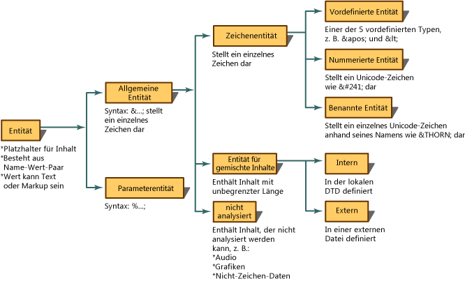

# <a name="reading-entity-declarations-and-entity-references-into-the-dom"></a>Einlesen von Entitätsdeklarationen und Entitätsverweisen in das Dokumentobjektmodell
Eine Entität ist eine Deklaration, die einen Namen angibt, der anstelle von Inhalt oder Markup im XML-Code zu verwenden ist. Entitäten setzen sich aus zwei Teilen zusammen. Erstens müssen Sie mithilfe einer Entitätsdeklaration einen Namen an den ersetzenden Inhalt binden. Eine Entitätsdeklaration wird durch Verwenden der `<!ENTITY name "value">`-Syntax in einer DTD (Document Type Definition) oder einem XML-Schema erstellt. Zweitens wird der Name, der in der Entitätsdeklaration definiert wurde, anschließend im XML-Code verwendet. Bei der Verwendung im XML-Code wird dieser Name als Entitätsverweis bezeichnet. Die folgende Entitätsdeklaration deklariert z. B., dass eine Entität mit dem Namen `publisher` mit dem Inhalt von "Microsoft Press" verknüpft wird.  
  
```xml  
<!ENTITY publisher "Microsoft Press">  
```  
  
 Im folgenden Beispiel wird die Verwendung dieser Entitätsdeklaration im XML-Code als Entitätsverweis veranschaulicht.  
  
```xml  
<author>Fred</author>  
<pubinfo>Published by &publisher;</pubinfo>  
```  
  
 Manche Parser erweitern Entitäten automatisch, wenn ein Dokument in den Speicher geladen wird. Daher werden Entitätsdeklarationen, wenn der XML-Code in den Speicher eingelesen wird, aufbewahrt und gespeichert. Wenn der Parser anschließend auf `&;`-Zeichen stößt, die einen allgemeinen Entitätsverweis kennzeichnen, sucht der Parser diesen Namen in einer Entitätsdeklarationstabelle. Der Verweis, `&publisher;`, wird durch den entsprechenden Inhalt ersetzt. Bei dem folgenden XML-Code  
  
```xml  
<author>Fred</author>  
<pubinfo>Published by &publisher;</pubinfo>  
```  
  
 , das Erweitern des Entitätsverweises und das Ersetzen von `&publisher;` durch "Microsoft Press" führt zu folgendem erweiterten XML-Code.  
  
 **Ausgabe**  
  
```xml  
<author>Fred</author>  
<pubinfo>Published by Microsoft Press</pubinfo>  
```  
  
 Es gibt viele verschiedene Entitäten. Die folgende Abbildung zeigt die einzelnen Entitätstypen und die zugehörige Terminologie.  
  
   
  
 Für die .NET Framework-Implementierung des Dokumentobjektmodells (DOM) werden die Entitätsverweise standardmäßig beibehalten, und die Entitäten werden nicht erweitert, wenn der XML-Code geladen wird. Dies hat folgende Konsequenzen: Wenn ein Dokument in das DOM geladen wird, wird ein **XmlEntityReference**-Knoten erstellt, der die Verweisvariable `&publisher;` enthält. Dieser Knoten enthält untergeordnete Knoten, die den Inhalt der in der DTD deklarierten Entität darstellen.  
  
 Im folgenden Diagramm werden die Knoten **XmlEntity** und **XmlText** dargestellt, die anhand der Entitätsdeklaration `<!ENTITY publisher "Microsoft Press">` erstellt werden.  
  
   
  
 Die Tatsache, ob Entitätsverweise erweitert werden oder nicht, ist entscheidend dafür, welche Knoten in der DOM-Struktur im Speicher generiert werden. Die Unterschiede zwischen den generierten Knoten werden in den Themen [Entitätsverweise werden beibehalten](../../../../docs/standard/data/xml/entity-references-are-preserved.md) und [Entitätsverweise werden erweitert und nicht beibehalten](../../../../docs/standard/data/xml/entity-references-are-expanded-and-not-preserved.md) erläutert.  
  
## <a name="see-also"></a>Siehe auch

- [XML-Dokumentobjektmodell (DOM)](../../../../docs/standard/data/xml/xml-document-object-model-dom.md)
