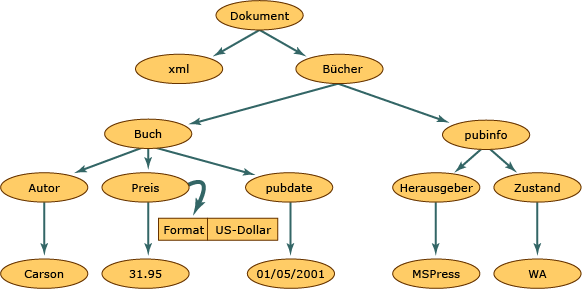

# <a name="xml-document-object-model-dom"></a>XML-Dokumentobjektmodell (DOM)
Die XML-DOM-Klasse ist eine Darstellung eines XML-Dokuments im Speicher. Mit dem DOM können Sie ein XML-Dokument programmgesteuert lesen und ändern. Die **XmlReader** -Klasse liest auch XML; sie bietet jedoch nicht zwischengespeicherten, nur vorwärts, nur-Lese Zugriff. Dies bedeutet, dass es keine Funktionen zum Bearbeiten der Werte eines Attributs oder Inhalt eines Elements oder die Fähigkeit zum Einfügen und Entfernen von Knoten mit der **XmlReader**. Der DOM erfüllt in erster Linie Bearbeitungsfunktionen. Es ist die herkömmliche strukturierte Methode, XML-Daten im Speicher darzustellen, obwohl die tatsächlichen XML-Daten linear gespeichert werden, wenn sie sich in einer Datei befinden oder aus einem anderen Objekt in eine Datei eingefügt werden. Im Folgenden werden XML-Daten dargestellt.  
  
## <a name="input"></a>Eingabe  
  
```xml  
<?xml version="1.0"?>  
  <books>  
    <book>  
        <author>Carson</author>  
        <price format="dollar">31.95</price>  
        <pubdate>05/01/2001</pubdate>  
    </book>  
    <pubinfo>  
        <publisher>MSPress</publisher>  
        <state>WA</state>  
    </pubinfo>  
  </books>   
```  
  
 In der folgenden Abbildung wird dargestellt, wie ein Speicher strukturiert ist, wenn diese XML-Daten in die DOM-Struktur eingelesen werden.  
  
   
Struktur von XML-Dokumenten  
  
 Innerhalb der XML-Dokumentstruktur stellt jeder Kreis in dieser Abbildung einen Knoten, der aufgerufen wird, eine **XmlNode** Objekt. Die **XmlNode** Objekt ist das Basisobjekt in der DOM-Struktur. Die **XmlDocument** -Klasse, die durch Erweiterung **XmlNode**, unterstützt Methoden zum Ausführen von Vorgängen für das Dokument als Ganzes (z. B. in den Arbeitsspeicher laden oder den XML-Code in einer Datei speichern. Darüber hinaus **XmlDocument** bietet eine Möglichkeit zum Anzeigen und Bearbeiten von Knoten in das gesamte XML-Dokument. Beide **XmlNode** und **XmlDocument** haben Erweiterungen der Leistung und Nutzbarkeit und Methoden und Eigenschaften hinzu:  
  
-   Zugreifen auf DOM-spezifische Knoten, z. B. Elementknoten, Entitätsverweisknoten usw.  
  
-   Abfragen ganzer Knoten zusätzlich zu den im Knoten enthaltenen Informationen, z. B. dem Text in einem Elementknoten.  
  
    > [!NOTE]
    >  Wenn eine Anwendung nicht über die Struktur oder die Bearbeitungsfunktionen, die vom DOM bereitgestellte erfordert die **XmlReader** und **"XmlWriter"** Klassen bieten nicht zwischengespeicherten, nur vorwärts Vorwärtsstreamzugriff auf XML. Weitere Informationen finden Sie unter <xref:System.Xml.XmlReader> und <xref:System.Xml.XmlWriter>.  
  
 **Knoten** Objekte verfügen über eine Reihe von Methoden und Eigenschaften sowie grundlegende, genau definierte Merkmale. Einige dieser Merkmale sind z. B.:  
  
-   Knoten haben einen einzigen direkt übergeordneten Knoten, d. h., der direkt übergeordnete Knoten stellt einen Knoten dar, der sich genau eine Ebene höher befindet. Der einzige Knoten, der keinen direkt übergeordneten Knoten besitzt, ist der Dokumentstamm. Dieser Knoten befindet sich auf der obersten Ebene und enthält das Dokument selbst sowie die Fragmente des Dokuments.  
  
-   Viele Knoten verfügen über mehrere direkt untergeordnete Knoten. Dies sind Knoten, die sich genau eine Ebene darunter befinden. In der folgenden Liste sind Knotentypen aufgeführt, die über untergeordnete Knoten verfügen können.  
  
    -   **Dokument**  
  
    -   **DocumentFragment**  
  
    -   **EntityReference**  
  
    -   **Element**  
  
    -   **Attribut**  
  
     Die **XmlDeclaration**, **Notation**, **Entität**, **CDATASection**, **Text**,  **Kommentar**, **ProcessingInstruction**, und **DocumentType** Knoten verfügen über keine untergeordneten Knoten.  
  
-   Knoten, die auf der gleichen Ebene, die im Diagramm von dargestellt sind die **Buch** und **Pubinfo** Knoten nebengeordneten Knoten vorhanden sind.  
  
 Ein Merkmal des DOM besteht in der Art, wie es Attribute behandelt. Attribute sind keine Knoten, die übergeordneten, untergeordneten oder nebengeordneten Beziehungen angehören. Attribute werden als Eigenschaft des Elementknotens betrachtet. Sie werden aus einem Name-Wert-Paar gebildet. Wenn Sie beispielsweise über XML-Daten verfügen, die aus `format="dollar`" und dem Element `price` bestehen, stellt das Wort `format` den Namen dar und `format` ist der Wert des Attributs `dollar`. Zum Abrufen der `format="dollar"` Attribut des der **Preis** Knoten, rufen Sie die **GetAttribute** Methode, wenn der Cursor auf befindet der `price` Elementknoten. Weitere Informationen finden Sie unter [Zugriff auf Attribute im DOM](../../../../docs/standard/data/xml/accessing-attributes-in-the-dom.md).  
  
 Wenn XML in den Speicher eingelesen wird, werden Knoten erstellt. Jedoch entsprechen nicht alle Knoten dem gleichen Typ. Ein Element in XML verfügt über andere Regeln und eine anderen Syntax als eine Anweisung zur Verarbeitung. Deshalb wird beim Lesen der verschiedenen Daten jedem Knoten ein Knotentyp zugewiesen. Dieser Knotentyp bestimmt die Merkmale und Funktionalitäten des Knotens.  
  
 Weitere Informationen zu den Arten von im Speicher generierten Knotentypen finden Sie unter [XML-Knotentypen](../../../../docs/standard/data/xml/types-of-xml-nodes.md). Weitere Informationen zu den in der Knotenstruktur erstellten Objekten finden Sie unter [Zuordnen der Objekthierarchie zu XML-Daten](../../../../docs/standard/data/xml/mapping-the-object-hierarchy-to-xml-data.md).  
  
 Microsoft hat die APIs erweitert, die in Level 1 und Level 2 des DOM des World Wide Web Consortium (W3C) verfügbar sind, um die Arbeit mit XML-Domkumenten zu vereinfachen. Die zusätzlichen Klassen, Methoden und Eigenschaften unterstützen nicht nur die W3C-Standards vollständig, sondern erweitern die Funktionen über die Möglichkeiten des XML-DOM des W3C hinaus. Mit neuen Klassen können Sie auf relationale Daten zugreifen und somit Methoden für die Synchronisierung mit ADO.NET-Daten nutzen, wobei Daten simultan als XML verfügbar gemacht werden. Weitere Informationen finden Sie unter [Synchronisieren eines Datasets mit einem XmlDataDocument](../../../../docs/framework/data/adonet/dataset-datatable-dataview/dataset-and-xmldatadocument-synchronization.md).  
  
 Das DOM ist zum Einlesen von XML-Daten in den Speicher besonders nützlich, um deren Struktur zu ändern, Knoten hinzuzufügen oder zu entfernen oder die in einem Knoten gespeicherten Daten zu bearbeiten, z. B. den Text in einem Element. Allerdings stehen auch andere Klassen zur Verfügung, die in anderen Szenarios schneller als das DOM sind. Verwenden Sie für den schnellen, nicht zwischengespeicherten, nur vorwärts Vorwärtsstreamzugriff auf XML, das **XmlReader** und **"XmlWriter"**. Wenn die gewünschte zufälligen Zugriff mit einem Cursormodell und **XPath**, verwenden Sie die **"XPathNavigator"** Klasse.  
  
## <a name="see-also"></a>Siehe auch  
 [XML-Knotentypen](../../../../docs/standard/data/xml/types-of-xml-nodes.md)  
 [Zuordnen der Objekthierarchie zu XML-Daten](../../../../docs/standard/data/xml/mapping-the-object-hierarchy-to-xml-data.md)
