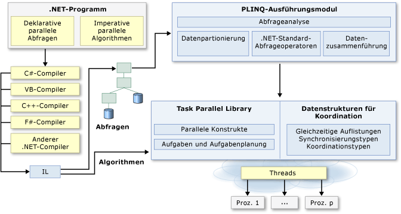

# Parallel Programming in the .NET Framework
Viele Personalcomputer und Arbeitsstationen verfügen über zwei oder vier Kerne \(d. h. CPUs\), die die gleichzeitige Ausführung mehrerer Threads ermöglichen.  Schon in naher Zukunft werden Computer vermutlich über deutlich mehr Kerne verfügen.  Um sowohl aktuelle als auch künftige Hardware nutzen zu können, kann der Code parallelisiert werden, um die Arbeit über mehrere Prozessoren zu verteilen.  Früher erforderte die Parallelisierung Änderungen von Threads und Sperren auf niedriger Ebene.  [!INCLUDE[vs_dev10_long](../../../includes/vs-dev10-long-md.md)] und [!INCLUDE[net_v40_short](../../../includes/net-v40-short-md.md)] verbessern die Unterstützung für parallele Programmierung, indem sie eine neue Laufzeit, neue Klassenbibliothekstypen und neue Diagnosetools bereitstellen.  Durch diese Funktionen wird die parallele Entwicklung vereinfacht, sodass sie effizienten, differenzierten und skalierbaren parallelen Code in einer natürlichen Sprache schreiben können, ohne direkt mit Threads oder dem Threadpool arbeiten zu müssen.  Die folgende Abbildung stellt in [!INCLUDE[net_v40_short](../../../includes/net-v40-short-md.md)] eine allgemeine Übersicht der parallelen Programmierarchitektur bereit.  
  
   
  
## Verwandte Themen  
  
|Technologie|Beschreibung|  
|-----------------|------------------|  
|[Task Parallel Library \(TPL\)](../../../docs/standard/parallel-programming/task-parallel-library-tpl.md)|Stellt eine Dokumentation für die <xref:System.Threading.Tasks.Parallel?displayProperty=fullName>\-Klasse, die parallele Versionen einer `For`\-Schleife und einer `ForEach`\-Schleife einschließt, sowie für die <xref:System.Threading.Tasks.Task?displayProperty=fullName>\-Klasse bereit. Dies ist die bevorzugte Methode, um asynchrone Vorgänge auszudrücken.|  
|[Parallel LINQ \(PLINQ\)](../../../docs/standard/parallel-programming/parallel-linq-plinq.md)|Eine parallele Implementierung von LINQ to Objects, die die Leistung in vielen Szenarien deutlich verbessert.|  
|[Data Structures for Parallel Programming](../../../docs/standard/parallel-programming/data-structures-for-parallel-programming.md)|Stellt Links zu Dokumentationen über threadsichere Auflistungsklassen, einfache Synchronisierungstypen und Typen für verzögerte Initialisierung bereit.|  
|[Parallel Diagnostic Tools](../../../docs/standard/parallel-programming/parallel-diagnostic-tools.md)|Stellt Links zu Dokumentationen über Visual Studio\-Debuggerfenster für Aufgaben und parallele Stapel und die [Parallelitätsschnellansicht](../Topic/Concurrency%20Visualizer.md) bereit, die aus einer Gruppe von Ansichten im [!INCLUDE[vsprvsts](../../../includes/vsprvsts-md.md)]\-Profiler besteht, mit dem paralleler Code debuggt und dessen Leistung optimiert werden kann.|  
|[Custom Partitioners for PLINQ and TPL](../../../docs/standard/parallel-programming/custom-partitioners-for-plinq-and-tpl.md)|Beschreibt, wie Partitionierer funktionieren und wie die Standardpartitionierer konfiguriert bzw. wie ein neuer Partitionierer erstellt wird.|  
|[Task Schedulers](../Topic/Task%20Schedulers.md)|Beschreibt, wie Planer funktionieren und wie die Standardplaner konfiguriert werden.|  
|[Lambda Expressions in PLINQ and TPL](../../../docs/standard/parallel-programming/lambda-expressions-in-plinq-and-tpl.md)|Bietet einen kurzen Überblick über Lamba\-Ausdrücke in C\# und Visual Basic und zeigt, wie sie in PLINQ und der Task Parallel Library verwendet werden.|  
|[For Further Reading](../../../docs/standard/parallel-programming/for-further-reading-parallel-programming.md)|Stellt Links zu zusätzlichen Dokumentationen und Beispielressourcen für parallele Programmierung in .NET Framework bereit.|  
  
## Siehe auch  
 [Patterns for Parallel Programming: Understanding and Applying Parallel Patterns with the .NET Framework 4](http://go.microsoft.com/fwlink/?LinkID=185142)   
 [Samples for Parallel Programming with the .NET Framework](http://code.msdn.microsoft.com/Samples-for-Parallel-b4b76364)