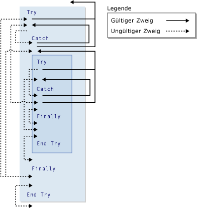

# <a name="goto-statement"></a>GoTo-Anweisung
Verzweigungen bedingungslos an eine angegebene Zeile in einer Prozedur.  
  
## <a name="syntax"></a>Syntax  
  
```  
GoTo line  
```  
  
## <a name="part"></a>Segment  
 `line`  
 Erforderlich. Alle zeilenbezeichnungen.  
  
## <a name="remarks"></a>Hinweise  
 Die `GoTo` -Anweisung verzweigen kann, nur für Zeilen in der Prozedur, in dem er angezeigt wird. Die Zeile benötigen eine Linie, die Bezeichnung `GoTo` finden können. Weitere Informationen finden Sie unter [wie: Label-Anweisungen](../../../visual-basic/programming-guide/program-structure/how-to-label-statements.md).  
  
> [!NOTE]
>  `GoTo` Anweisungen können, dass Code schwierig zu lesen und zu verwalten. Wann immer möglich, verwenden Sie stattdessen eine Steuerelement-Struktur. Weitere Informationen finden Sie unter [Control Flow](../../../visual-basic/programming-guide/language-features/control-flow/index.md).  
  
 Sie können keine `GoTo` Anweisung außerhalb von einer `For`... `Next`, `For Each`... `Next`, `SyncLock`... `End SyncLock`, `Try`... `Catch`... `Finally`, `With`... `End With`, oder `Using`... `End Using` Konstruktion zu einer Bezeichnung in.  
  
## <a name="branching-and-try-constructions"></a>Verzweigung und Try-Konstrukten  
 Innerhalb einer `Try`... `Catch`... `Finally` Konstruktion, die folgenden Regeln gelten, für die Verzweigung mit der `GoTo` Anweisung.  
  
|Blockieren oder region|Verzweigung von außerhalb|Verzweigen Sie von innerhalb|  
|---------------------|-------------------------------|-------------------------------|  
|`Try` Blockieren|Nur von einem `Catch` Block mit der gleichen Konstruktion <sup>1</sup>|Nur für außerhalb der gesamten Konstruktion|  
|`Catch` Blockieren|Nie zulässig.|Nur für außerhalb der gesamten Konstruktion oder auf die `Try` Block mit der gleichen Konstruktion <sup>1</sup>|  
|`Finally` Blockieren|Nie zulässig.|Nie zulässig.|  
  
 <sup>1</sup> sofern `Try`... `Catch`... `Finally` Konstruktion in einer anderen geschachtelt ist ein `Catch` Block kann keine Verzweigung in die `Try` Block auf einem eigenen Schachtelungsebene, jedoch nicht in einen anderen `Try` Block. Eine geschachtelte `Try`... `Catch`... `Finally` -Konstruktion muss vollständig in enthalten eine `Try` oder `Catch` Block der Konstruktion, in dem sie geschachtelt ist.  
  
 Die folgende Abbildung zeigt eine `Try` Konstruktion in einer anderen geschachtelt. Verschiedene Verzweigungen zwischen den Blöcken des zwei Konstruktionen werden als gültig oder ungültig gekennzeichnet.  
  
   
Gültigen und ungültigen Verzweigungen in Try-Konstrukten  
  
## <a name="example"></a>Beispiel  
 Im folgenden Beispiel wird die `GoTo` Anweisung zum Verzweigen zeilenbezeichnungen in einer Prozedur.  
  
 [!code-vb[VbVbalrStatements#31](../../../visual-basic/language-reference/error-messages/codesnippet/VisualBasic/goto-statement_1.vb)]  
  
## <a name="see-also"></a>Siehe auch  
 [Do...Loop-Anweisung](../../../visual-basic/language-reference/statements/do-loop-statement.md)  
 [For...Next-Anweisung](../../../visual-basic/language-reference/statements/for-next-statement.md)  
 [For Each...Next-Anweisung](../../../visual-basic/language-reference/statements/for-each-next-statement.md)  
 [If...Then...Else-Anweisung](../../../visual-basic/language-reference/statements/if-then-else-statement.md)  
 [Select...Case-Anweisung](../../../visual-basic/language-reference/statements/select-case-statement.md)  
 [Try...Catch...Finally-Anweisung](../../../visual-basic/language-reference/statements/try-catch-finally-statement.md)  
 [While...End While-Anweisung](../../../visual-basic/language-reference/statements/while-end-while-statement.md)  
 [With...End With-Anweisung](../../../visual-basic/language-reference/statements/with-end-with-statement.md)
