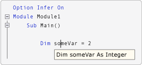

# Option Infer Statement
[!INCLUDE[vs2017banner](../../../visual-basic/developing-apps/includes/vs2017banner.md)]

Ermöglicht die Verwendung des lokalen Typrückschlusses beim Deklarieren von Variablen.  
  
## Syntax  
  
```  
Option Infer { On | Off }  
```  
  
## Teile  
  
|||  
|-|-|  
|Begriff|Definition|  
|`On`|Dies ist optional.  Ermöglicht den lokalen Typrückschluss.|  
|`Off`|Dies ist optional.  Deaktiviert den lokalen Typrückschluss.|  
  
## Hinweise  
 Geben Sie zum Festlegen von `Option Infer` in einer Datei am Anfang der Datei `Option Infer On` oder `Option Infer Off` ein.  Wenn der in einer Datei für `Option Infer` festgelegte Wert mit dem in der IDE oder in der Befehlszeile festgelegten Wert im Konflikt steht, hat der Wert in der Datei Vorrang.  
  
 Wenn Sie für `Option Infer` `On` festlegen, können Sie lokale Variablen deklarieren, ohne explizit einen Datentyp anzugeben.  Der Compiler leitet den Datentyp einer Variablen vom Typ des Initialisierungsausdrucks ab.  
  
 In der folgenden Abbildung ist `Option Infer` eingeschaltet.  Die Variable in der Deklaration `Dim someVar = 2` wird als ganze Zahl durch Typrückschluss deklariert.  
  
   
IntelliSense, wenn die Option Infer aktiviert ist.  
  
 In der folgenden Abbildung ist `Option Infer` deaktiviert.  Die Variable in der Deklaration `Dim someVar = 2` ist durch Typrückschluss als `Object` deklariert.  In diesem Beispiel ist die Einstellung **Option Strict** in[Seite "Kompilieren", Projekt\-Designer \(Visual Basic\)](/visual-studio/ide/reference/compile-page-project-designer-visual-basic) auf **Aus** eingestellt.  
  
   
IntelliSense, wenn Option Infer deaktiviert ist  
  
> [!NOTE]
>  Wenn eine Variable als `Object`deklariert ist, kann sich der Laufzeittyp ändern, während das Programm ausgeführt wird.  [!INCLUDE[vbprvb](../../../csharp/programming-guide/concepts/linq/includes/vbprvb-md.md)] führt Operationen mit Bezeichnung *Boxing* und *Unboxing* aus, um zwischen einem `Object` und einem Werttyp zu konvertieren, was die Ausführung langsamer macht.  Weitere Informationen zu Boxing und Unboxing finden Sie unter der [Visual Basic Language Specification](../../../visual-basic/reference/language-specification.md).  
  
 Typrückschluss findet auf Prozedurebene Anwendung und nicht außerhalb einer Prozedur in einer Klasse, Struktur, Modul oder Schnittstelle.  
  
 Weitere Informationen finden Sie unter [Local Type Inference](../../../visual-basic/programming-guide/language-features/variables/local-type-inference.md).  
  
## Wenn eine Option Infer\-Anweisung nicht vorhanden ist  
 Wenn der Quellcode keine `Option Infer`\-Anweisung enthält, wird die Einstellung **Option Infer** auf der [Seite "Kompilieren", Projekt\-Designer \(Visual Basic\)](/visual-studio/ide/reference/compile-page-project-designer-visual-basic) verwendet.  Wenn der Befehlszeilen\-Compiler verwendet wird, wird die [\/optioninfer](../../../visual-basic/reference/command-line-compiler/optioninfer.md)\-Compileroption verwendet.  
  
#### Festlegen der Option Infer in der IDE  
  
1.  Wählen Sie im **Projektmappen\-Explorer** ein Projekt aus.  Klicken Sie im Menü **Projekt** auf **Eigenschaften**.  Weitere Informationen finden Sie unter [NIB: Managing Project Properties with the Project Designer](http://msdn.microsoft.com/de-de/983f3c18-832f-4666-afec-74b716ff3e0e).  
  
2.  Klicken Sie die Registerkarte **Kompilieren**.  
  
3.  Legen Sie den Wert im Textfeld **Option infer** fest.  
  
 Wenn Sie ein neues Projekt erstellen, ist die Einstellung **Option Infer** auf der Registerkarte **Kompilieren** auf die Einstellung **Option Infer** im Textfeld **VB Defaults** festgelegt.  Klicken Sie zum Zugriff auf das Dialogfeld **VB Defaults** im das Menü **Tools** auf **Optionen**.  Erweitern Sie im Dialogfeld **Optionen Projekte und Lösungen** und klicken Sie dann auf **VB Defaults**.  Die ursprüngliche Standardeinstellung in **VB\-Standard** ist `On`.  
  
#### Festlegen der Option Infer in der Befehlszeile.  
  
-   Aktivieren Sie die [\/optioninfer](../../../visual-basic/reference/command-line-compiler/optioninfer.md)\-Compileroption im **vbc**\-Befehl.  
  
## Standarddatentypen und \-werte  
 Die folgende Tabelle beschreibt die Ergebnisse der verschiedenen Kombinationen der Spezifizierung von Datentyp und Initialisierung in einer `Dim`\-Anweisung.  
  
|||||  
|-|-|-|-|  
|Datentyp angegeben?|Initialisierung angegeben?|Beispiel|Ergebnis|  
|Nein|Nein|`Dim qty`|Wenn `Option Strict` deaktiviert ist \(Standard\), ist die Variable auf `Nothing` eingestellt.<br /><br /> Wenn `Option Strict` aktiviert ist, tritt ein Kompilierungsfehler auf.|  
|Nein|Ja|`Dim qty = 5`|Wenn `Option Infer` aktiviert ist \(Standard\), übernimmt die Variable den Datentyp des Initialisierers an.  Siehe [Local Type Inference](../../../visual-basic/programming-guide/language-features/variables/local-type-inference.md).<br /><br /> Wenn `Option Infer` und `Option Strict` ausgeschaltet sind, nimmt die Variable den Datentyp des `Object` an.<br /><br /> Wenn `Option Infer` deaktiviert ist und `Option Strict` aktiviert ist, tritt ein Kompilierungsfehler auf.|  
|Ja|Nein|`Dim qty As Integer`|Die Variable wird auf den Standardwert für den Datentyp initialisiert.  Weitere Informationen finden Sie unter [Dim Statement](../../../visual-basic/language-reference/statements/dim-statement.md).|  
|Ja|Ja|`Dim qty  As Integer = 5`|Wenn der Datentyp der Initialisierung nicht in den angegebenen Datentyp konvertiert werden kann, tritt ein Fehler während der Kompilierung auf.|  
  
## Beispiel  
 Die folgenden Beispiele veranschaulichen, wie die `Option Infer`\-Anweisung den lokalen Typrückschluss ermöglicht.  
  
 [!code-vb[VbVbalrTypeInference#6](../../../visual-basic/language-reference/statements/codesnippet/VisualBasic/option-infer-statement_1.vb)]  
  
## Beispiel  
 Das folgende Beispiel veranschaulicht, dass der Laufzeittyp abweichen kann, wenn eine Variable als ein `Object` gekennzeichnet ist.  
  
 [!code-vb[VbVbalrTypeInference#11](../../../visual-basic/language-reference/statements/codesnippet/VisualBasic/option-infer-statement_2.vb)]  
  
## Siehe auch  
 [Dim Statement](../../../visual-basic/language-reference/statements/dim-statement.md)   
 [Local Type Inference](../../../visual-basic/programming-guide/language-features/variables/local-type-inference.md)   
 [Option Compare Statement](../../../visual-basic/language-reference/statements/option-compare-statement.md)   
 [Option Explicit Statement](../../../visual-basic/language-reference/statements/option-explicit-statement.md)   
 [Option Strict Statement](../../../visual-basic/language-reference/statements/option-strict-statement.md)   
 [VB\-Standard, Projekte, Dialogfeld "Optionen"](/visual-studio/ide/reference/visual-basic-defaults-projects-options-dialog-box)   
 [\/optioninfer](../../../visual-basic/reference/command-line-compiler/optioninfer.md)   
 [Boxing und Unboxing](../../../csharp/programming-guide/types/boxing-and-unboxing.md)