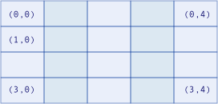

# <a name="array-dimensions-in-visual-basic"></a>Arraydimensionen in Visual Basic
Ein *Dimension* ist eine Richtung, in dem Sie die Spezifikation der Elemente eines Arrays können variieren. Ein Array, das den Umsatz für jeden Tag des Monats insgesamt enthält hat es sich um eine Dimension (Tag des Monats). Ein Array, das die Verkäufe nach Abteilung für jeden Tag des Monats insgesamt enthält hat zwei Dimensionen (die Abteilungsnummer und den Tag des Monats). Wird aufgerufen, die Anzahl der Dimensionen, die ein Array hat seine *Rang*.  
  
> [!NOTE]
>  Sie können die <xref:System.Array.Rank%2A> -Eigenschaft können Sie bestimmen, wie viele Dimensionen ein Array ist.  
  
## <a name="working-with-dimensions"></a>Arbeiten mit Dimensionen  
 Geben Sie ein Element eines Arrays, durch Angabe einer *Index* oder *Feldindex* aller seiner Dimensionen. Die Elemente werden fortlaufend über die einzelnen Dimensionen von Index 0 bis zum höchsten Index für diese Dimension.  
  
 Die folgenden Abbildungen zeigen die grundlegende Struktur von Arrays mit unterschiedlichem Rang. Jedes Element in der Abbildung zeigt die Werte des Indexes, die darauf zugreifen. Sie können z. B. das erste Element der zweiten Zeile des zweidimensionalen Arrays zugreifen, durch Angabe von Indizes `(1, 0)`.  
  
   
Eindimensionale Arrays  
  
   
zweidimensionales array  
  
   
dreidimensionale array  
  
### <a name="one-dimension"></a>Eine Dimension  
 Viele Arrays haben nur eine Dimension, z. B. die Anzahl der einzelnen Altersgruppen. Die einzige Anforderung an ein Element ist das Alter an, für das die Anzahl von dieses Element enthält. Ein solches Array wird daher nur einen Index verwendet. Das folgende Beispiel deklariert eine Variable für eine *1D-Array* Alter zählt für Alter von 0 bis 120.  
  
```  
Dim ageCounts(120) As UInteger  
```  
  
### <a name="two-dimensions"></a>Zwei Dimensionen  
 Einige Arrays haben zwei Dimensionen, z. B. die Anzahl der Zweigstellen in jeder erzeugt, der jeder Erstellung auf eine Gelände. Die Spezifikation eines Elements erfordert, die Gebäudenummer und der Floor, und jedes Element enthält die Anzahl die für diese Kombination von Gebäude und Etage. Aus diesem Grund wird ein solches Array zwei Indizes verwendet. Das folgende Beispiel deklariert eine Variable für eine *zweidimensionales Array* der Office-Anzahl für Gebäude 0 bis 40 und Stockwerken 0 bis 5.  
  
```  
Dim officeCounts(40, 5) As Byte  
```  
  
 Ein zweidimensionales Array wird auch bezeichnet eine *rechteckiges Array*.  
  
### <a name="three-dimensions"></a>Drei Dimensionen  
 Einige Arrays haben drei Dimensionen, z. B. Werte im dreidimensionalen Raum. Ein solches Array verwendet drei Indizes, die in diesem Fall die x-, y- und Z-Koordinaten des physischen Speicherplatzes darstellen. Das folgende Beispiel deklariert eine Variable für eine *dreidimensionale Array* per Funk temperaturspalte an verschiedenen Punkten in einem dreidimensionalen Volume.  
  
```  
Dim airTemperatures(99, 99, 24) As Single  
```  
  
### <a name="more-than-three-dimensions"></a>Mehr als drei Dimensionen  
 Obwohl ein Array mit bis zu 32 Dimensionen aufweisen kann, ist es jedoch selten mehr als drei aufweisen.  
  
> [!NOTE]
>  Wenn Sie ein Array Dimensionen hinzufügen, erhöht der gesamte Speicher, der vom Array benötigt beträchtlich, daher verwenden mehrdimensionale Arrays mit Vorsicht zu verwenden.  
  
## <a name="using-different-dimensions"></a>Verwenden unterschiedliche Dimensionen  
 Angenommen Sie, Sie möchten zum Nachverfolgen der Umsätze für jeden Tag des Monats vorhanden. Sie können ein eindimensionales Array mit 31 Elementen deklarieren, eine für jeden Tag des Monats, wie das folgende Beispiel zeigt.  
  
```  
Dim salesAmounts(30) As Double  
```  
  
 Jetzt nehmen Sie die gleiche Informationen nicht nur für jeden Tag eines Monats, sondern auch für jeden Monat des Jahres verfolgen möchten. Sie können ein zweidimensionales Array mit 12 Zeilen (für die Monate) und 31 Spalten (für die Tage), wie im folgenden Beispiel gezeigt deklarieren.  
  
```  
Dim salesAmounts(11, 30) As Double  
```  
  
 Angenommen, Sie entscheiden, damit Ihr Array enthalten jetzt Informationen für mehr als ein Jahr. Wenn Sie die Umsatzbeträge für fünf Jahre nachverfolgen möchten, konnte Sie ein dreidimensionales Array mit 5 Ebenen, 12 Zeilen und 31 Spalten wie im folgenden Beispiel gezeigt deklarieren.  
  
```  
Dim salesAmounts(4, 11, 30) As Double  
```  
  
 Beachten Sie Folgendes: Da jeder Index von 0 auf das Maximum, jede Dimension des variiert `salesAmounts` als eins kleiner als die erforderliche Länge für diese Dimension deklariert ist. Beachten Sie außerdem, dass die Größe des Arrays mit jeder neuen Dimension zunimmt. Die drei Größen in den vorherigen Beispielen sind 31, 372 und 1.860 Elementen.  
  
> [!NOTE]
>  Sie können ein Array erstellen, ohne die `Dim` Anweisung oder der `New` Klausel. Sie können z. B. Aufrufen der <xref:System.Array.CreateInstance%2A> -Methode oder eine andere Komponente kann Ihrem Code auf diese Weise erstellte Array übergeben. Ein solches Array kann mit eine unteren Grenze ungleich 0 haben. Sie können immer für die untere Grenze einer Dimension testen, indem die <xref:System.Array.GetLowerBound%2A> Methode oder die `LBound` Funktion.  
  
## <a name="see-also"></a>Siehe auch  
 [Arrays](../../../../visual-basic/programming-guide/language-features/arrays/index.md)  
 [Problembehandlung bei Arrays](../../../../visual-basic/programming-guide/language-features/arrays/troubleshooting-arrays.md)
