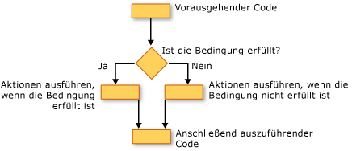

# Entscheidungsstrukturen (Visual Basic)
Visual Basic können Sie testbedingungen und andere Vorgänge abhängig von den Ergebnissen dieser Tests ausführen. Sie können testen, auf eine Bedingung "true" oder "false" für verschiedene Werte für einen Ausdruck oder für verschiedene Ausnahmen generiert, wenn Sie eine Reihe von Anweisungen ausgeführt werden.  
  
 Die folgende Abbildung zeigt eine Entscheidungsstruktur, die für eine Bedingung "true" wird überprüft und verschiedene Aktionen abhängig davon, ob er "true" oder "false".  
  
   
Wenn eine Bedingung ist "true" und "false" wird er Maßnahmen andere  
  
## If... Dann... Else-Konstruktion  
 `If...Then...Else` Konstruktionen können Sie für eine oder mehrere Bedingungen zu testen, und führen Sie eine oder mehrere Anweisungen, je nach jede Bedingung. Sie können testen Bedingungen und Aktionen auf folgende Weise:  
  
-   Führen Sie eine oder mehrere Anweisungen, wenn eine Bedingung `True`  
  
-   Führen Sie eine oder mehrere Anweisungen, wenn eine Bedingung `False`  
  
-   Führen Sie einige Anweisungen, wenn eine Bedingung `True` und andere wird jedoch `False`  
  
-   Testen einer zusätzlichen Bedingung, wenn eine vorherige Bedingung `False`  
  
 Die Steuerelement-Struktur, die alle diese Methoden bietet, ist die [Wenn... Dann... Else-Anweisung](../../../../visual-basic/language-reference/statements/if-then-else-statement.md). Sie können eine einzeilige Version verwenden, haben nur eine Test- und eine Anweisung auszuführen. Wenn Sie einen komplexen Satz von Bedingungen und Aktionen verfügen, können Sie die Version für mehrere Zeilen.  
  
## Wählen Sie... Groß-/Kleinschreibung Konstruktion  
 Die `Select...Case` Konstruktion können Sie Auswerten eines Ausdrucks einmal, und führen Sie verschiedene Gruppen von Anweisungen basierend auf verschiedenen möglichen Werte. Weitere Informationen finden Sie unter [auswählen... Case-Anweisung](../../../../visual-basic/language-reference/statements/select-case-statement.md).  
  
## Wiederholen Sie den... Catch... Finally-Konstruktion  
 `Try...Catch...Finally` Konstruktionen können Sie eine Reihe von Anweisungen in einer Umgebung ausführen, die von Steuerelement beibehalten, wenn einer der Anweisungen, eine Ausnahme löst. Sie können verschiedene Aktionen für verschiedene Ausnahmen ausführen. Optional können Sie angeben, einen Codeblock, der ausgeführt wird, vor dem Beenden des gesamten `Try...Catch...Finally` Konstruktion, unabhängig davon, was auftritt. Weitere Informationen finden Sie unter [Try...Catch...Finally-Anweisung](../../../../visual-basic/language-reference/statements/try-catch-finally-statement.md).  
  
> [!NOTE]
>  Für viele Steuerungsstrukturen werden, wenn Sie ein Schlüsselwort, klicken Sie auf alle Schlüsselwörter in der Struktur hervorgehoben. Z. B. beim Klicken auf `If` in einer `If...Then...Else` Konstruktion, die alle Instanzen von `If`, `Then`, `ElseIf`, `Else`, und `End If` bei der Erstellung werden hervorgehoben. Um zum nächsten oder vorherigen hervorgehobenen Schlüsselwort zu verschieben, drücken Sie STRG + UMSCHALT + nach-oben-Taste oder STRG + UMSCHALT + nach-oben-Taste.  
  
## Siehe auch  
 [Ablaufsteuerung](../../../../visual-basic/programming-guide/language-features/control-flow/index.md)  
 [Schleifenstruktur](../../../../visual-basic/programming-guide/language-features/control-flow/loop-structures.md)  
 [Weitere Steuerungsstrukturen](../../../../visual-basic/programming-guide/language-features/control-flow/other-control-structures.md)  
 [Geschachtelte Steuerungsstrukturen](../../../../visual-basic/programming-guide/language-features/control-flow/nested-control-structures.md)  
 [If-Operator](../../../../visual-basic/language-reference/operators/if-operator.md)
