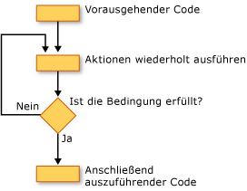

# Loop Structures (Visual Basic)
[!INCLUDE[vs2017banner](../../../../visual-basic/developing-apps/includes/vs2017banner.md)]

[!INCLUDE[vbprvb](../../../../csharp/programming-guide/concepts/linq/includes/vbprvb-md.md)]\-Schleifenstrukturen ermöglichen Ihnen, ein oder mehrere Zeilen Code wiederholt auszuführen.  Sie können die Anweisungen in einer Schleifenstruktur wiederholen, bis eine Bedingung `True` oder `False` ist, Sie können eine definierte Anzahl von Wiederholungen abarbeiten lassen oder die Anweisung für jedes Auflistungselement einmal ausführen lassen.  
  
 Im folgenden Beispiel wird eine Schleifenstruktur veranschaulicht, die mehrere Anweisungen ausführt, bis eine Bedingung den Wert True annimmt.  
  
   
Ausführen von Anweisungen, bis eine Bedingung den Wert True annimmt  
  
## While\-Schleifen  
 Die `While`...`End While`\-Konstruktion führt eine Reihe von Anweisungen aus, solange die Bedingung in der `While`\-Anweisung `True` ist.  Weitere Informationen finden Sie unter [While...End While Statement](../../../../visual-basic/language-reference/statements/while-end-while-statement.md).  
  
## Do\-Schleifen  
 Die `Do`...`Loop`\-Konstruktion ermöglicht Ihnen, eine Bedingung entweder zu Beginn oder am Ende einer Schleifenstruktur zu testen.  Sie können außerdem angeben, ob die Schleife wiederholt werden soll, solange die Bedingung `True` bleibt oder bis sie `True` wird.  Weitere Informationen finden Sie unter [Do...Loop Statement](../../../../visual-basic/language-reference/statements/do-loop-statement.md).  
  
## For\-Schleifen  
 Die `For`...`Next`\-Konstruktion führt in der Schleife eine angegebene Anzahl von Wiederholungen aus.  Dabei kommt eine Schleifensteuerungsvariable zum Einsatz. Diese wird auch als *Zähler* bezeichnet und verfolgt die Wiederholungen.  Sie geben den Start\- und den Endwert für diesen Zähler an. Optional können Sie angeben, in welchem Maße der Variablenwert des Zählers von einer Wiederholung zu nächsten erhöht wird.  Weitere Informationen finden Sie unter [For...Next\-Anweisung](../../../../visual-basic/language-reference/statements/for-next-statement.md).  
  
## For Each\-Schleifen  
 Die `For Each`...`Next`\-Konstruktion führt eine Reihe von Anweisungen für jedes Element in einer Auflistung aus.  Sie geben die Schleifensteuerungsvariable an, müssen aber den Start\- und den Endwert dieser Variablen nicht festlegen.  Weitere Informationen finden Sie unter [For Each...Next\-Anweisung](../../../../visual-basic/language-reference/statements/for-each-next-statement.md).  
  
## Siehe auch  
 [Control Flow](../../../../visual-basic/programming-guide/language-features/control-flow/index.md)   
 [Decision Structures](../../../../visual-basic/programming-guide/language-features/control-flow/decision-structures.md)   
 [Other Control Structures](../../../../visual-basic/programming-guide/language-features/control-flow/other-control-structures.md)   
 [Nested Control Structures](../../../../visual-basic/programming-guide/language-features/control-flow/nested-control-structures.md)