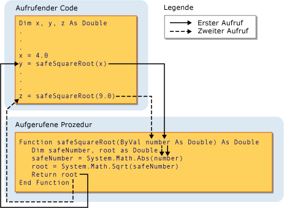

# Procedure Parameters and Arguments (Visual Basic)
[!INCLUDE[vs2017banner](../../../../visual-basic/developing-apps/includes/vs2017banner.md)]

In den meisten Fällen benötigen Prozeduren einige Informationen zu den Umständen, unter denen sie aufgerufen wurden.  Prozeduren, die sich wiederholende und freigegebene Aufgaben ausführen, verwenden für jeden Aufruf andere Informationen.  Diese Informationen bestehen aus Variablen, Konstanten und Ausdrücken, die beim Aufruf an die Prozedur übergeben werden.  
  
 Ein *Parameter* stellt einen Wert dar, der der Prozedur angegeben werden muss, wenn sie aufgerufen wird.  Die Parameter der Prozedur werden in der Deklaration der Prozedur definiert.  
  
 Sie können eine Prozedur ohne Parameter, mit einem Parameter oder mehreren Parametern definieren.  Der Teil der Prozedurdefinition, der die Parameter angibt, wird *Parameterliste* genannt.  
  
 Ein *Argument* stellt den Wert dar, der im Prozeduraufruf für einen Prozedurparameter angegeben wird.  Der Aufrufcode stellt beim Aufrufen der Prozedur die Argumente zur Verfügung.  Der Teil des Prozeduraufrufs, der die Argumente angibt, wird *Argumentliste* genannt.  
  
 Die folgende Darstellung zeigt Code, der die `safeSquareRoot`\-Prozedur von zwei verschiedenen Stellen aus aufruft.  Im ersten Aufruf wird der Wert der `x`\-Variablen \(4,0\) an den `number`\-Parameter übergeben. Der in `root` gespeicherte Rückgabewert \(2,0\) wird der `y`\-Variablen zugewiesen.  Im zweiten Aufruf wird der Literalwert 9,0 an `number` übergeben und der `z`\-Variablen der Rückgabewert \(3,0\) zugewiesen.  
  
   
Übergeben eines Arguments an einen Parameter  
  
 Weitere Informationen finden Sie unter [Differences Between Parameters and Arguments](../../../../visual-basic/programming-guide/language-features/procedures/differences-between-parameters-and-arguments.md).  
  
## Parameterdatentyp  
 Der Datentyp eines Parameters wird mithilfe der `As`\-Klausel in seiner Deklaration definiert.  Die folgende Funktion akzeptiert z. B. eine Zeichenfolge und eine ganze Zahl.  
  
 [!code-vb[VbVbcnProcedures#32](../../../../visual-basic/programming-guide/language-features/procedures/codesnippet/VisualBasic/procedure-parameters-and-ar_1.vb)]  
  
 Wenn die Typüberprüfung \([Option Strict Statement](../../../../visual-basic/language-reference/statements/option-strict-statement.md)\) den Wert `Off,` hat, ist die `As`\-Klausel optional, sofern sie nicht für einen Parameter angegeben wird. In diesem Fall gilt, dass sie für alle Parameter angegeben werden muss.  Wenn die Typüberprüfung den Wert `On` hat, muss die `As`\-Klausel für alle Prozedurparameter angegeben werden.  
  
 Wenn im Aufrufcode ein Argument mit einem anderen Datentyp als dem des zugehörigen Parameters angegeben werden soll, z. B. `Byte` für einen `String`\-Parameter, muss eines der folgenden Verfahren angewendet werden:  
  
-   Geben Sie nur Argumente mit Datentypen an, die zum Parameterdatentyp erweitert werden können.  
  
-   Legen Sie `Option Strict Off` fest, um implizite einschränkende Konvertierungen zu ermöglichen, oder  
  
-   verwenden Sie ein Konvertierungsschlüsselwort, um den Datentyp explizit zu konvertieren.  
  
### Typparameter  
 Zudem definiert eine *generische Prozedur* neben den normalen Parametern einen oder mehrere *Typparameter*.  Mit einer generischen Prozedur kann der aufrufende Code bei jedem Aufruf der Prozedur verschiedene Datentypen übergeben. Folglich können die Datentypen an die Anforderungen der einzelnen Aufrufe angepasst werden.  Weitere Informationen finden Sie unter [Generic Procedures in Visual Basic](../../../../visual-basic/programming-guide/language-features/data-types/generic-procedures.md).  
  
## Siehe auch  
 [Procedures](../../../../visual-basic/programming-guide/language-features/procedures/index.md)   
 [Sub Procedures](../../../../visual-basic/programming-guide/language-features/procedures/sub-procedures.md)   
 [Function\-Prozeduren](../../../../visual-basic/programming-guide/language-features/procedures/function-procedures.md)   
 [Eigenschaftenprozeduren](../../../../visual-basic/programming-guide/language-features/procedures/property-procedures.md)   
 [Operator Procedures](../../../../visual-basic/programming-guide/language-features/procedures/operator-procedures.md)   
 [How to: Define a Parameter for a Procedure](../../../../visual-basic/programming-guide/language-features/procedures/how-to-define-a-parameter-for-a-procedure.md)   
 [How to: Pass Arguments to a Procedure](../../../../visual-basic/programming-guide/language-features/procedures/how-to-pass-arguments-to-a-procedure.md)   
 [Passing Arguments by Value and by Reference](../../../../visual-basic/programming-guide/language-features/procedures/passing-arguments-by-value-and-by-reference.md)   
 [Procedure Overloading](../../../../visual-basic/programming-guide/language-features/procedures/procedure-overloading.md)   
 [Type Conversions in Visual Basic](../../../../visual-basic/programming-guide/language-features/data-types/type-conversions.md)